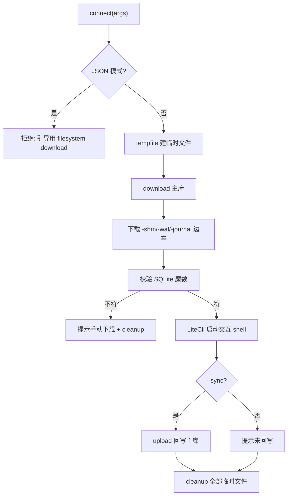

# SQLite 数据库交互 <code>commands/sqlite.py</code>

本模块把设备上的 SQLite 数据库**下载到本地临时文件**，用 litecli 启动一个交互式 SQL shell，退出时可选 `--sync` 回写设备。命令组前缀为 `sqlite connect`。

## 📋 模块概览

| 项目 | 值 |
| --- | --- |
| 文件路径 | `objection/commands/sqlite.py` |
| Agent 实现 | 复用 `agent/src/ios/filesystem.ts`、`agent/src/android/filesystem.ts`（download/upload） |
| 命令组 | `sqlite connect` |
| 依赖 | `binascii`、`os`、`tempfile`、`click`、`litecli`、`objection.commands.filemanager`、`objection.utils.output` |

## 🎯 解决的问题

- App 的 SQLite 库在设备上，不想逐个 `filesystem download` 再手动开 DB 工具。
- 想**就地**用熟悉的 SQL CLI 查/改库表。
- SQLite 的 `-shm`/`-wal`/`-journal` 边车文件要一起缓存，否则数据不一致。
- 改完要能回写设备（`--sync`）。
- Agent 模式下交互 shell 不可用，要明确引导替代路径。

## 📜 命令清单

| 命令 | 函数 | 说明 |
| --- | --- | --- |
| `sqlite connect <remote_file> [--sync]` | `connect()` | 缓存 DB 到本地并启动 litecli |

辅助函数：

| 函数 | 作用 |
| --- | --- |
| `modify_config` | monkey-patch litecli 配置（关 pager、less_chatty） |
| `cleanup` | 删除本地临时 DB |
| `_should_sync_once_done` | 检测 `--sync` |

## ⚙️ 实现原理

模块加载时即 monkey-patch `litecli.main.get_config`（`objection/commands/sqlite.py:30-31`），关掉 pager 与 chatty 提示。`connect` 用 `tempfile.mkstemp` 建临时文件，调 `filemanager.download` 把远程库拉下来，校验 SQLite 文件头魔数 `53514c69746520666f726d6174203300`（`"SQLite format 3\0"`），再启动 `LiteCli`。

### `connect()` — 连接并启动 shell

源码：`objection/commands/sqlite.py:56`

无参数报错。**JSON/Agent 模式直接拒绝**——交互 shell 无法在 Agent 下运行（`objection/commands/sqlite.py:80-91`）：

```python
# objection/commands/sqlite.py:80-91
if should_output_json(args):
    return output_result(
        CommandResult(
            result={'error': 'interactive sqlite shell unavailable in JSON mode'},
            status='error', exit_code=1,
            human_text=('Use `filesystem download <remote_file> <local.sqlite>` '
                        'to pull the database, then inspect locally.'),
            warnings=['The interactive litecli shell cannot run under an AI Agent.'],
        ),
        command='sqlite connect',
    )
```

缓存 DB 与边车文件（`objection/commands/sqlite.py:104-117`）：

```python
# objection/commands/sqlite.py:105-117
download([db_location, local_path])
if path_exists(full_remote_file + '-shm'):
    download([db_location + '-shm', local_path + '-shm'])
    use_shm = True
if path_exists(full_remote_file + '-wal'):
    download([db_location + '-wal', local_path + '-wal'])
    use_wal = True
if path_exists(full_remote_file + '-journal'):
    download([db_location + '-journal', local_path + '-journal'])
    use_jnl = True
```

文件头校验（`objection/commands/sqlite.py:119-128`）：读前 16 字节 hex，必须等于 `b'53514c69746520666f726d6174203300'`，否则提示手动下载并清理。启动 litecli（`objection/commands/sqlite.py:133-135`）：

```python
# objection/commands/sqlite.py:133-135
lite = LiteCli(prompt='SQLite @ {} > '.format(db_location))
lite.connect(local_path)
lite.run_cli()
```

退出后 `--sync` 则回写主库（边车文件回写默认关闭，`write_back_tmp_sqlite` 未启用，`objection/commands/sqlite.py:137-147`）；最后清理所有临时文件（`objection/commands/sqlite.py:152-158`）。

### `modify_config()` / `cleanup()` — 辅助

`modify_config`（`objection/commands/sqlite.py:14`）在 patch 后的 `get_config` 里强制 `less_chatty=True`、`enable_pager=False`。`cleanup`（`:34`）单行 `os.remove(p)`。`_should_sync_once_done`（`:45`）检测 `--sync`。



## 🔌 JSON 模式行为

- **JSON/Agent 模式下不可用**：返回 `status='error'`、`exit_code=1`，`human_text` 引导用 `filesystem download` 拉库后本地查看。这是关键差异——交互 shell 无法在 Agent 下运行。
- 非 JSON 模式：缺参数打印用法；文件头不符提示手动下载。
- `--sync` 默认关闭；边车文件回写 (`write_back_tmp_sqlite`) 硬编码为 `False`，注释说明未测试。

## 🔍 源码索引

| 符号 | 位置 |
| --- | --- |
| `modify_config` | `objection/commands/sqlite.py:14` |
| `real_get_config` | `objection/commands/sqlite.py:30` |
| `cleanup` | `objection/commands/sqlite.py:34` |
| `_should_sync_once_done` | `objection/commands/sqlite.py:45` |
| `connect` | `objection/commands/sqlite.py:56` |

## 🔗 相关文档

- [运行时操作命令](/features/runtime-commands)
- [文件系统](/features/filesystem)
- [RPC 通信机制](/guide/rpc)
- [REPL 与命令](/guide/repl)
