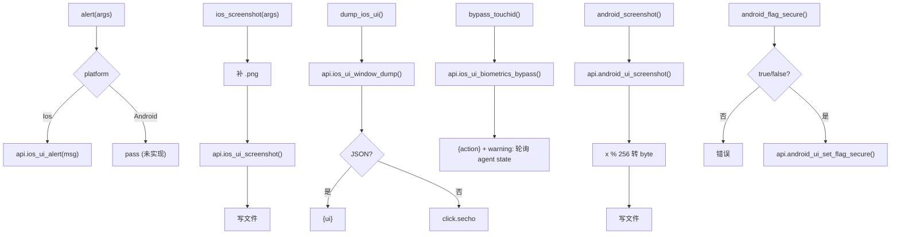

# UI 操作 <code>commands/ui.py</code>

本模块覆盖与设备 UI 交互的动作：弹窗提示、截屏、dump UI 树、TouchID 绕过、Android `FLAG_SECURE` 控制。命令组前缀为 `ui ...` / `ios ui ...` / `android ui ...`，按平台分发。

## 📋 模块概览

| 项目 | 值 |
| --- | --- |
| 文件路径 | `objection/commands/ui.py` |
| Agent 实现 | `agent/src/ios/ui.ts`、`agent/src/android/ui.ts` |
| 命令组 | `ui alert`、`ios ui screenshot/dump/bypass_touchid`、`android ui screenshot/flag_secure` |
| 依赖 | `click`、`objection.state.connection`、`objection.state.device`、`objection.utils.output` |

## 🎯 解决的问题

- 在设备上弹个提示，验证注入是否生效。
- 截屏取证（iOS/Android 各一）。
- dump iOS 当前 UI 树的序列化形式，便于自动化定位控件。
- 绕过 TouchID 校验（hook 生物识别类）。
- 控制 Android `FLAG_SECURE`，决定是否允许截屏/录屏。

## 📜 命令清单

| 命令 | 函数 | 说明 |
| --- | --- | --- |
| `ui alert [message]` | `alert()` | 弹窗/Toast 提示 |
| `ios ui screenshot <local png>` | `ios_screenshot()` | iOS 截屏存本地 |
| `ios ui dump` | `dump_ios_ui()` | dump iOS UI 序列化 |
| `ios ui bypass_touchid` | `bypass_touchid()` | 启动 TouchID 绕过作业 |
| `android ui screenshot <local png>` | `android_screenshot()` | Android 截屏存本地 |
| `android ui flag_secure <true/false>` | `android_flag_secure()` | 设置 FLAG_SECURE |

## ⚙️ 实现原理

所有函数都走 `state_connection.get_api()` 调对应 `ios_ui_*` / `android_ui_*` RPC。`alert` 与 `flag_secure` 按平台分发；截屏函数把 Agent 返回的字节写本地 PNG。

### `alert()` — 弹窗

源码：`objection/commands/ui.py:10`

默认消息 `objection!`，按平台分发；Android 分支当前为 `pass`（未实现，`objection/commands/ui.py:27-28`）：

```python
# objection/commands/ui.py:24-28
if isinstance(device_state.platform, Ios):
    _alert_ios(message)

if isinstance(device_state.platform, Android):
    pass
```

JSON 模式返回 `{'action': 'alert', 'message', 'platform'}`。`_alert_ios` 调 `api.ios_ui_alert(message)`（`objection/commands/ui.py:46-47`）。

### `ios_screenshot()` — iOS 截屏

源码：`objection/commands/ui.py:50`

无目标文件报错；自动补 `.png` 后缀，写字节：

```python
# objection/commands/ui.py:69-76
if not destination.endswith('.png'):
    destination = destination + '.png'

api = state_connection.get_api()
png = api.ios_ui_screenshot()

with open(destination, 'wb') as f:
    f.write(png)
```

JSON 模式返回 `{'saved_to', 'bytes': len(png)}`。

### `dump_ios_ui()` — UI 树

源码：`objection/commands/ui.py:88`

```python
# objection/commands/ui.py:96-97
api = state_connection.get_api()
ui = api.ios_ui_window_dump()
```

非 JSON 模式直接 `click.secho(ui)`；JSON 模式返回 `{'ui': ui}`。

### `bypass_touchid()` — TouchID 绕过

源码：`objection/commands/ui.py:110`

调 `api.ios_ui_biometrics_bypass()`，**不**接收 job id（`objection/commands/ui.py:119-120`）。JSON 模式返回 `{'action': 'bypass_touchid'}` 并带 warning：job id 未暴露，需 `agent state` 查运行中作业（`objection/commands/ui.py:122-129`）。

### `android_screenshot()` — Android 截屏

源码：`objection/commands/ui.py:133`

与 iOS 对称，但 Agent 返回的数据需做 `% 256` 截断转 byte（`objection/commands/ui.py:157`）：

```python
# objection/commands/ui.py:155-157
data = api.android_ui_screenshot()
image = bytearray(map(lambda x: x % 256, data))
```

### `android_flag_secure()` — FLAG_SECURE

源码：`objection/commands/ui.py:172`

参数必须为 `true` 或 `false`：

```python
# objection/commands/ui.py:181-191
if len(args) <= 0 or args[0] not in ('true', 'false'):
    ...
api = state_connection.get_api()
api.android_ui_set_flag_secure(args[0])
```

JSON 模式返回 `{'action': 'set_flag_secure', 'value': args[0]}`。



## 🔌 JSON 模式行为

- 截屏两函数：缺目标文件返回 `status='error'`；成功返回 `saved_to` 与 `bytes`。
- `dump_ios_ui`：JSON 模式返回 UI 序列化字符串。
- `bypass_touchid`：返回 `action`，job id 不在返回值，需轮询。
- `android_flag_secure`：参数非 `true`/`false` 返回 `status='error'`。
- `alert`：Android 分支当前不实际弹窗（`pass`），但 JSON 仍返回结构化结果。

## 🔍 源码索引

| 符号 | 位置 |
| --- | --- |
| `alert` | `objection/commands/ui.py:10` |
| `_alert_ios` | `objection/commands/ui.py:38` |
| `ios_screenshot` | `objection/commands/ui.py:50` |
| `dump_ios_ui` | `objection/commands/ui.py:88` |
| `bypass_touchid` | `objection/commands/ui.py:110` |
| `android_screenshot` | `objection/commands/ui.py:133` |
| `android_flag_secure` | `objection/commands/ui.py:172` |

## 🔗 相关文档

- [运行时操作命令](/features/runtime-commands)
- [RPC 通信机制](/guide/rpc)
- [REPL 与命令](/guide/repl)
