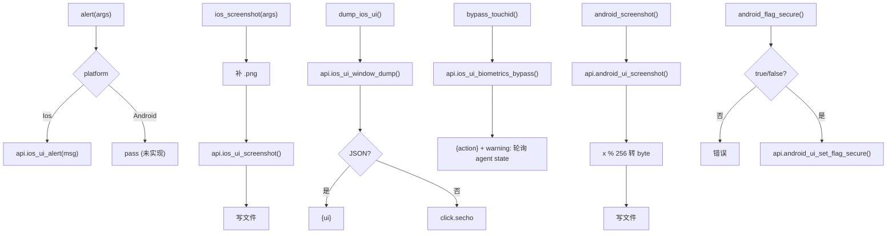
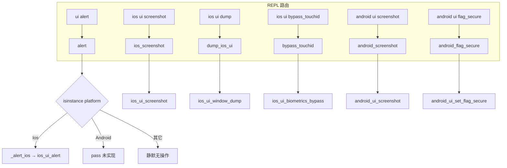

# UI 操作 <code>commands/ui.py</code>

本模块覆盖与设备 UI 交互的动作：弹窗提示、截屏、dump UI 树、TouchID 绕过、Android `FLAG_SECURE` 控制。命令组前缀为 `ui ...` / `ios ui ...` / `android ui ...`，按平台分发。

## 📋 模块概览

| 项目 | 值 |
| --- | --- |
| 文件路径 | `objection/commands/ui.py` |
| Agent 实现 | `agent/src/ios/ui.ts`、`agent/src/android/ui.ts` |
| 命令组 | `ui alert`、`ios ui screenshot/dump/bypass_touchid`、`android ui screenshot/flag_secure` |
| 依赖 | `click`、`objection.state.connection`、`objection.state.device`、`objection.utils.output` |

## 🎯 解决的问题

- 在设备上弹个提示，验证注入是否生效。
- 截屏取证（iOS/Android 各一）。
- dump iOS 当前 UI 树的序列化形式，便于自动化定位控件。
- 绕过 TouchID 校验（hook 生物识别类）。
- 控制 Android `FLAG_SECURE`，决定是否允许截屏/录屏。

## 📜 命令清单

| 命令 | 函数 | 说明 |
| --- | --- | --- |
| `ui alert [message]` | `alert()` | 弹窗/Toast 提示 |
| `ios ui screenshot <local png>` | `ios_screenshot()` | iOS 截屏存本地 |
| `ios ui dump` | `dump_ios_ui()` | dump iOS UI 序列化 |
| `ios ui bypass_touchid` | `bypass_touchid()` | 启动 TouchID 绕过作业 |
| `android ui screenshot <local png>` | `android_screenshot()` | Android 截屏存本地 |
| `android ui flag_secure <true/false>` | `android_flag_secure()` | 设置 FLAG_SECURE |

## ⚙️ 实现原理

所有函数都走 `state_connection.get_api()` 调对应 `ios_ui_*` / `android_ui_*` RPC。`alert` 与 `flag_secure` 按平台分发；截屏函数把 Agent 返回的字节写本地 PNG。

### `alert()` — 弹窗

源码：[`objection/commands/ui.py:10`](https://github.com/android-security-engineer/objection-skills/blob/master/objection/commands/ui.py#L10)

默认消息 `objection!`，按平台分发；Android 分支当前为 `pass`（未实现，[`objection/commands/ui.py:27-28`](https://github.com/android-security-engineer/objection-skills/blob/master/objection/commands/ui.py#L27)）：

```python
# objection/commands/ui.py:24-28
if isinstance(device_state.platform, Ios):
    _alert_ios(message)

if isinstance(device_state.platform, Android):
    pass
```

JSON 模式返回 `{'action': 'alert', 'message', 'platform'}`。`_alert_ios` 调 `api.ios_ui_alert(message)`（[`objection/commands/ui.py:46-47`](https://github.com/android-security-engineer/objection-skills/blob/master/objection/commands/ui.py#L46)）。

### `ios_screenshot()` — iOS 截屏

源码：[`objection/commands/ui.py:50`](https://github.com/android-security-engineer/objection-skills/blob/master/objection/commands/ui.py#L50)

无目标文件报错；自动补 `.png` 后缀，写字节：

```python
# objection/commands/ui.py:69-76
if not destination.endswith('.png'):
    destination = destination + '.png'

api = state_connection.get_api()
png = api.ios_ui_screenshot()

with open(destination, 'wb') as f:
    f.write(png)
```

JSON 模式返回 `{'saved_to', 'bytes': len(png)}`。

### `dump_ios_ui()` — UI 树

源码：[`objection/commands/ui.py:88`](https://github.com/android-security-engineer/objection-skills/blob/master/objection/commands/ui.py#L88)

```python
# objection/commands/ui.py:96-97
api = state_connection.get_api()
ui = api.ios_ui_window_dump()
```

非 JSON 模式直接 `click.secho(ui)`；JSON 模式返回 `{'ui': ui}`。

### `bypass_touchid()` — TouchID 绕过

源码：[`objection/commands/ui.py:110`](https://github.com/android-security-engineer/objection-skills/blob/master/objection/commands/ui.py#L110)

调 `api.ios_ui_biometrics_bypass()`，**不**接收 job id（[`objection/commands/ui.py:119-120`](https://github.com/android-security-engineer/objection-skills/blob/master/objection/commands/ui.py#L119)）。JSON 模式返回 `{'action': 'bypass_touchid'}` 并带 warning：job id 未暴露，需 `agent state` 查运行中作业（[`objection/commands/ui.py:122-129`](https://github.com/android-security-engineer/objection-skills/blob/master/objection/commands/ui.py#L122)）。

### `android_screenshot()` — Android 截屏

源码：[`objection/commands/ui.py:133`](https://github.com/android-security-engineer/objection-skills/blob/master/objection/commands/ui.py#L133)

与 iOS 对称，但 Agent 返回的数据需做 `% 256` 截断转 byte（[`objection/commands/ui.py:157`](https://github.com/android-security-engineer/objection-skills/blob/master/objection/commands/ui.py#L157)）：

```python
# objection/commands/ui.py:155-157
data = api.android_ui_screenshot()
image = bytearray(map(lambda x: x % 256, data))
```

### `android_flag_secure()` — FLAG_SECURE

源码：[`objection/commands/ui.py:172`](https://github.com/android-security-engineer/objection-skills/blob/master/objection/commands/ui.py#L172)

参数必须为 `true` 或 `false`：

```python
# objection/commands/ui.py:181-191
if len(args) <= 0 or args[0] not in ('true', 'false'):
    ...
api = state_connection.get_api()
api.android_ui_set_flag_secure(args[0])
```

JSON 模式返回 `{'action': 'set_flag_secure', 'value': args[0]}`。



## 🔌 JSON 模式行为

- 截屏两函数：缺目标文件返回 `status='error'`；成功返回 `saved_to` 与 `bytes`。
- `dump_ios_ui`：JSON 模式返回 UI 序列化字符串。
- `bypass_touchid`：返回 `action`，job id 不在返回值，需轮询。
- `android_flag_secure`：参数非 `true`/`false` 返回 `status='error'`。
- `alert`：Android 分支当前不实际弹窗（`pass`），但 JSON 仍返回结构化结果。

## 🔍 源码索引

| 符号 | 位置 |
| --- | --- |
| `alert` | [`objection/commands/ui.py:10`](https://github.com/android-security-engineer/objection-skills/blob/master/objection/commands/ui.py#L10) |
| `_alert_ios` | [`objection/commands/ui.py:38`](https://github.com/android-security-engineer/objection-skills/blob/master/objection/commands/ui.py#L38) |
| `ios_screenshot` | [`objection/commands/ui.py:50`](https://github.com/android-security-engineer/objection-skills/blob/master/objection/commands/ui.py#L50) |
| `dump_ios_ui` | [`objection/commands/ui.py:88`](https://github.com/android-security-engineer/objection-skills/blob/master/objection/commands/ui.py#L88) |
| `bypass_touchid` | [`objection/commands/ui.py:110`](https://github.com/android-security-engineer/objection-skills/blob/master/objection/commands/ui.py#L110) |
| `android_screenshot` | [`objection/commands/ui.py:133`](https://github.com/android-security-engineer/objection-skills/blob/master/objection/commands/ui.py#L133) |
| `android_flag_secure` | [`objection/commands/ui.py:172`](https://github.com/android-security-engineer/objection-skills/blob/master/objection/commands/ui.py#L172) |

## 🎛️ UI 命令分派与平台路由

`ui.py` 的命令分派有两层：REPL 层按命令组前缀（`ui`/`ios ui`/`android ui`）路由到具体函数，函数内部按 `device_state.platform` 二次分发到 iOS/Android 实现。注意 `alert` 用 `isinstance(device_state.platform, Ios)`（`:24`，**子类检查**），而 `filemanager` 等模块用 `device_state.platform == Ios`（**恒等比较**）——`isinstance` 对 `Ios` 子类也命中，`==` 仅对 `Ios` 实例本身命中。因 `Ios`/`Android` 无子类，两者行为相同，但风格不一致。



关键设计差异：`ios_screenshot` 与 `android_screenshot` 是**两个独立函数**（而非平台分发同一个），因为它们属于不同命令组（`ios ui` vs `android ui`），REPL 只在对应平台会话中暴露对应命令。`alert` 是唯一跨平台命令（`ui` 前缀不分平台），故需运行时 `isinstance` 分发。`dump_ios_ui` 与 `bypass_touchid` 是 iOS 独占，无 Android 对应。

## 🖼️ 截屏字节流转换差异

iOS 与 Android 截屏都返回字节流写本地 PNG，但数据形态不同。iOS 的 `ios_ui_screenshot()` 直接返回可写的 PNG 字节（`UIGraphicsGetImageFromCurrentImageContext` + `UIImagePNGRepresentation`），Python 侧直接 `f.write(png)`（`:76`）。Android 的 `android_ui_screenshot()` 返回的是**整数列表**（每像素/每字节为 int），需 `bytearray(map(lambda x: x % 256, data))` 截断到 0-255 再转字节（`:157`）——`% 256` 处理了 Agent 端可能返回超出字节范围的值（如符号扩展产生的负数或大整数）。

```
   iOS 截屏数据流
   +-------------------+        +-------------------+
   | UIGraphicsBegin   |  PNG   | f.write(png)      |
   | UIImagePNGRepr    | -----> | 直接写 'wb'        |
   +-------------------+ bytes  +-------------------+

   Android 截屏数据流
   +-------------------+  [int,int,...]  +-------------------+
   | Bitmap.compress   | -------------> | map(x % 256)      |
   | 或 PixelCopy       |   可能含 >255  | 截断到 0-255      |
   +-------------------+   或负数       +-------------------+
                                            | bytearray()
                                            v
                                        +-------------------+
                                        | f.write(image)    |
                                        | 'wb'              |
                                        +-------------------+
```

`% 256` 的语义：Python `%` 对负数返回非负结果（`-1 % 256 == 255`），故负数也被映射到 0-255。这是对 Frida RPC 返回数据形态的防御性处理——iOS Agent 返回的是 `NSData`（自动转 Python bytes），Android Agent 返回的可能是 `int[]`（Frida 的 Java `byte[]` 转 Python 时可能变 int 列表）。两平台数据形态不一致源于 Agent 端 TypeScript 实现差异，objection Python 侧用 `% 256` 兜底 Android 的形态。

## 🐛 边界情况与设计细节

- **`alert` Android 静默无操作**：`pass`（`:28`）意味着 `ui alert` 在 Android 上**不弹窗**，但 JSON 模式仍返回 `{action:'alert', message, platform}`（`:30-34`）——Agent 收到"成功"响应但设备无任何反馈。这是潜在的误判陷阱：Agent 应在 Android 上避免用 `ui alert` 验证注入。
- **`.png` 后缀自动补**：iOS 用 `if not destination.endswith('.png'): destination = destination + '.png'`（`:69-70`），Android 用三元 `args[0] if args[0].endswith('.png') else args[0] + '.png'`（`:151`）——逻辑相同，写法不同。对 `path.png.txt` 这种不以 `.png` 结尾的路径会强制加 `.png` 变成 `path.png.txt.png`。
- **截屏覆盖无确认**：`open(destination, 'wb')`（`:75`/`:159`）直接覆盖已存在文件，不问确认。
- **`dump_ios_ui` 输出未截断**：`click.secho(ui)`（`:100`）直接打印整个 UI 树字符串——大型 UI 树会刷屏，且含中文控件名可能触发终端编码问题。JSON 模式把整个字符串塞入 `{ui}`，体积可能很大。
- **`bypass_touchid` 无 job id 返回**：`api.ios_ui_biometrics_bypass()`（`:120`）启动后台 hook job 但不返回 id，warning（`:126`）提示用 `agent state` 查。与 `android hooking watch` 等命令返回 job id 的设计不一致——Agent 无法程序化 kill 此 job，需轮询 `jobs list` 找到后 `jobs kill`。
- **`android_flag_secure` 参数严格**：`args[0] not in ('true', 'false')`（`:181`）——必须是**小写字符串** `true`/`false`，`True`/`TRUE`/`1` 都被拒。Agent 调用须注意大小写。
- **`flag_secure` 的字符串透传**：`api.android_ui_set_flag_secure(args[0])`（`:191`）传的是字符串 `'true'`/`'false'`，不是布尔值——Agent 端负责解析字符串，这避免了 JSON 序列化中布尔值的歧义。
- **`isinstance` vs `==` 风格不一致**：`alert` 用 `isinstance`（`:24`），其余截图等函数直接调 `api.*` 不做平台检查（因命令组已绑定平台）。若 Agent 端平台识别错误导致 `device_state.platform` 与实际不符，`alert` 会走错分支，而 `ios_screenshot` 在 Android 上调 `ios_ui_screenshot` 会 RPC 失败。

## 🔗 相关文档

- [运行时操作命令](/features/runtime-commands)
- [RPC 通信机制](/guide/rpc)
- [REPL 与命令](/guide/repl)
