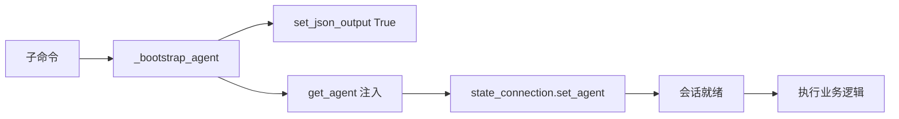
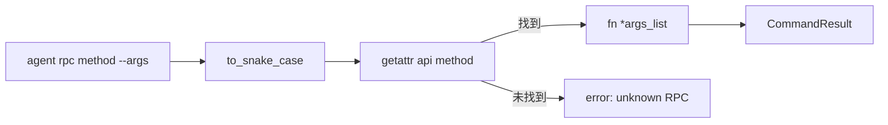
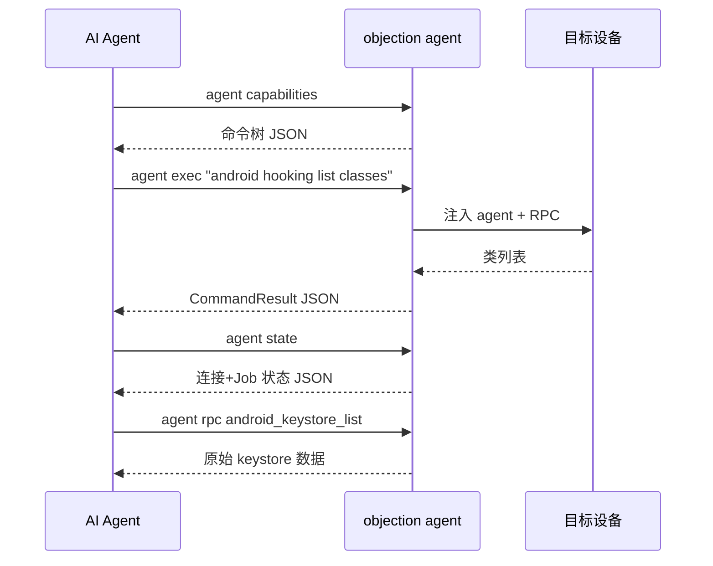

# 🤖 Agent CLI <code>console/agent_cli.py</code>

`agent_cli.py` 是 objection 为 **AI Agent 专门设计的 CLI 子命令组**——`objection agent ...`。它与面向人类的 `objection run` / REPL 形成对照：人类命令输出彩色文本，Agent 命令强制结构化 JSON，并提供能力自描述与状态查询，让 Agent 能"发现能力→执行→感知状态"地自主闭环。

## 📋 模块概览

| 项目 | 值 |
| --- | --- |
| 文件路径 | `objection/console/agent_cli.py` |
| 类型 | CLI 入口（Click 子命令组） |
| 入口命令 | `objection agent <subcommand>` |
| 被谁调用 | `objection/console/cli.py`（注册为 `cli` 的子组） |
| 依赖 | `state.app`、`state.connection`、`state.jobs`、`utils.output`、`utils.helpers`、`console.commands`、`console.repl` |

## 🎯 解决的问题

- 🔄 **JSON 进 / JSON 出**：AI Agent 用工具需要可解析的结构化输出，而非彩色人类文本。
- 🧭 **能力自发现**：Agent 不可能背下所有命令，`capabilities` 让它枚举可用命令与结构。
- 📊 **状态感知**：多步流程中 Agent 需知道"我连了什么设备、装了哪些 Job/Hook"。
- ⚡ **可直调 RPC**：`rpc` 子命令绕过人类命令层，直调底层 agent RPC 拿原始数据，省去文本解析。

## 🏗️ 子命令清单

| 子命令 | 函数 | 作用 |
| --- | --- | --- |
| `agent exec <command>` | `agent_exec()` | 执行一条 objection 命令，返回统一 JSON |
| `agent rpc <method> [--args]` | `agent_rpc()` | 直调 agent RPC 方法 |
| `agent state` | `agent_state()` | 输出当前会话状态 JSON |
| `agent capabilities` | `agent_capabilities()` | 枚举所有可用命令（不连设备） |

## ⚙️ 实现原理

### `_bootstrap_agent()` — 会话准备

源码：[`objection/console/agent_cli.py:30`](https://github.com/android-security-engineer/objection-skills/blob/master/objection/console/agent_cli.py#L30)

所有需要连接设备的子命令（`exec`/`rpc`/`state`）都先调用它：复用 `cli.get_agent` 拿到注入的 agent，并 **`set_json_output(True)`** 打开全局 JSON 输出开关。

```python
set_json_output(True)
agent = get_agent()
state_connection.set_agent(agent=agent)
return agent
```



### `agent_exec()` — 执行 objection 命令

源码：[`objection/console/agent_cli.py:65`](https://github.com/android-security-engineer/objection-skills/blob/master/objection/console/agent_cli.py#L65)

把 Agent 传入的命令字符串交给 `Repl().run_command()` 分派。因为已 `set_json_output(True)`，**已改造的命令走 JSON 路径，未改造的仍打印人类文本**——Agent 可据此判断哪些命令尚未 Agent 化。

```python
command_str = ' '.join(command)
repl = Repl()
repl.run_command(command_str)
```

失败时包装成 `CommandResult(status='error', exit_code=1)`，保证 Agent 拿到的永远是合法 JSON。

### `agent_rpc()` — 直调底层 RPC

源码：[`objection/console/agent_cli.py:113`](https://github.com/android-security-engineer/objection-skills/blob/master/objection/console/agent_cli.py#L113)

这是给 Agent 的"逃生舱"：当人类命令层不够用时，直接调 agent 的 `rpc.exports`。方法名用 `to_snake_case` 归一化（蛇形/驼峰均可），`--args` 是 JSON 数组作位置参数。

```python
api = state_connection.get_api()
method_name = to_snake_case(method)
fn = getattr(api, method_name, None)
if fn is None:
    raise AttributeError('unknown RPC method: {0}'.format(method_name))
result = fn(*args_list)
```



### `agent_state()` — 会话状态快照

源码：[`objection/console/agent_cli.py:178`](https://github.com/android-security-engineer/objection-skills/blob/master/objection/console/agent_cli.py#L178)

收集连接信息、PID、运行中的 Job 列表，供 Agent 感知"我现在连了什么、装了哪些 Hook/Job"：

```python
state = {
    'connection': { 'type', 'network', 'host', 'port', 'device_id', 'name', 'spawn', 'foremost' },
    'pid': ...,
    'jobs': [{ 'identifier', 'name' }, ...],
}
```

### `agent_capabilities()` — 能力枚举（不连设备）

源码：[`objection/console/agent_cli.py:230`](https://github.com/android-security-engineer/objection-skills/blob/master/objection/console/agent_cli.py#L230)

递归遍历 `COMMANDS` 注册表，输出扁平命令树。**不需要连接设备**——这是命令注册表的静态快照，是 Agent 自发现能力的入口。

### `_enumerate_capabilities()` — 递归遍历注册表

源码：[`objection/console/agent_cli.py:247`](https://github.com/android-security-engineer/objection-skills/blob/master/objection/console/agent_cli.py#L247)

递归 `COMMANDS` 字典，对每个节点输出 `{name, meta, has_exec, subcommands}`：

```python
for name, node in commands.items():
    full = '{0} {1}'.format(prefix, name).strip() if prefix else name
    has_exec = 'exec' in node and callable(node.get('exec'))
    entry = {'name': full, 'meta': meta, 'has_exec': has_exec}
    if sub_commands:
        entry['subcommands'] = _enumerate_capabilities(sub_commands, full)
```

## 🧠 典型 Agent 工作流



## 🔍 源码索引

| 符号 | 位置 |
| --- | --- |
| `_bootstrap_agent` | [`objection/console/agent_cli.py:30`](https://github.com/android-security-engineer/objection-skills/blob/master/objection/console/agent_cli.py#L30) |
| `agent` (group) | [`objection/console/agent_cli.py:48`](https://github.com/android-security-engineer/objection-skills/blob/master/objection/console/agent_cli.py#L48) |
| `agent_exec` | [`objection/console/agent_cli.py:65`](https://github.com/android-security-engineer/objection-skills/blob/master/objection/console/agent_cli.py#L65) |
| `agent_rpc` | [`objection/console/agent_cli.py:113`](https://github.com/android-security-engineer/objection-skills/blob/master/objection/console/agent_cli.py#L113) |
| `agent_state` | [`objection/console/agent_cli.py:178`](https://github.com/android-security-engineer/objection-skills/blob/master/objection/console/agent_cli.py#L178) |
| `agent_capabilities` | [`objection/console/agent_cli.py:230`](https://github.com/android-security-engineer/objection-skills/blob/master/objection/console/agent_cli.py#L230) |
| `_enumerate_capabilities` | [`objection/console/agent_cli.py:247`](https://github.com/android-security-engineer/objection-skills/blob/master/objection/console/agent_cli.py#L247) |

## 🔗 相关文档

- [面向 AI Agent 使用](/guide/agent-usage)
- [统一 JSON Schema](/guide/agent-schema)
- [HTTP API 端点](/guide/agent-http)
- [REPL 与命令](/guide/repl)
- [output 工具](/reference/utils/output)
