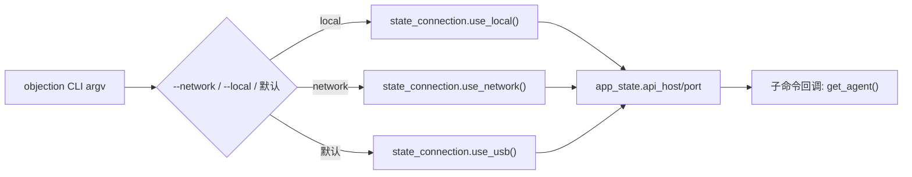
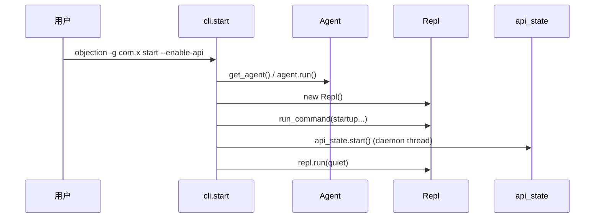

# objection CLI 入口 <code>objection/console/cli.py</code>

`cli.py` 是 objection 命令行工具的总入口，基于 [Click](https://click.palletsprojects.com/) 构建。它定义了顶层命令组 `cli`，把全局连接选项（`--network` / `--local` / `--host` / `--port` / `--name` / `--serial` 等）解析后写入 `state_connection` 与 `app_state`，并注册了 `api`、`start`、`explore`、`run`、`version`、`patchipa`、`patchapk`、`signapk` 以及面向 AI Agent 的 `agent` 子命令组。每个子命令在执行前都会调用 `get_agent()` 注入 Frida agent。

## 📋 模块概览

| 项目 | 值 |
| --- | --- |
| 文件路径 | `objection/console/cli.py` |
| 类型 | CLI 入口（Click command group） |
| 被谁调用 | `__main__`（`python -m objection`）、setup.py 注册的 `objection` 控制台脚本 |
| 依赖 | `click`、`frida`、`objection.utils.agent.Agent`、`objection.state.{connection,app,api}`、`objection.console.repl.Repl`、`objection.console.agent_cli.agent`、`objection.commands.mobile_packages`、`objection.commands.plugin_manager` |

## 🎯 解决的问题

- 统一解析连接参数（USB / 网络 / 本地模拟器），填充全局状态对象，避免每个子命令重复初始化。
- 提供"开箱即用"的子命令：交互式探索（`start`）、无头 API（`api`）、单命令执行（`run`）、版本（`version`）、APK/IPA 重打包与签名。
- 为 AI Agent 提供结构化 JSON 子命令组 `agent`（通过 `cli.add_command(agent_group)` 注册）。
- 兼容旧命令名 `explore`（已 deprecated，转发到 `start`）与旧参数 `--gadget`（转发到 `--name`）。

## 🏗️ 核心结构

### `cli` 顶层命令组 — 全局选项与状态初始化

源码：[`objection/console/cli.py:45-115`](https://github.com/android-security-engineer/objection-skills/blob/master/objection/console/cli.py#L45)

```python
@click.group()
@click.option('--network', '-N', is_flag=True, help='Connect using a network connection instead of USB.')
@click.option('--local', '-L', is_flag=True, help='Connect using a local connection (for iOS Simulator).')
@click.option('--host', '-h', default='127.0.0.1', show_default=True)
@click.option('--port', '-P', required=False, default=27042, show_default=True)
@click.option('--api-host', '-ah', default='127.0.0.1', show_default=True)
@click.option('--api-port', '-ap', required=False, default=8888, show_default=True)
@click.option('--name', '-n', required=False, help='Name or bundle identifier to attach to.')
@click.option('--gadget', '-g', is_eager=True, hidden=True, deprecated="Please use '-n' or '--name' instead")
@click.option('--serial', '-S', required=False, default=None, help='A device serial to connect to.')
@click.option('--debug', '-d', required=False, default=False, is_flag=True, help='Enable debug mode with verbose output.')
@click.option('--spawn', '-s', required=False, is_flag=True, help='Spawn the target.')
@click.option('--no-pause', '-p', required=False, is_flag=True, help='Resume the target immediately.')
@click.option('--foremost', '-f', required=False, is_flag=True, help='Use the current foremost application.')
@click.option('--debugger', required=False, default=False, is_flag=True, help='Enable the Chrome debug port.')
@click.option('--uid', required=False, default=None, help='Specify the uid to run as (Android only).')
def cli(network, local, host, port, api_host, api_port, name, gadget, serial, debug, spawn, no_pause, foremost, debugger, uid):
    ...
```

回调体把连接模式写入 `state_connection`（`use_local` / `use_network` / `use_usb`），并把 API 主机端口写入 `app_state`。`--network` 与 `--local` 互斥（`cli.py:83-84` 抛 `click.UsageError`）。



### `get_agent()` — 注入并启动 Frida agent

源码：[`objection/console/cli.py:20-41`](https://github.com/android-security-engineer/objection-skills/blob/master/objection/console/cli.py#L20)

用 `state_connection` 中的字段构造 `AgentConfig`，创建 `Agent` 并 `agent.run()`。若 Frida server/gadget 未运行，捕获 `frida.ServerNotRunningError` 红字提示后 `exit(1)`。

```python
def get_agent() -> Agent:
    agent = Agent(AgentConfig(
        name=state_connection.name,
        host=state_connection.host,
        port=state_connection.port,
        device_type=state_connection.device_type,
        device_id=state_connection.device_id,
        spawn=state_connection.spawn,
        foremost=state_connection.foremost,
        debugger=state_connection.debugger,
        pause=not state_connection.no_pause,
        uid=state_connection.uid
    ))
    try:
        agent.run()
    except ServerNotRunningError:
        click.secho('Frida server or gadget is not running on the target!', fg='red')
        exit(1)
    return agent
```

### 顶层 `@cli.command()` 子命令一览

下表列出 `cli.py` 中通过 `@cli.command()` / `cli.add_command()` 注册的全部顶层命令（命令名即源码函数名或显式 name）：

| 命令 | 源码位置 | 作用 |
| --- | --- | --- |
| `api` | `cli.py:118-128` | 无头模式启动 objection HTTP API 服务器（`api_state.start`） |
| `start` | `cli.py:131-204` | 注入 agent、加载插件、运行 startup 脚本/命令、可选启动 API、最后进入 `Repl().run()` |
| `explore` | `cli.py:207-232` | 旧名（hidden + deprecated），通过 `ctx.invoke(start, ...)` 转发 |
| `run` | `cli.py:234-257` | 执行单条 objection 命令（`Repl().run_command`），支持 `--hook-debug` |
| `version` | `cli.py:260-266` | 打印 `__version__` 并退出 |
| `patchipa` | `cli.py:273-301` | 用 FridaGadget dylib 重打包 IPA，转调 `patch_ios_ipa` |
| `patchapk` | `cli.py:304-362` | 用 frida-gadget.so 重打包 APK，转调 `patch_android_apk` |
| `signapk` | `cli.py:365-374` | zipalign + 用 objection 密钥签名 APK，转调 `sign_android_apk` |
| `agent` | `cli.py:270`（`cli.add_command(agent_group)`） | 面向 AI Agent 的子命令组（强制 JSON），定义于 `agent_cli.py` |

> `explore` 标记了 `deprecated="Use 'objection start' instead of 'objection explore'"` 与 `hidden=True`，仅为向后兼容保留。

### `start` 命令 — 完整会话编排

源码：[`objection/console/cli.py:131-204`](https://github.com/android-security-engineer/objection-skills/blob/master/objection/console/cli.py#L131)

选项：`--plugin-folder/-P`、`--quiet/-q`、`--startup-command/-s`（可多次）、`--file-commands/-c`（文件）、`--startup-script/-S`（文件）、`--enable-api/-a`。

执行顺序：

1. `get_agent()` + `state_connection.set_agent(agent)`（`cli.py:149-150`）
2. 遍历 `--plugin-folder` 下子目录，调用 `load_plugin([p])`（`cli.py:153-162`）
3. 若有 `--startup-script`，`agent.attach_script(...)`（`cli.py:166-169`）
4. 依次运行 `--startup-command` 与 `--file-commands` 中的命令（`cli.py:171-186`）
5. `warn_about_older_operating_systems()`（`cli.py:188`）
6. 若 `--enable-api`，在守护线程中 `api_state.start(...)`，`time.sleep(2)` 等就绪（`cli.py:191-201`）
7. `repl.run(quiet=quiet)` 进入交互循环（`cli.py:204`）



### `run` 命令 — 单命令执行

源码：[`objection/console/cli.py:234-257`](https://github.com/android-security-engineer/objection-skills/blob/master/objection/console/cli.py#L234)

接受可变参数 `command`，join 后交给 `Repl().run_command`。`--hook-debug/-d` 把 `app_state.debug_hooks` 置位，使编译后的 hook 同时打印到屏幕与日志。

### 重打包命令 `patchipa` / `patchapk` / `signapk`

源码：`cli.py:273-374`

- `patchipa`：签名身份、mobileprovision、gadget 版本/配置、script-source 等选项，转调 `patch_ios_ipa(**locals())`。
- `patchapk`：架构、`--network-security-config` / `--skip-resources` / `--ignore-nativelibs` 之间存在互斥校验（`cli.py:348-360`），转调 `patch_android_apk(**locals())`。
- `signapk`：对每个来源 APK 调用 `sign_android_apk(source, skip_cleanup)`。

## ⚙️ 实现要点

- **全局状态集中化**：连接与 API 参数不进子命令签名，而是写入 `state_connection` / `app_state`，`get_agent()` 读取这些全局态构造 agent。这使得新增子命令时无需重复连接逻辑。
- **Agent 友好性**：`agent` 子命令组以 `cli.add_command(agent_group)` 方式挂载（`cli.py:270`），与人类命令共享同一套连接初始化；Agent 可用 `objection -g com.x agent exec '...'` / `agent rpc ...` / `agent state` / `agent capabilities` 获得结构化输出（详见 [agent_cli.md](./agent_cli.md)）。
- **向后兼容**：`--gadget` 用 `is_eager=True` + `deprecated` 标记，回填到 `name`（`cli.py:107-108`）；`explore` 隐藏并转发 `start`（`cli.py:225-232`）。
- **插件加载**：`--plugin-folder` 跳过文件与 `.` 开头目录（`cli.py:157`），仅对子目录调 `load_plugin`。
- **API 守护线程**：`start --enable-api` 时 Flask 跑在 daemon 线程，`time.sleep(2)` 给启动留缓冲；而 `api` 子命令是阻塞式无头运行。

## 🔍 源码索引

| 符号 | 位置 |
| --- | --- |
| `get_agent()` | [`objection/console/cli.py:20`](https://github.com/android-security-engineer/objection-skills/blob/master/objection/console/cli.py#L20) |
| `cli`（command group） | [`objection/console/cli.py:45`](https://github.com/android-security-engineer/objection-skills/blob/master/objection/console/cli.py#L45) |
| `api` 命令 | [`objection/console/cli.py:118`](https://github.com/android-security-engineer/objection-skills/blob/master/objection/console/cli.py#L118) |
| `start` 命令 | [`objection/console/cli.py:131`](https://github.com/android-security-engineer/objection-skills/blob/master/objection/console/cli.py#L131) |
| `explore` 命令 | [`objection/console/cli.py:207`](https://github.com/android-security-engineer/objection-skills/blob/master/objection/console/cli.py#L207) |
| `run` 命令 | [`objection/console/cli.py:234`](https://github.com/android-security-engineer/objection-skills/blob/master/objection/console/cli.py#L234) |
| `version` 命令 | [`objection/console/cli.py:260`](https://github.com/android-security-engineer/objection-skills/blob/master/objection/console/cli.py#L260) |
| `cli.add_command(agent_group)` | [`objection/console/cli.py:270`](https://github.com/android-security-engineer/objection-skills/blob/master/objection/console/cli.py#L270) |
| `patchipa` 命令 | [`objection/console/cli.py:273`](https://github.com/android-security-engineer/objection-skills/blob/master/objection/console/cli.py#L273) |
| `patchapk` 命令 | [`objection/console/cli.py:304`](https://github.com/android-security-engineer/objection-skills/blob/master/objection/console/cli.py#L304) |
| `signapk` 命令 | [`objection/console/cli.py:365`](https://github.com/android-security-engineer/objection-skills/blob/master/objection/console/cli.py#L365) |
| `__main__` 入口 | [`objection/console/cli.py:377`](https://github.com/android-security-engineer/objection-skills/blob/master/objection/console/cli.py#L377) |

## 🔗 相关文档

- [整体架构](/guide/architecture)
- [REPL 与命令](/guide/repl)
- [快速上手](/guide/quickstart)
- [Agent CLI 子命令组](./agent_cli)
