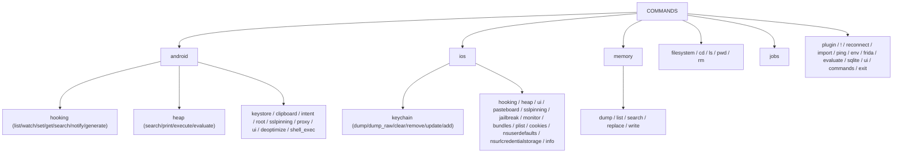
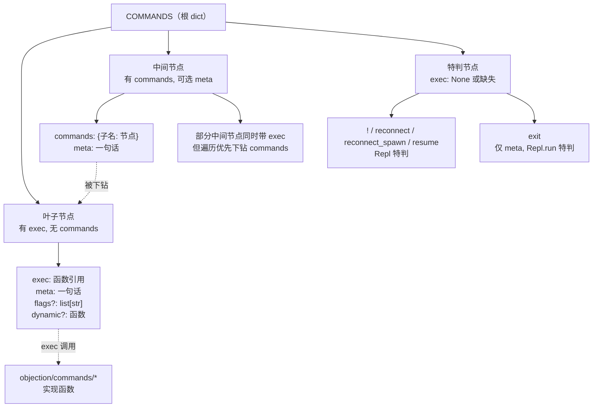
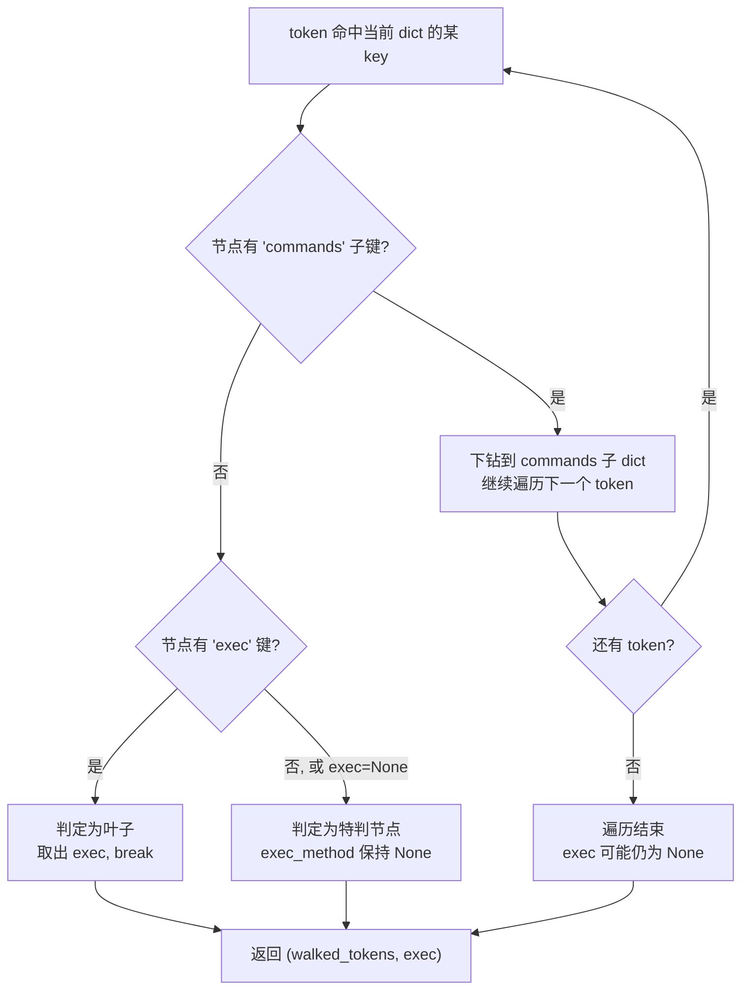

# REPL 命令注册表 <code>objection/console/commands.py</code>

`commands.py` 定义了 objection REPL 的**命令注册表** `COMMANDS`——一个嵌套字典，把命令名映射到 `meta`（一句话说明）、`exec`（执行函数）、`dynamic`（动态补全函数）、`flags`（可补全的 flag）、`commands`（子命令）等元信息。`Repl` 在执行命令、`CommandCompleter` 在补全时都遍历这棵树。它是 objection 所有人类命令的单一事实来源。

## 📋 模块概览

| 项目 | 值 |
| --- | --- |
| 文件路径 | `objection/console/commands.py` |
| 类型 | 静态注册表（Python dict 字面量） |
| 被谁调用 | `Repl._find_command_exec_method` / `Repl._find_command_help`、`CommandCompleter.find_completions`、`agent_cli._enumerate_capabilities`、`agent_endpoints.capabilities` |
| 依赖 | `objection.commands.*`（各命令实现模块）与 `objection.commands.android.*` / `objection.commands.ios.*` |

## 🎯 解决的问题

- 把"命令字符串 → 可调用 Python 函数"的映射集中在一处，避免散落各模块。
- 用嵌套 `commands` 表达多级子命令（如 `android hooking list classes`），无需手写解析器。
- 同时承载补全元数据（`dynamic`、`flags`）与帮助文本指针（帮助文本存于 `helpfiles/*.txt`）。
- 让 Agent 能通过 `agent capabilities` / `GET /capabilities` 拿到完整能力清单。

## 🏗️ 核心结构

### 节点 schema — 每个命令节点的字段

源码注释：[`objection/console/commands.py:38-45`](https://github.com/android-security-engineer/objection-skills/blob/master/objection/console/commands.py#L38)

```
# meta: A small one-liner containing information about the command itself
# dynamic: A method to execute that would return completions to populate in the prompt
# exec: The *actual* method to execute when the command is issued.
# commands help is stored in the help files directory as a txt file.
```

典型叶子节点（`commands.py:84-87`）：

```python
'ping': {
    'meta': 'Ping the injected agent',
    'exec': frida_commands.ping
},
```

带子命令的中间节点（`commands.py:263-276`）：

```python
'jobs': {
    'meta': 'Work with objection jobs',
    'commands': {
        'list': {'meta': 'List all of the current jobs', 'exec': jobs.show},
        'kill': {'meta': 'Kill a job. This unloads the script',
                  'dynamic': jobs.list_current_jobs, 'exec': jobs.kill}
    }
},
```

带 flag 的节点（`commands.py:227-231`）：

```python
'search': {
    'meta': 'Search for pattern in the applications memory',
    'flags': ['--string', '--offsets-only'],
    'exec': memory.find_pattern
},
```

### `COMMANDS` 顶层命令分组

| 顶层 key | 源码位置 | 说明 |
| --- | --- | --- |
| `plugin` | `commands.py:49-57` | 插件加载 |
| `!` | `commands.py:59-62` | 执行 OS 命令（`exec: None`，由 `Repl.run_command` 特判） |
| `reconnect` / `reconnect_spawn` / `resume` | `commands.py:64-77` | 重连/重 spawn/恢复（`exec: None`，由 `Repl` 特判） |
| `import` | `commands.py:79-82` | 导入并运行 fridascript |
| `ping` | `commands.py:84-87` | ping 注入的 agent |
| `cd` / `ls` / `pwd` / `rm` | `commands.py:91-124,167-171` | 文件系统导航 |
| `commands` | `commands.py:97-113` | 命令历史（`history` / `save` / `clear`） |
| `filesystem` | `commands.py:126-165` | `cat` / `upload` / `download`（含被注释掉的 `http` 子组） |
| `env` / `frida` / `evaluate` | `commands.py:175-188` | 环境信息、Frida 信息、JS 求值 |
| `memory` | `commands.py:192-245` | 内存 `dump` / `list` / `search` / `replace` / `write` |
| `sqlite` | `commands.py:249-259` | SQLite `connect` |
| `jobs` | `commands.py:263-276` | Job `list` / `kill` |
| `ui` | `commands.py:280-288` | 通用 UI（`alert`） |
| `android` | `commands.py:292-518` | Android 全部子命令 |
| `ios` | `commands.py:520-772` | iOS 全部子命令 |
| `exit` | `commands.py:774-776` | 退出（无 `exec`，`Repl.run` 特判） |

### Android 子命令树（`commands.py:292-518`）

`android` 节点下的二级命令：

| 二级 key | exec 来源 | 说明 |
| --- | --- | --- |
| `deoptimize` | `general.deoptimise` | 强制 VM 解释执行 |
| `shell_exec` | `command.execute` | 执行 shell 命令 |
| `hooking` | `android_hooking.*` | `list` / `watch` / `set` / `get` / `search` / `notify` / `generate` |
| `heap` | `android_heap.*` | `search` / `print` / `execute` / `evaluate` |
| `keystore` | `keystore.*` | `list` / `detail` / `clear` / `watch` |
| `clipboard` | `clipboard.monitor` | 剪贴板监控 |
| `intent` | `intents.*` | `launch_activity` / `launch_service` / `implicit_intents` |
| `root` | `root.*` | `disable` / `simulate` |
| `sslpinning` | `android_pinning.android_disable` | 禁用 SSL pinning |
| `proxy` | `android_proxy.android_proxy_set` | 设置代理 |
| `ui` | `ui.*` | `screenshot` / `FLAG_SECURE` |

### iOS 子命令树（`commands.py:520-772`）

`ios` 节点下的二级命令：

| 二级 key | exec 来源 | 说明 |
| --- | --- | --- |
| `info` | `binary.info` | 二进制/dylib 信息 |
| `keychain` | `keychain.*` | `dump` / `dump_raw` / `clear` / `remove` / `update` / `add` |
| `plist` | `plist.cat` | 读取 plist |
| `bundles` | `bundles.*` | `list_frameworks` / `list_bundles` |
| `nsuserdefaults` | `nsuserdefaults.get` | NSUserDefaults |
| `nsurlcredentialstorage` | `nsurlcredentialstorage.dump` | 凭证存储 |
| `cookies` | `cookies.get` | 共享 cookie |
| `ui` | `ui.*` | `alert` / `dump` / `screenshot` / `biometrics_bypass` |
| `heap` | `ios_heap.*` | `print` / `search` / `execute` / `evaluate` |
| `hooking` | `ios_hooking.*` | `list` / `watch` / `set` / `search` / `generate` |
| `pasteboard` | `pasteboard.monitor` | 剪贴板监控 |
| `sslpinning` | `ios_pinning.ios_disable` | 禁用 SSL pinning |
| `jailbreak` | `jailbreak.*` | `disable` / `simulate` |
| `monitor` | `ios_crypto.crypto_enable` | CommonCrypto 监控 |



### `dynamic` 与 `flags` — 补全元数据

`dynamic` 指向一个返回补全候选的函数，常用于文件系统类命令（按当前目录内容补全）：

```python
'cd': {
    'meta': 'Change the current working directory',
    'dynamic': filemanager.list_folders_in_current_fm_directory,
    'exec': filemanager.cd
},
```

`flags` 列出可补全的 `--flag`，`CommandCompleter` 会排除已输入的 flag：

```python
'search': {
    'meta': 'Search for pattern in the applications memory',
    'flags': ['--string', '--offsets-only'],
    'exec': memory.find_pattern
},
```

## ⚙️ 实现要点

- **特判节点**：`!`、`reconnect`、`reconnect_spawn`、`resume`、`exit` 的 `exec` 为 `None` 或缺失，由 `Repl` 在主循环 / `run_command` 中特判处理（见 [repl.md](./repl.md)）。
- **帮助文本外置**：注册表只存命令名，帮助文本存于 `objection/console/helpfiles/*.txt`，文件名由命令 token 用 `.` 连接（`repl.py:267-268`）。
- **被注释的 `http` 子组**：`filesystem.http` 整段被注释（`commands.py:147-163`），保留为待启用功能。
- **Agent 可发现性**：`_enumerate_capabilities`（`agent_cli.py:247`）递归遍历 `COMMANDS`，输出扁平 `{name, meta, has_exec, subcommands}` 列表，供 `agent capabilities` 与 `GET /capabilities` 暴露给 AI Agent。
- **平铺优于继承**：注册表是纯数据字典，命令实现函数集中在 `objection/commands/` 下，二者解耦——补全、执行、帮助各自遍历同一棵树。

## 🔍 源码索引

| 符号 | 位置 |
| --- | --- |
| 模块 import 块 | [`objection/console/commands.py:1-36`](https://github.com/android-security-engineer/objection-skills/blob/master/objection/console/commands.py#L1) |
| schema 注释 | [`objection/console/commands.py:38-45`](https://github.com/android-security-engineer/objection-skills/blob/master/objection/console/commands.py#L38) |
| `COMMANDS` 字典起始 | [`objection/console/commands.py:47`](https://github.com/android-security-engineer/objection-skills/blob/master/objection/console/commands.py#L47) |
| `plugin` / `!` / `reconnect` / `resume` / `import` / `ping` | [`objection/console/commands.py:49-87`](https://github.com/android-security-engineer/objection-skills/blob/master/objection/console/commands.py#L49) |
| 文件系统命令 `cd`/`ls`/`pwd`/`rm`/`filesystem` | [`objection/console/commands.py:91-171`](https://github.com/android-security-engineer/objection-skills/blob/master/objection/console/commands.py#L91) |
| `env`/`frida`/`evaluate` | [`objection/console/commands.py:175-188`](https://github.com/android-security-engineer/objection-skills/blob/master/objection/console/commands.py#L175) |
| `memory` | [`objection/console/commands.py:192-245`](https://github.com/android-security-engineer/objection-skills/blob/master/objection/console/commands.py#L192) |
| `sqlite` / `jobs` / `ui` | [`objection/console/commands.py:249-288`](https://github.com/android-security-engineer/objection-skills/blob/master/objection/console/commands.py#L249) |
| `android` 子树 | [`objection/console/commands.py:292-518`](https://github.com/android-security-engineer/objection-skills/blob/master/objection/console/commands.py#L292) |
| `ios` 子树 | [`objection/console/commands.py:520-772`](https://github.com/android-security-engineer/objection-skills/blob/master/objection/console/commands.py#L520) |
| `exit` | [`objection/console/commands.py:774-776`](https://github.com/android-security-engineer/objection-skills/blob/master/objection/console/commands.py#L774) |

## 🌳 COMMANDS 字典树形结构

`COMMANDS` 是一棵深嵌套字典树。下图刻画节点类型与字段组合，以及"中间节点 vs 叶子节点"的区分规则。



节点字段语义与必选/可选关系：

| 字段 | 适用节点 | 必选? | 含义 |
| --- | --- | --- | --- |
| `meta` | 所有 | 推荐 | 一句话说明，用于补全菜单与 `agent capabilities` |
| `exec` | 叶子 | 是（除特判） | 命令执行函数，签名为 `(arguments: list) -> None` |
| `commands` | 中间 | 是 | 子命令字典，键为子命令名 |
| `dynamic` | 叶子 | 否 | 返回补全候选词列表的函数（如按当前目录列出文件夹） |
| `flags` | 叶子 | 否 | 可补全的 `--flag` 列表，`CommandCompleter` 会排除已输入项 |

## 🎯 节点类型判定决策流

`Repl._find_command_exec_method` 与 `CommandCompleter.find_completions` 都需要判定"当前 token 命中的节点是哪一类"。下图刻画该判定流程。



关键判定规则（基于 [`repl.py:214-221`](https://github.com/android-security-engineer/objection-skills/blob/master/objection/console/repl.py#L214)）：

- **`commands` 优先于 `exec`**：若节点同时含两者，遍历会下钻 `commands` 而忽略 `exec`。实际注册表中 `android`、`ios`、`memory`、`jobs` 等中间节点都只有 `commands`，无 `exec`，所以不会出现歧义；但 schema 层面并不禁止二者并存。
- **`exec: None` 等价于无 `exec`**：`!`、`reconnect`、`reconnect_spawn`、`resume` 显式写 `exec: None`（[`commands.py:59-77`](https://github.com/android-security-engineer/objection-skills/blob/master/objection/console/commands.py#L59)），`exit` 干脆不写 `exec`（[`commands.py:774`](https://github.com/android-security-engineer/objection-skills/blob/master/objection/console/commands.py#L774)）。两者在遍历时都被视为"无 exec"，由 `Repl` 特判。
- **补全器视角不同**：`CommandCompleter` 遇到 `commands` 子键会列出子命令名作为候选；遇到 `flags` 会列出未输入的 flag；遇到 `dynamic` 会调用该函数取候选。三类候选在 `find_completions` 中分别处理。

## 📐 注册表内存布局（ASCII 框图）

下图用一个具体命令 `android hooking list classes` 的注册路径，展示字典嵌套的内存结构与遍历指针移动。

```
COMMANDS (dict)
│
├── "plugin"      : {meta, commands:{...}}
├── "!"           : {meta, exec:None}        ← 特判
├── "reconnect"   : {meta, exec:None}        ← 特判
├── "ping"        : {meta, exec:frida_commands.ping}
│
├── "android"     : {meta, commands:{                ← 中间节点, 下钻
│       │
│       ├── "deoptimize": {meta, exec:general.deoptimise}
│       │
│       ├── "hooking"  : {meta, commands:{           ← 中间节点, 下钻
│       │       │
│       │       ├── "list": {meta, commands:{        ← 中间节点, 下钻
│       │       │       │
│       │       │       ├── "classes": {
│       │       │       │     meta:'List the currently loaded classes',
│       │       │       │     exec: android_hooking.show_android_classes  ← 叶子
│       │       │       │ }
│       │       │       ├── "class_methods": {meta, exec:...}
│       │       │       ├── "activities":    {meta, exec:...}
│       │       │       └── ... (receivers/services/class_loaders)
│       │       │ }
│       │       ├── "watch": {meta, exec:..., flags:[--dump-args,...]}
│       │       ├── "set":  {meta, commands:{ return_value:{...} }}
│       │       └── ... (get/search/notify/generate)
│       │ }
│       ├── "heap":     {meta, commands:{ search/print/execute/evaluate }}
│       ├── "keystore": {meta, commands:{ list/detail/clear/watch }}
│       └── ... (clipboard/intent/root/sslpinning/proxy/ui)
│   }}
│
├── "ios":   {meta, commands:{...}}   ← 与 android 同构
├── "memory":{meta, commands:{ dump/list/search/replace/write }}
└── "exit":  {meta}                   ← 无 exec, 特判

遍历指针移动（输入 "android hooking list classes"）:
  dict_to_walk = COMMANDS
  token="android"  → 命中, 有 commands → 下钻
  dict_to_walk = COMMANDS["android"]["commands"]
  token="hooking" → 命中, 有 commands → 下钻
  dict_to_walk = ...["hooking"]["commands"]
  token="list"    → 命中, 有 commands → 下钻
  dict_to_walk = ...["list"]["commands"]
  token="classes" → 命中, 无 commands, 有 exec → 取 exec, break
  walked_tokens=4, exec_method=show_android_classes
  arguments = tokens[4:] = []   ← 无额外参数
```

## 🔗 相关文档

- [整体架构](/guide/architecture)
- [REPL 与命令](/guide/repl)
