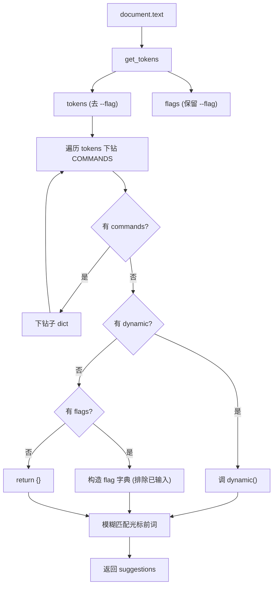

# 命令补全器 <code>objection/console/completer.py</code>

`completer.py` 实现 objection REPL 的 Tab 补全 `CommandCompleter`，继承自 `prompt_toolkit.completion.Completer`。它根据当前输入文本切出 token，遍历 `COMMANDS` 注册表下钻到最深匹配的子树，再结合 `dynamic`（动态补全函数）与 `flags`（可补全 flag）返回候选。`Repl` 用 `FuzzyCompleter(CommandCompleter())` 包一层以支持模糊匹配。

## 📋 模块概览

| 项目 | 值 |
| --- | --- |
| 文件路径 | `objection/console/completer.py` |
| 类型 | prompt_toolkit Completer |
| 被谁调用 | `Repl.__init__`（`FuzzyCompleter(CommandCompleter())`，`repl.py:31`） |
| 依赖 | `prompt_toolkit.completion`、`commands.COMMANDS`、`utils.helpers.get_tokens`、`collections` |

## 🎯 解决的问题

- 根据已输入的命令前缀，动态生成下一级子命令候选。
- 支持文件系统类命令的运行时补全（`dynamic` 按当前设备目录内容返回）。
- 把 `--flag` 也纳入补全，并自动排除已输入的 flag，避免重复建议。
- 对 `!` 开头的 OS 命令直接放弃补全（交给 shell）。

## 🏗️ 核心结构

### `CommandCompleter.__init__` — 持有注册表引用

源码：`objection/console/completer.py:15-17`

```python
def __init__(self) -> None:
    super(CommandCompleter, self).__init__()
    self.COMMANDS = COMMANDS
```

### `find_completions(document)` — 下钻命令树

源码：`objection/console/completer.py:19-97`

算法：

1. 用 `get_tokens(document.text)` 切词，分出 `tokens`（去掉 `--flag`）与 `flags`（保留 `--flag`）（`completer.py:43-48`）。
2. `current_suggestions = self.COMMANDS`，对每个 token 小写后查匹配：
   - 有 `commands` 子键 → 下钻（`completer.py:66-67`）。
   - 有 `dynamic` → 调用该函数拿动态候选（`completer.py:71-72`）。
   - 有 `flags` → 构造 `{flag: ''}` 字典，排除已输入 flag（`completer.py:75-78`）。
   - 否则返回 `{}`（无更深建议，`completer.py:82-83`）。
3. 对最终 `current_suggestions` 做模糊匹配：保留 `document.get_word_before_cursor().lower() in k.lower()` 的 key（`completer.py:90-96`）。



### `get_completions(document, complete_event)` — prompt_toolkit 钩子

源码：`objection/console/completer.py:99-132`

```python
def get_completions(self, document: Document, complete_event: CompleteEvent) -> Completion:
    word_before_cursor = document.get_word_before_cursor()
    if document.text.startswith('!'):
        return
    commands = self.find_completions(document)
    if len(commands) <= 0:
        return
    commands = collections.OrderedDict(sorted(list(commands.items()), key=lambda t: t[0]))
    for cmd, extra in commands.items():
        meta = extra['meta'] if type(extra) is dict and 'meta' in extra else None
        yield Completion(cmd, -(len(word_before_cursor)), display_meta=meta)
```

要点：

- `!` 前缀直接 `return`（不补全 OS 命令，`completer.py:113-114`）。
- 候选按字母序排序（`OrderedDict(sorted(...))`，`completer.py:123`）。
- 每个 `Completion` 带上注册表里的 `meta` 一句话说明作为 `display_meta`，补全菜单里同时显示命令名与说明。
- `-(len(word_before_cursor))` 是光标处替换起点，让 prompt_toolkit 知道从哪里替换。

## ⚙️ 实现要点

- **数据驱动**：补全器不硬编码任何命令，全部从 `COMMANDS` 的 `commands`/`dynamic`/`flags` 字段推导，新增命令自动获得补全。
- **flag 去重**：`flags` 列表会过滤掉已在输入行中出现的 `--flag`，避免重复建议（`completer.py:76-78`）。
- **大小写不敏感**：匹配时统一 `.lower()`（`completer.py:61,94`），但返回的候选保留注册表里的原始大小写。
- **与帮助系统一致**：补全下钻逻辑与 `Repl._find_command_exec_method` / `_find_command_help` 同构，三者都"走命令树"，保证补全建议与可执行命令一致。
- **模糊层外包**：本类只做精确前缀子串匹配，模糊容错由 `Repl` 外层的 `FuzzyCompleter` 提供（`repl.py:31`）。

## 🔍 源码索引

| 符号 | 位置 |
| --- | --- |
| `CommandCompleter` 类 | `objection/console/completer.py:10` |
| `__init__` | `objection/console/completer.py:15` |
| `find_completions` | `objection/console/completer.py:19` |
| `get_completions` | `objection/console/completer.py:99` |

## 🔗 相关文档

- [整体架构](/guide/architecture)
- [REPL 与命令](/guide/repl)
