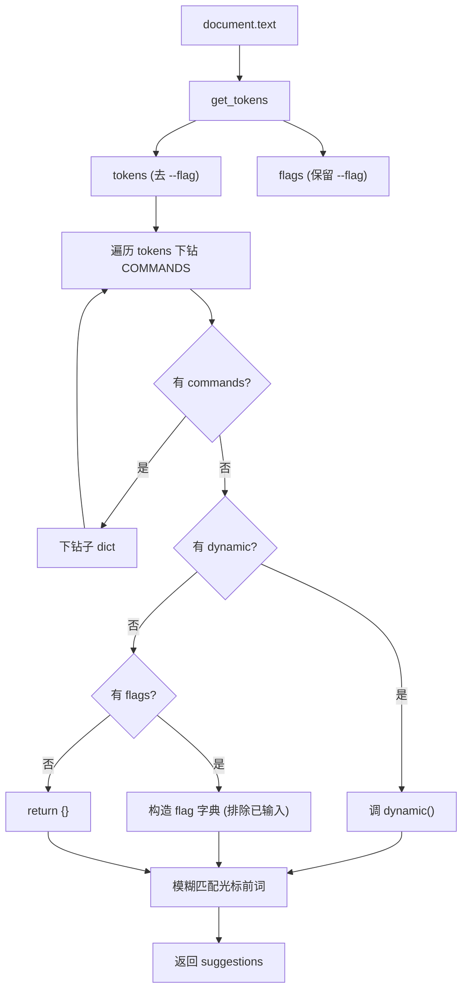
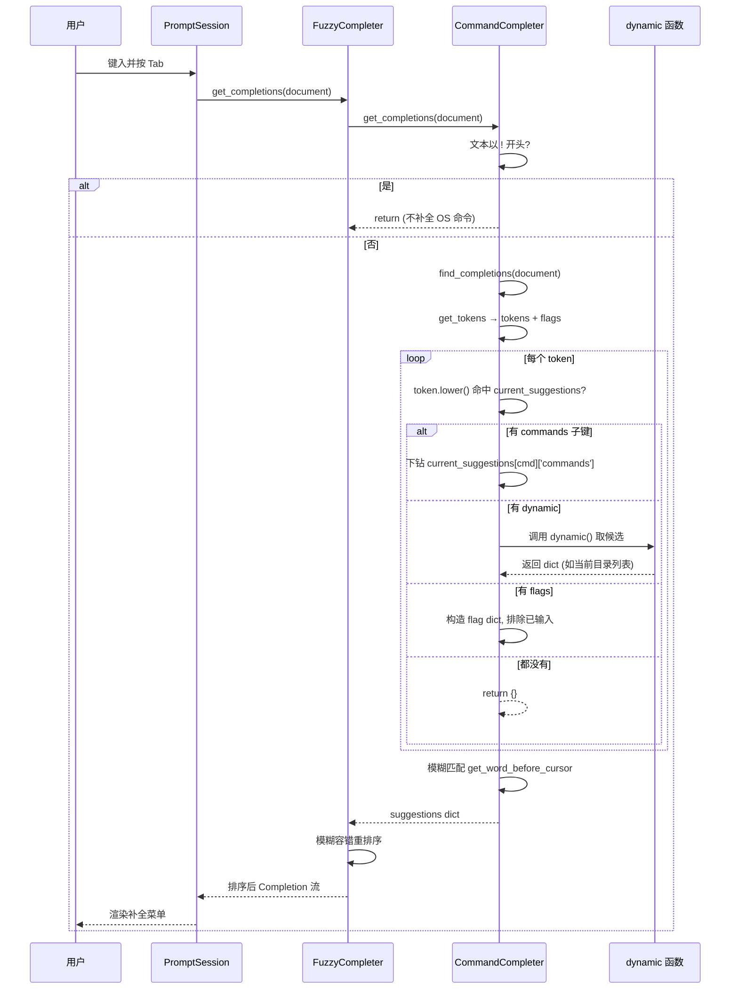
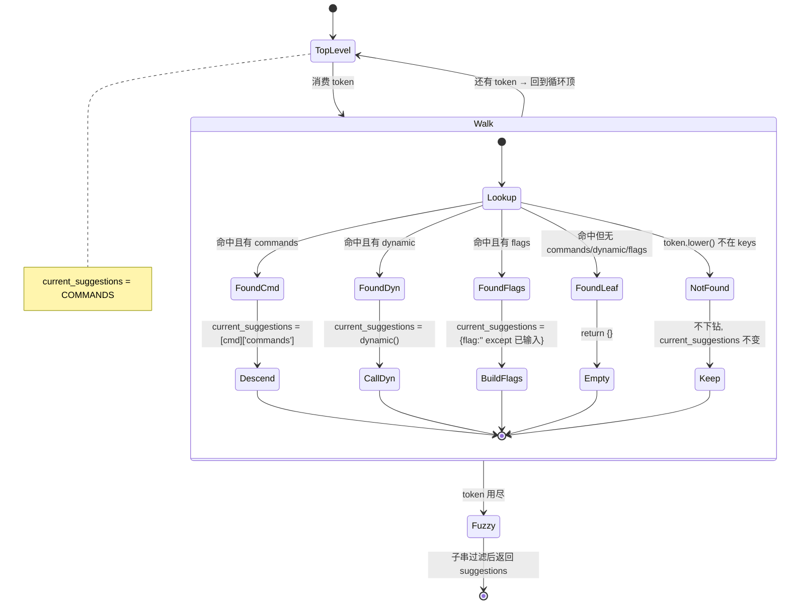

# 命令补全器 <code>objection/console/completer.py</code>

`completer.py` 实现 objection REPL 的 Tab 补全 `CommandCompleter`，继承自 `prompt_toolkit.completion.Completer`。它根据当前输入文本切出 token，遍历 `COMMANDS` 注册表下钻到最深匹配的子树，再结合 `dynamic`（动态补全函数）与 `flags`（可补全 flag）返回候选。`Repl` 用 `FuzzyCompleter(CommandCompleter())` 包一层以支持模糊匹配。

## 📋 模块概览

| 项目 | 值 |
| --- | --- |
| 文件路径 | `objection/console/completer.py` |
| 类型 | prompt_toolkit Completer |
| 被谁调用 | `Repl.__init__`（`FuzzyCompleter(CommandCompleter())`，`repl.py:31`） |
| 依赖 | `prompt_toolkit.completion`、`commands.COMMANDS`、`utils.helpers.get_tokens`、`collections` |

## 🎯 解决的问题

- 根据已输入的命令前缀，动态生成下一级子命令候选。
- 支持文件系统类命令的运行时补全（`dynamic` 按当前设备目录内容返回）。
- 把 `--flag` 也纳入补全，并自动排除已输入的 flag，避免重复建议。
- 对 `!` 开头的 OS 命令直接放弃补全（交给 shell）。

## 🏗️ 核心结构

### `CommandCompleter.__init__` — 持有注册表引用

源码：[`objection/console/completer.py:15-17`](https://github.com/android-security-engineer/objection-skills/blob/master/objection/console/completer.py#L15)

```python
def __init__(self) -> None:
    super(CommandCompleter, self).__init__()
    self.COMMANDS = COMMANDS
```

### `find_completions(document)` — 下钻命令树

源码：[`objection/console/completer.py:19-97`](https://github.com/android-security-engineer/objection-skills/blob/master/objection/console/completer.py#L19)

算法：

1. 用 `get_tokens(document.text)` 切词，分出 `tokens`（去掉 `--flag`）与 `flags`（保留 `--flag`）（`completer.py:43-48`）。
2. `current_suggestions = self.COMMANDS`，对每个 token 小写后查匹配：
   - 有 `commands` 子键 → 下钻（`completer.py:66-67`）。
   - 有 `dynamic` → 调用该函数拿动态候选（`completer.py:71-72`）。
   - 有 `flags` → 构造 `{flag: ''}` 字典，排除已输入 flag（`completer.py:75-78`）。
   - 否则返回 `{}`（无更深建议，`completer.py:82-83`）。
3. 对最终 `current_suggestions` 做模糊匹配：保留 `document.get_word_before_cursor().lower() in k.lower()` 的 key（`completer.py:90-96`）。



### `get_completions(document, complete_event)` — prompt_toolkit 钩子

源码：[`objection/console/completer.py:99-132`](https://github.com/android-security-engineer/objection-skills/blob/master/objection/console/completer.py#L99)

```python
def get_completions(self, document: Document, complete_event: CompleteEvent) -> Completion:
    word_before_cursor = document.get_word_before_cursor()
    if document.text.startswith('!'):
        return
    commands = self.find_completions(document)
    if len(commands) <= 0:
        return
    commands = collections.OrderedDict(sorted(list(commands.items()), key=lambda t: t[0]))
    for cmd, extra in commands.items():
        meta = extra['meta'] if type(extra) is dict and 'meta' in extra else None
        yield Completion(cmd, -(len(word_before_cursor)), display_meta=meta)
```

要点：

- `!` 前缀直接 `return`（不补全 OS 命令，`completer.py:113-114`）。
- 候选按字母序排序（`OrderedDict(sorted(...))`，`completer.py:123`）。
- 每个 `Completion` 带上注册表里的 `meta` 一句话说明作为 `display_meta`，补全菜单里同时显示命令名与说明。
- `-(len(word_before_cursor))` 是光标处替换起点，让 prompt_toolkit 知道从哪里替换。

## ⚙️ 实现要点

- **数据驱动**：补全器不硬编码任何命令，全部从 `COMMANDS` 的 `commands`/`dynamic`/`flags` 字段推导，新增命令自动获得补全。
- **flag 去重**：`flags` 列表会过滤掉已在输入行中出现的 `--flag`，避免重复建议（`completer.py:76-78`）。
- **大小写不敏感**：匹配时统一 `.lower()`（`completer.py:61,94`），但返回的候选保留注册表里的原始大小写。
- **与帮助系统一致**：补全下钻逻辑与 `Repl._find_command_exec_method` / `_find_command_help` 同构，三者都"走命令树"，保证补全建议与可执行命令一致。
- **模糊层外包**：本类只做精确前缀子串匹配，模糊容错由 `Repl` 外层的 `FuzzyCompleter` 提供（`repl.py:31`）。

## 🔍 源码索引

| 符号 | 位置 |
| --- | --- |
| `CommandCompleter` 类 | [`objection/console/completer.py:10`](https://github.com/android-security-engineer/objection-skills/blob/master/objection/console/completer.py#L10) |
| `__init__` | [`objection/console/completer.py:15`](https://github.com/android-security-engineer/objection-skills/blob/master/objection/console/completer.py#L15) |
| `find_completions` | [`objection/console/completer.py:19`](https://github.com/android-security-engineer/objection-skills/blob/master/objection/console/completer.py#L19) |
| `get_completions` | [`objection/console/completer.py:99`](https://github.com/android-security-engineer/objection-skills/blob/master/objection/console/completer.py#L99) |

## 🔀 补全决策时序

下图刻画从 prompt_toolkit 触发补全到 yield `Completion` 对象的完整时序，重点展示 `FuzzyCompleter` 外包层与 `complete_in_thread` 异步调用栈。



时序关键点：

- **双层模糊**：`CommandCompleter` 内部只做子串匹配（`document.get_word_before_cursor().lower() in k.lower()`，[`completer.py:94`](https://github.com/android-security-engineer/objection-skills/blob/master/objection/console/completer.py#L94)），外层 `FuzzyCompleter` 再做容错排序。内层是"光标前词是否为候选子串"的精确过滤，外层才允许错位/缺字匹配。
- **线程化补全**：`Repl.__init__` 设 `complete_in_thread=True`（[`repl.py:48`](https://github.com/android-security-engineer/objection-skills/blob/master/objection/console/repl.py#L48)），`get_completions` 在独立线程执行。当 `dynamic` 调用涉及设备 I/O（如列出远程目录）较慢时，输入框不会冻结。
- **`dynamic` 副作用**：`dynamic` 函数（如 `filemanager.list_folders_in_current_fm_directory`）每次补全都重新调用，会触发 Frida RPC 查询设备文件系统。这意味着高频按 Tab 会产生多次 RPC 往返——补全延迟主要受设备 I/O 制约。

## 🧭 补全路径决策状态机

下图刻画单个 token 在 `find_completions` 循环中如何决定 `current_suggestions` 的下一步走向。这是一个隐式状态机：每消费一个 token，状态机的"当前候选字典"就迁移一次。



状态迁移规则（基于 [`completer.py:59-83`](https://github.com/android-security-engineer/objection-skills/blob/master/objection/console/completer.py#L59)）：

- **`elif` 链优先级**：`commands` > `dynamic` > `flags` > 兜底空 dict。节点同时有多个字段时，靠前的分支胜出。实际注册表无节点同时具备这三者，故无歧义。
- **`NotFound` 不下钻但不报错**：若 token 不匹配任何 key，`current_suggestions` 保持不变，继续消费下一个 token（[`completer.py:59-63`](https://github.com/android-security-engineer/objection-skills/blob/master/objection/console/completer.py#L59) 的 `if candidate in ...` 失败时循环体跳过）。这意味着输入 `android foo bar` 时，`foo` 不匹配后 `bar` 仍会基于 `android` 的子树尝试——但因为 `current_suggestions` 仍是 `android['commands']`，`bar` 也不会命中，最终返回整个 `android['commands']` 的所有 key 做模糊过滤。
- **`FoundLeaf` 返回空**：到达叶子（如 `ping`）后再有 token，直接 `return {}`，补全菜单为空（[`completer.py:82-83`](https://github.com/android-security-engineer/objection-skills/blob/master/objection/console/completer.py#L82)）。

## 📐 候选字典数据流（ASCII 框图）

下图用具体输入 `memory list modules --json` 展示 `current_suggestions` 在循环中的逐步变迁，以及 flag 过滤如何工作。

```
输入: "memory list modules --json"
       (光标在末尾, get_word_before_cursor() = "")

┌──────────────────────────────────────────────────────────┐
│ Step 0: 初始化                                            │
│   tokens = ["memory","list","modules"]   (去掉 --json)   │
│   flags  = ["--json"]                                     │
│   current_suggestions = COMMANDS                          │
└──────────────────────────────────────────────────────────┘
                          │
                          ▼
┌──────────────────────────────────────────────────────────┐
│ Step 1: token="memory"                                    │
│   "memory" in COMMANDS? 是                                │
│   有 'commands'? 是                                       │
│   → current_suggestions = COMMANDS["memory"]["commands"]  │
│     = {dump:{...}, list:{...}, search:{...}, replace, write}│
└──────────────────────────────────────────────────────────┘
                          │
                          ▼
┌──────────────────────────────────────────────────────────┐
│ Step 2: token="list"                                      │
│   "list" in current_suggestions? 是                       │
│   有 'commands'? 是                                       │
│   → current_suggestions = ...["list"]["commands"]         │
│     = {modules:{flags:[--json], exec:...}, exports:{...}} │
└──────────────────────────────────────────────────────────┘
                          │
                          ▼
┌──────────────────────────────────────────────────────────┐
│ Step 3: token="modules"                                   │
│   "modules" in current_suggestions? 是                    │
│   有 'commands'? 否                                       │
│   有 'dynamic'? 否                                        │
│   有 'flags'? 是 → 进入 BuildFlags 分支                   │
│   → current_suggestions = {                               │
│       f: '' for f in ["--json"] if f not in ["--json"]    │
│     }                                                     │
│     = {}  ← --json 已输入, 被排除!                        │
└──────────────────────────────────────────────────────────┘
                          │
                          ▼
┌──────────────────────────────────────────────────────────┐
│ Step 4: 模糊过滤                                          │
│   word_before_cursor = "" (光标紧跟 --json 后)            │
│   "" in k.lower() 对任意 k 都成立, 但 current_suggestions={}│
│   → suggestions = {}                                      │
│   → get_completions: len(commands)<=0 → return           │
│   → 补全菜单为空 (因为唯一 flag 已用掉)                   │
└──────────────────────────────────────────────────────────┘

对比: 输入 "memory list modules " (末尾空格, 无 --json)
  Step 3 同样进入 BuildFlags, 但 flags=[]
  → current_suggestions = {"--json": ''}
  Step 4: word_before_cursor="" → "--json".lower() 含 "" → 命中
  → suggestions = {"--json": ''}
  → yield Completion("--json", ..., display_meta=None)
```

边界情况说明：

- **光标前词为空字符串**：`document.get_word_before_cursor()` 在光标紧跟空格时返回 `""`，而 `"" in k.lower()` 对任意字符串都为 `True`（[`completer.py:94`](https://github.com/android-security-engineer/objection-skills/blob/master/objection/console/completer.py#L94)）。所以"输入到子命令后按空格再 Tab"会列出该层全部候选——这是符合预期的"列出所有可能"行为。
- **`meta` 丢失容忍**：`get_completions` 用 `type(extra) is dict and 'meta' in extra` 双重判断（[`completer.py:129`](https://github.com/android-security-engineer/objection-skills/blob/master/objection/console/completer.py#L129)）。当 `current_suggestions` 来自 `dynamic()` 返回的 `{flag: ''}` 字典时，值是空串而非 dict，此时 `meta=None`，补全菜单只显示 flag 名不显示说明。
- **`!` 前缀短路**：`get_completions` 在 `find_completions` 之前就检查 `document.text.startswith('!')`（[`completer.py:113`](https://github.com/android-security-engineer/objection-skills/blob/master/objection/console/completer.py#L113)），直接 `return` 不进入命令树遍历。OS 命令的补全交给 shell 层（实际 objection 不提供 shell 补全，仅放行）。

## 🔗 相关文档

- [整体架构](/guide/architecture)
- [REPL 与命令](/guide/repl)
