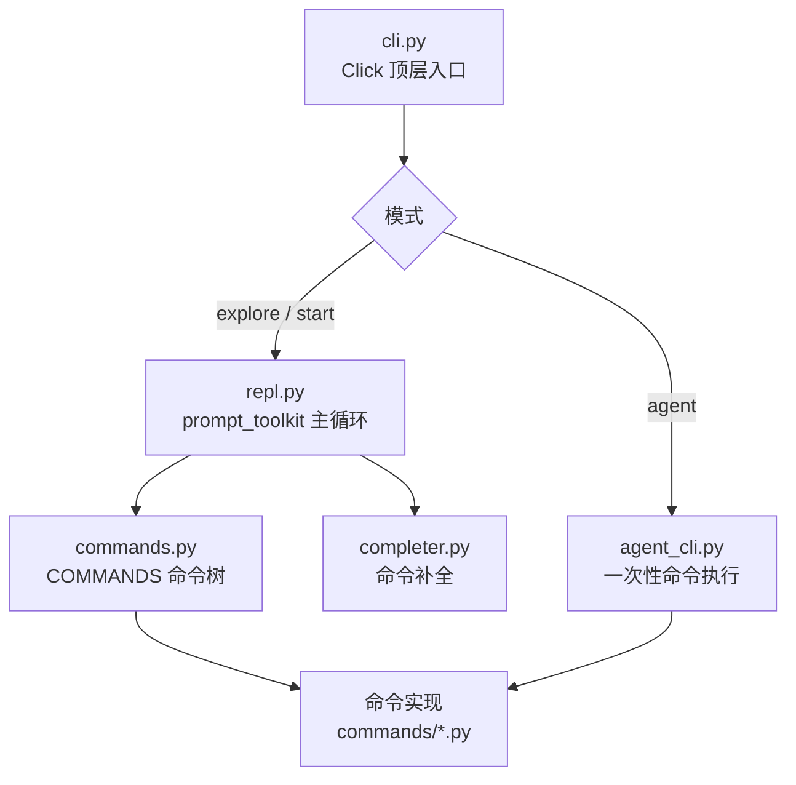

# 🖥️ CLI 与 REPL 文档

`objection/console/` 实现两层入口：基于 Click 的命令行 `cli.py`，以及交互式 REPL `repl.py`。本分区逐文件讲解。

## 🗺️ 调用关系

## 📂 文件清单

| 文档 | 源码 | 职责 |
| --- | --- | --- |
| [cli](/reference/console/cli) | `console/cli.py` | Click 顶层命令组（`explore`/`start`/`agent` 等） |
| [commands](/reference/console/commands) | `console/commands.py` | REPL 命令注册表 `COMMANDS` |
| [repl](/reference/console/repl) | `console/repl.py` | prompt_toolkit REPL 主循环 |
| [completer](/reference/console/completer) | `console/completer.py` | 命令补全 |
| [agent_cli](/reference/console/agent_cli) | `console/agent_cli.py` | 面向 AI Agent 的 CLI 入口 |

## 🔗 相关文档

- [快速上手](/guide/quickstart)
- [REPL 与命令](/guide/repl)
- [面向 AI Agent 使用](/guide/agent-usage)
