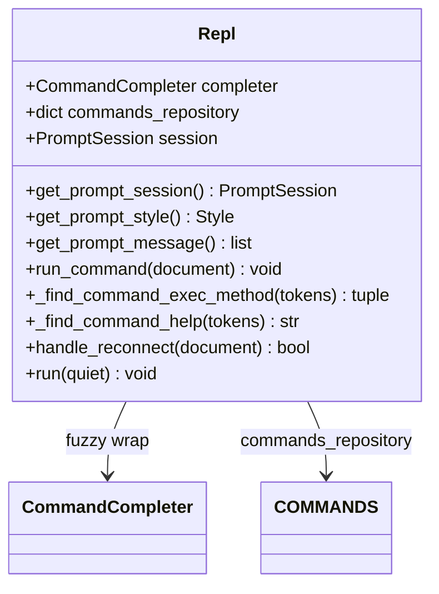
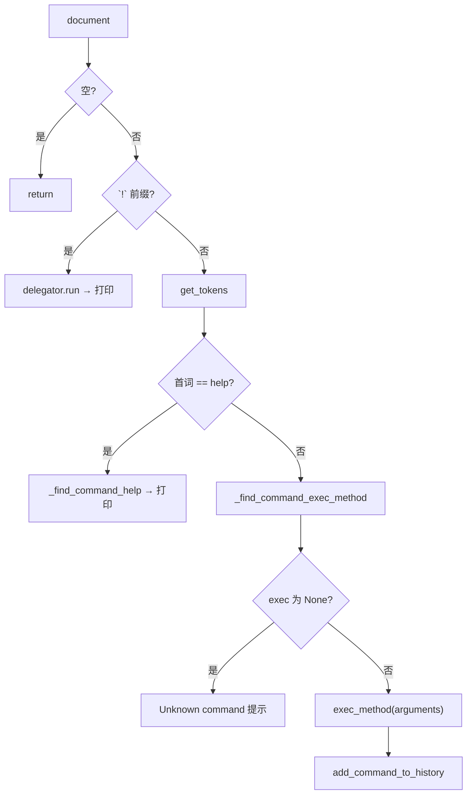
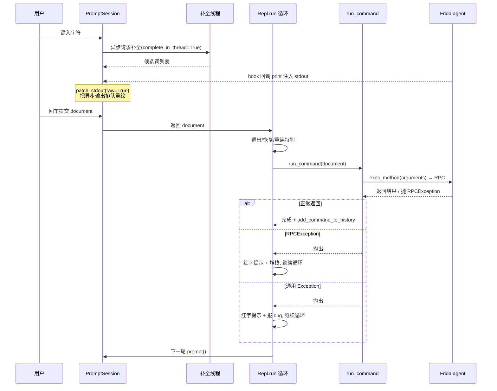
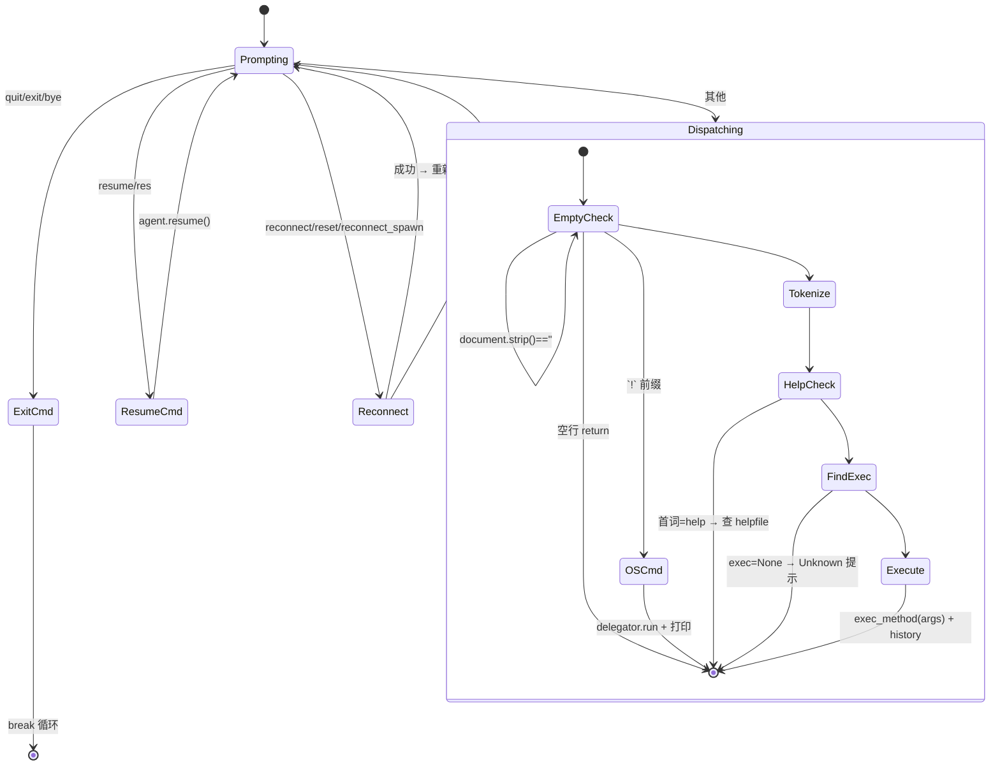

# 交互式 REPL 循环 <code>objection/console/repl.py</code>

`repl.py` 实现 objection 的交互式探索 REPL `Repl`，基于 [prompt_toolkit](https://python-prompt-toolkit.readthedocs.io/) 构建。它负责 prompt 会话、命令分派、帮助查找、重连/恢复/退出等控制流。`run_command` 是单命令执行的入口，既被交互循环调用，也被 `cli.py` 的 `run` 命令、`agent_cli` 的 `agent exec`、`agent_endpoints` 的 `/command/exec` 复用。

## 📋 模块概览

| 项目 | 值 |
| --- | --- |
| 文件路径 | `objection/console/repl.py` |
| 类型 | REPL 主循环（prompt_toolkit + Click 输出） |
| 被谁调用 | `cli.start`（`repl.run`）、`cli.run`（`repl.run_command`）、`agent_cli.agent_exec`（`repl.run_command`）、`agent_endpoints.command_exec`（`repl.run_command`） |
| 依赖 | `prompt_toolkit`（`PromptSession`/`FuzzyCompleter`/`FileHistory`/`AutoSuggestFromHistory`/`patch_stdout`/`Style`）、`click`、`delegator`、`frida`；`commands.COMMANDS`、`completer.CommandCompleter`、`state.connection`、`state.app`、`utils.helpers.get_tokens` |

## 🎯 解决的问题

- 提供带模糊补全、历史回溯、彩色 prompt 的交互式命令行。
- 把命令字符串解析为 token，遍历 `COMMANDS` 树找到 `exec` 函数并分派。
- 统一处理 OS 命令（`!` 前缀）、`help`、`reconnect`/`reconnect_spawn`/`resume`/`exit` 等特判命令。
- 在主循环中捕获 `frida.core.RPCException` 与其他异常，避免单次命令失败把整个 REPL 打挂。

## 🏗️ 核心结构

### `Repl.__init__` — 装配 prompt 会话

源码：[`objection/console/repl.py:28-49`](https://github.com/android-security-engineer/objection-skills/blob/master/objection/console/repl.py#L28)

```python
def __init__(self) -> None:
    self.cli = None
    self.completer = FuzzyCompleter(CommandCompleter())
    self.commands_repository = COMMANDS
    self.session = self.get_prompt_session()
```

`get_prompt_session` 配置历史文件 `~/.objection/objection_history`、模糊补全器、自动建议、`complete_in_thread=True`（补全在线程中算，不阻塞输入）。



### `run_command(document)` — 单命令分派核心

源码：[`objection/console/repl.py:101-172`](https://github.com/android-security-engineer/objection-skills/blob/master/objection/console/repl.py#L101)

处理顺序：

1. 空行直接返回（`repl.py:111-112`）。
2. `!` 前缀 → 用 `delegator.run` 执行 OS 命令，打印 stdout/stderr（`repl.py:115-132`）。
3. `get_tokens(document)` 切词；首词为 `help` → 调 `_find_command_help`（`repl.py:141-156`）。
4. `_find_command_exec_method(tokens)` 返回 `(walked_tokens, exec_method)`；若 `exec_method is None` 报"Unknown or ambiguous command"（`repl.py:159-163`）。
5. `arguments = tokens[token_matches:]`，调 `exec_method(arguments)`（`repl.py:167-170`）。
6. `app_state.add_command_to_history(document)`（`repl.py:172`）。



### `_find_command_exec_method(tokens)` — 遍历命令树

源码：[`objection/console/repl.py:174-227`](https://github.com/android-security-engineer/objection-skills/blob/master/objection/console/repl.py#L174)

从 `commands_repository` 出发，对每个 token：若 token 在当前 dict 中——

- 若无 `commands` 子键且有 `exec`：取 `exec` 并 `break`（叶子节点）。
- 若有 `commands`：下钻到子 dict 继续。
- 否则 `break`。

返回 `(walked_tokens, exec_method)`，`walked_tokens` 告知调用方应剥离多少 token 才是参数。

### `_find_command_help(tokens)` — 帮助文件查找

源码：[`objection/console/repl.py:229-280`](https://github.com/android-security-engineer/objection-skills/blob/master/objection/console/repl.py#L229)

同样遍历命令树收集匹配 token，拼成 `helpfiles/<a>.<b>.<c>.txt` 路径（`repl.py:267-268`），文件不存在则提示 `Unable to find helpfile`。

### `handle_reconnect(document)` — 重连/重 spawn

源码：[`objection/console/repl.py:282-343`](https://github.com/android-security-engineer/objection-skills/blob/master/objection/console/repl.py#L282)

仅当输入为 `reconnect` / `reset` / `reconnect_spawn` 时触发：

- `reconnect_spawn`：置 `spawn=True`、`no_pause=True`（全量重启）；否则 `spawn=False`（软重启）。
- 卸载当前 agent 的 script（`script.unload()`）与 session（`session.detach()`），异常吞掉（`repl.py:315-322`）。
- 清空 `curr_agent.script`、`state_connection.agent`、`state_connection.session`（`repl.py:324-326`）。
- 调 `cli.get_agent()` 重新注入，赋给 `state_connection.agent`（`repl.py:332-333`）。
- 全程 `try/except`，失败时红字提示并返回 `True`（表示已处理该输入）。

> 该方法用延迟导入 `from .cli import get_agent`（`repl.py:296`）避免 `cli ↔ repl` 循环依赖。

### `run(quiet)` — 主循环

源码：[`objection/console/repl.py:345-411`](https://github.com/android-security-engineer/objection-skills/blob/master/objection/console/repl.py#L345)

打印 banner（含 `__version__`）与 `[tab] for command suggestions` 提示后进入 `while True`：

- `patch_stdout(raw=True)` 包裹 `self.session.prompt(self.get_prompt_message())`，保证异步 hook 输出不撕裂 prompt（`repl.py:370-371`）。
- 输入 `quit`/`exit`/`bye` → 退出（`repl.py:374-376`）。
- 输入 `resume`/`res` → `state_connection.agent.resume()`（`repl.py:378-381`）。
- `handle_reconnect(document)` 命中则 `continue`（`repl.py:384`）。
- 否则 `run_command(document)`，包两层 `try`：
  - `frida.core.RPCException` → 红字"Frida agent exception"+堆栈（`repl.py:394-397`）。
  - 通用 `Exception` → 红字"unexpected internal exception"+提示报 bug+堆栈（`repl.py:399-403`）。
- `KeyboardInterrupt` 忽略；`EOFError` 退出（`repl.py:405-410`）。

### `get_prompt_message` — 彩色 prompt token

源码：[`objection/console/repl.py:77-99`](https://github.com/android-security-engineer/objection-skills/blob/master/objection/console/repl.py#L77)

读取 `state_connection.agent` 与设备 `query_system_parameters()`，拼出形如 `com.x (run) on (iOS: 17.0) [usb] # ` 的 token 列表，运行状态 `run`/`pause` 由 `agent.resumed` 决定。

## ⚙️ 实现要点

- **`run_command` 是唯一执行入口**：CLI `run`、`agent exec`、HTTP `/command/exec` 全部复用它，因此只要命令实现改造为输出统一 JSON（见 `utils/output`），三处入口同时受益。
- **特判集中在主循环**：`!`、`help`、`reconnect`、`resume`、`exit` 在 `run`/`run_command` 内特判，注册表里这些节点 `exec` 为 `None`（见 [commands.md](./commands.md)）。
- **异步输出友好**：`patch_stdout(raw=True)` + `complete_in_thread=True` 让 Frida 回调的 `print` 不会破坏 prompt 渲染。
- **容错**：主循环对每条命令做双层异常捕获，单条命令失败不致命；`handle_reconnect` 对 script/session 清理做防御性 `try`。
- **循环依赖规避**：`repl` 不在模块顶层 import `cli`，仅在 `handle_reconnect` 内延迟导入 `get_agent`。

## 🔍 源码索引

| 符号 | 位置 |
| --- | --- |
| `Repl` 类 | [`objection/console/repl.py:23`](https://github.com/android-security-engineer/objection-skills/blob/master/objection/console/repl.py#L23) |
| `__init__` | [`objection/console/repl.py:28`](https://github.com/android-security-engineer/objection-skills/blob/master/objection/console/repl.py#L28) |
| `get_prompt_session` | [`objection/console/repl.py:35`](https://github.com/android-security-engineer/objection-skills/blob/master/objection/console/repl.py#L35) |
| `get_prompt_style` | [`objection/console/repl.py:51`](https://github.com/android-security-engineer/objection-skills/blob/master/objection/console/repl.py#L51) |
| `get_prompt_message` | [`objection/console/repl.py:77`](https://github.com/android-security-engineer/objection-skills/blob/master/objection/console/repl.py#L77) |
| `run_command` | [`objection/console/repl.py:101`](https://github.com/android-security-engineer/objection-skills/blob/master/objection/console/repl.py#L101) |
| `_find_command_exec_method` | [`objection/console/repl.py:174`](https://github.com/android-security-engineer/objection-skills/blob/master/objection/console/repl.py#L174) |
| `_find_command_help` | [`objection/console/repl.py:229`](https://github.com/android-security-engineer/objection-skills/blob/master/objection/console/repl.py#L229) |
| `handle_reconnect` | [`objection/console/repl.py:282`](https://github.com/android-security-engineer/objection-skills/blob/master/objection/console/repl.py#L282) |
| `run` | [`objection/console/repl.py:345`](https://github.com/android-security-engineer/objection-skills/blob/master/objection/console/repl.py#L345) |

## 🔄 事件循环时序

下图展示一次完整交互从用户输入到执行结束的时序，重点刻画 `patch_stdout` 与 `complete_in_thread` 的协作，以及主循环的三层异常屏障。



关键时序点：

- `complete_in_thread=True`（[`repl.py:48`](https://github.com/android-security-engineer/objection-skills/blob/master/objection/console/repl.py#L48)）让补全候选词在独立线程计算，输入框永不卡顿，即便命令树遍历较慢。
- `patch_stdout(raw=True)`（[`repl.py:370`](https://github.com/android-security-engineer/objection-skills/blob/master/objection/console/repl.py#L370)）重定向 stdout，使 Frida 回调（如 `Java.perform` 内 `console.log`）的输出在 prompt 重绘时整体刷新，而非撕裂成半行。
- 三层异常屏障：`run_command` 内部抛出 → 主循环先接 `frida.core.RPCException`（[`repl.py:394`](https://github.com/android-security-engineer/objection-skills/blob/master/objection/console/repl.py#L394)）→ 再接通用 `Exception`（[`repl.py:399`](https://github.com/android-security-engineer/objection-skills/blob/master/objection/console/repl.py#L399)）→ 最外层 `KeyboardInterrupt`/`EOFError`（[`repl.py:405`](https://github.com/android-security-engineer/objection-skills/blob/master/objection/console/repl.py#L405)）。单条命令失败不会让 REPL 退出。

## 🔀 命令分派状态机

`run_command` 与主循环的特判逻辑共同构成一个隐式状态机。下图描述一条输入被路由到哪条分支，以及每条分支的终止方式。



状态机要点：

- `quit`/`exit`/`bye`（[`repl.py:374`](https://github.com/android-security-engineer/objection-skills/blob/master/objection/console/repl.py#L374)）与 `EOFError`（[`repl.py:408`](https://github.com/android-security-engineer/objection-skills/blob/master/objection/console/repl.py#L408)）是仅有的两条通往 `[*]` 的路径；其余分支都会回到 `Prompting`。
- `KeyboardInterrupt`（[`repl.py:405`](https://github.com/android-security-engineer/objection-skills/blob/master/objection/console/repl.py#L405)）不显式 `continue`，而是被 `pass` 后自然回到 `while True` 顶部，等价于"丢弃当前输入并重绘 prompt"。
- `reconnect` 与 `reconnect_spawn` 共享 `handle_reconnect`，区别仅在 `spawn`/`no_pause` 标志位（[`repl.py:298-305`](https://github.com/android-security-engineer/objection-skills/blob/master/objection/console/repl.py#L298)）：前者软重启（重新 attach 到已运行进程），后者全量重启（重新 spawn 并 resume）。

## 🧱 调用栈与命令树数据结构

下图用 ASCII 框图展示 `_find_command_exec_method` 遍历 `COMMANDS` 嵌套字典时的调用栈帧与数据结构关系。

```
   Repl.run_command(document)
   │
   │  tokens = get_tokens(document)
   │  例: ["android","hooking","list","classes"]
   │
   ▼
┌─────────────────────────────────────────────────────────┐
│ _find_command_exec_method(tokens)                        │
│  dict_to_walk = COMMANDS   walked_tokens=0  exec=None   │
└─────────────────────────────────────────────────────────┘
   │
   │  for token in tokens:
   │
   ▼
┌─────────────────────────────────────────────────────────┐
│ COMMANDS 树（每个节点: dict, 叶子含 'exec'）             │
│                                                         │
│  "android" ──commands──► "hooking" ──commands──► ...    │
│      │                         │                        │
│      │                    has 'commands'?  否 → 看'exec' │
│      │                         │                        │
│      │                    有 exec? 是 → 取出, break      │
│      │                                                  │
│   token 不在 dict_to_walk? → break（exec 仍为 None）    │
└─────────────────────────────────────────────────────────┘
   │
   ▼
   return (walked_tokens, exec_method)
   │
   ▼
   arguments = tokens[walked_tokens:]
   exec_method(arguments)      # 真正执行
   app_state.add_command_to_history(document)
```

边界情况说明：

- **部分匹配回退**：若输入 `android hooking foo`，前两个 token 命中，第三个 `foo` 不在 `hooking` 的 `commands` 子 dict 中，循环 `break`，`exec_method` 仍为 `None`，触发 `Unknown or ambiguous command` 提示（[`repl.py:162`](https://github.com/android-security-engineer/objection-skills/blob/master/objection/console/repl.py#L162)）。注意此处**不会**回退到 `android hooking` 自身的 `exec`——遍历是贪心下钻，一旦下钻失败不回溯。
- **中间节点也有 `exec`**：某些中间节点（如 `android`）若同时带 `commands` 与 `exec`，遍历会优先下钻 `commands` 而忽略当前层 `exec`（[`repl.py:214-221`](https://github.com/android-security-engineer/objection-skills/blob/master/objection/console/repl.py#L214)）。这意味着 `android` 单独作为命令时，只有当 `android` 节点没有 `commands` 子键时才会触发其 `exec`——实际注册表中 `android` 带 `commands`，所以裸输 `android` 会报 Unknown。
- **`walked_tokens` 语义**：它等于"已遍历的 token 数"，不一定等于"匹配成功的 token 数"。即便最后一个 token 不匹配导致 break，`walked_tokens` 也已自增（[`repl.py:203-204`](https://github.com/android-security-engineer/objection-skills/blob/master/objection/console/repl.py#L203)）。但因为此场景下 `exec_method is None` 会提前 return，`walked_tokens` 不会被用于切参数，所以无副作用。

## 🔗 相关文档

- [整体架构](/guide/architecture)
- [REPL 与命令](/guide/repl)
