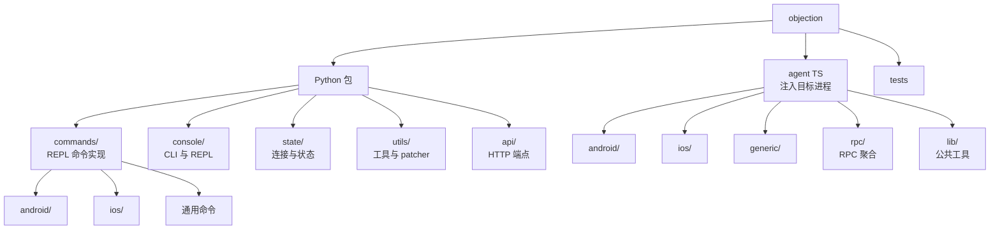

# 📚 源码模块文档

本分区按 objection 的**源码结构**逐文件讲解。每一页对应一个真实的源码文件，包含它解决的问题、命令/函数清单、实现原理（带 mermaid 图）、关键 `file:line` 引用与源码索引。

> 想按"功能"而非"代码"学习？看 [功能详解](/features/)。想查命令？看 [命令速查](/reference/cli/)。

## 🗺️ 源码地图



### 仓库目录与文档对照

```
objection-skills/
├── objection/                      ← Python 包（宿主侧）
│   ├── commands/                   命令实现（每个 .py = 一篇文档）
│   │   ├── android/                android hooking/heap/keystore/...  → reference/commands/android/
│   │   ├── ios/                    ios keychain/hooking/heap/...      → reference/commands/ios/
│   │   └── *.py                    memory/filemanager/jobs/...        → reference/commands/
│   ├── console/                    CLI 入口 + REPL                    → reference/console/
│   ├── state/                      连接/设备/作业状态单例              → reference/state/
│   ├── utils/                      agent 注入/输出/插件/patcher       → reference/utils/
│   │   └── patchers/               APK/IPA 重打包                     → reference/utils/patchers/
│   ├── api/                        HTTP 端点                          → reference/api/
│   └── agent.js                    ← 编译产物（gitignore），由 agent/ 编译
├── agent/src/                      ← TypeScript Agent（注入目标进程）
│   ├── index.ts                    RPC 总入口                          → reference/agent/index
│   ├── android/ + lib/             Android 实现                        → reference/agent/android/
│   ├── ios/ + lib/                 iOS 实现                            → reference/agent/ios/
│   ├── generic/                    平台无关（memory/env/ping）         → reference/agent/generic/
│   ├── rpc/                        RPC 聚合层                          → reference/agent/rpc/
│   └── lib/                        公共库                              → reference/agent/lib/
├── tests/                          ← pytest 测试（每个 test_*.py 一篇）→ reference/tests/
├── plugins/                        ← 示例插件
└── website/                        ← 本文档站（VitePress）
```

## 📂 分区入口

| 分区 | 内容 | 入口 |
| --- | --- | --- |
| 🤖 Android 命令 | `commands/android/*.py` 每个文件 | [/reference/commands/android/](/reference/commands/android/) |
| 🍎 iOS 命令 | `commands/ios/*.py` 每个文件 | [/reference/commands/ios/](/reference/commands/ios/) |
| 🛠️ 通用命令 | `commands/*.py`（memory/filesystem/jobs…） | [/reference/commands/](/reference/commands/) |
| 🖥️ CLI 与 REPL | `console/*.py` | [/reference/console/](/reference/console/) |
| 🔌 状态层 | `state/*.py` | [/reference/state/](/reference/state/) |
| ⚙️ 工具层 | `utils/*.py` + `patchers/` | [/reference/utils/](/reference/utils/) |
| 🌐 HTTP API | `api/*.py` | [/reference/api/](/reference/api/) |
| 🪝 Frida Agent | `agent/src/**/*.ts` | [/reference/agent/](/reference/agent/) |
| 🧪 测试 | `tests/**/*.py` | [/reference/tests/](/reference/tests/) |
| 📖 命令速查 | 完整 REPL 命令树 | [/cli/](/reference/cli/) |

## 🧭 如何使用

1. **新手**：先读 [指南](/guide/what-is-objection) 建立全局观，再按 [功能详解](/features/) 学高频能力。
2. **想深入某条命令**：从 [命令速查](/reference/cli/) 找到命令，点进对应源码模块文档。
3. **想读源码**：本分区的"源码索引"表给出每个符号的精确位置，可直接跳到 IDE。
4. **二次开发/写插件**：重点读 [state/connection](/reference/state/connection)、[utils/output](/reference/utils/output)、[console/repl](/reference/console/repl)。

## 🔗 相关文档

- [整体架构](/guide/architecture)
- [RPC 通信机制](/guide/rpc)
