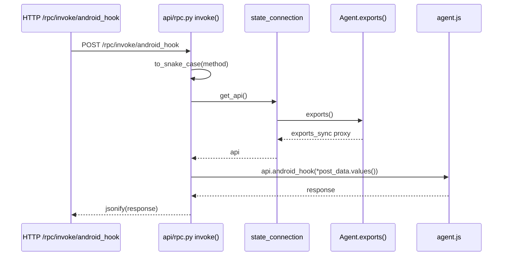
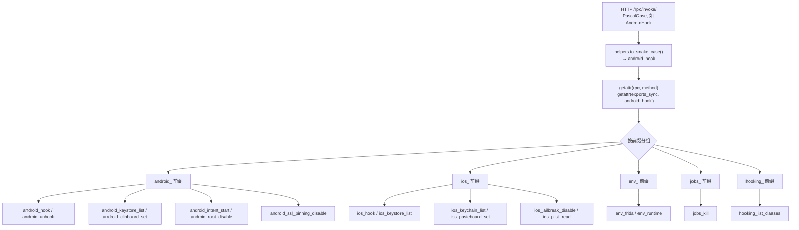
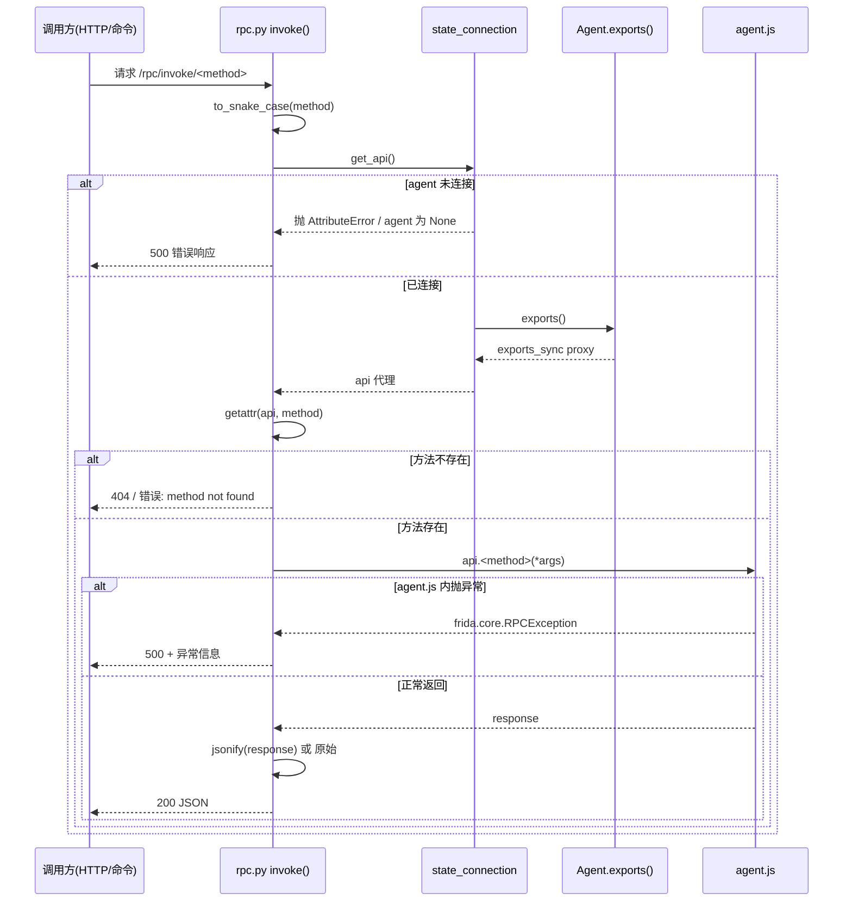

# API 状态 <code>objection/state/api.py</code>

objection 内置 HTTP API 服务的「应用工厂与蓝图注册表」单例。它不直接定义 RPC 方法（agent.js 的 RPC 导出由 `Agent.exports()` 提供，HTTP 侧的 `/rpc/invoke/<method>` 桥接在 `objection/api/rpc.py`），而是负责创建 Flask 应用、收集插件蓝图，并在 `start()` 时统一挂载启动。

## 📋 模块概览
| 项目 | 值 |
| --- | --- |
| 文件路径 | `objection/state/api.py` |
| 类型 | 状态（State，进程级单例） |
| 被谁调用 | `console/cli.py`（`api` 子命令启动服务）、`utils/plugin.py`（`_append_to_api` 注册插件蓝图） |
| 依赖 | `objection.api.app.create_app()`（Flask 工厂）、`objection.api.rpc` / `objection.api.script` / `objection.api.agent_endpoints` 蓝图 |

## 🎯 解决的问题
- 把 objection 的内置 Flask 端点（RPC 桥接、脚本注入、Agent 事件端点）与插件贡献的端点统一挂到一个 Flask app 上。
- 让插件通过 `Plugin.http_api()` 返回 `flask.Blueprint` 即可扩展 HTTP API，无需改核心。
- 暴露 `start(host, port, debug)` 作为 `objection api` 子命令的统一入口。

## 🏗️ 核心结构

### `ApiState` — Flask app 与蓝图列表
源码：[`objection/state/api.py:4`](https://github.com/android-security-engineer/objection-skills/blob/master/objection/state/api.py#L4)

```python
def __init__(self):
    self.core_api = create_app()
    self.blueprints = []
```

`create_app()`（[`objection/api/app.py:8`](https://github.com/android-security-engineer/objection-skills/blob/master/objection/api/app.py#L8)）创建一个 Flask 实例并注册三个核心蓝图：`rpc.bp`、`script.bp`、`agent_endpoints.bp`。`self.blueprints` 是「插件贡献、待挂载」的蓝图列表，在 `start()` 时才挂到 `core_api` 上。

```mermaid
flowchart LR
    CREATE["api/app.py<br/>create_app()"] -->|注册核心蓝图| CORE["Flask app<br/>rpc / script / agent_endpoints"]
    CORE --> AS["ApiState.core_api"]
    PLUGIN["utils/plugin.py<br/>Plugin.http_api()"] -->|返回 Blueprint| AS2["ApiState.blueprints[]"]
    AS2 -->|start() 挂载| CORE
    CLI["console/cli.py<br/>objection api"] -->|api_state.start(host,port)| AS
```

### `append_api_blueprint` — 插件蓝图入列
源码：[`objection/state/api.py:11`](https://github.com/android-security-engineer/objection-skills/blob/master/objection/state/api.py#L11)

```python
def append_api_blueprint(self, blueprint):
    self.blueprints.append(blueprint)
```

由 `Plugin._append_to_api()`（`utils/plugin.py:101`）调用：若插件类定义了 `http_api()` 方法且返回 `flask.Blueprint`，则把它追加进列表。这是插件扩展 HTTP API 的唯一钩子。

### `start` — 挂载蓝图并启动 Flask
源码：[`objection/state/api.py:25`](https://github.com/android-security-engineer/objection-skills/blob/master/objection/state/api.py#L25)

```python
def start(self, host: str, port: int, debug: bool = False):
    for bp in self.blueprints:
        self.core_api.register_blueprint(bp)
    self.core_api.run(host=host, port=port, debug=debug)
```

启动前把所有待挂载蓝图注册到 `core_api`，随后 `app.run()`。延迟注册是为了让插件加载完成后统一挂载，避免加载中途蓝图被部分访问。

### 模块级单例
源码：[`objection/state/api.py:43`](https://github.com/android-security-engineer/objection-skills/blob/master/objection/state/api.py#L43)

```python
api_state = ApiState()
```

## ⚙️ 实现要点

### 与 RPC 方法包装层的关系
本模块只管理 Flask app 生命周期，**不定义任何 RPC 方法**。真正的「Frida RPC 方法包装」分布在两处：

1. **agent.js 侧的 RPC 导出**：由 `Agent.exports()`（`utils/agent.py:366`）返回 `script.exports_sync` 代理，命令层经 `state_connection.get_api()` 调用。agent.js 导出的方法按平台前缀分组，便于检索：
   - **`android_` 前缀**：Android 专属能力。代表如 `android_hook`（方法 hook）、`android_unhook`、`android_keystore_list`、`android_clipboard_set`、`android_intent_start`、`android_root_disable`、`android_ssl_pinning_disable` 等。
   - **`ios_` 前缀**：iOS 专属能力。代表如 `ios_hook`、`ios_keystore_list`、`ios_keychain_list`、`ios_pasteboard_set`、`ios_jailbreak_disable`、`ios_plist_read` 等。
   - **通用前缀**：`env_`（运行时信息，如 `env_frida`、`env_runtime`）、`jobs_`（任务管理，如 `jobs_kill`）、`hooking_`（通用 hook 工具，如 `hooking_list_classes`）。

   命名遵循 `to_snake_case` 转换：HTTP `/rpc/invoke/AndroidHook` 经 `helpers.to_snake_case` 转为 `android_hook` 后 `getattr(rpc, method)` 调用（见 [`objection/api/rpc.py:22`](https://github.com/android-security-engineer/objection-skills/blob/master/objection/api/rpc.py#L22)）。

2. **HTTP 桥接层 `objection/api/rpc.py`**：`/rpc/invoke/<method>` 端点把 HTTP 请求转成 RPC 调用，GET 无参、POST 以 JSON body 的 values 为位置参数。响应默认 JSON 序列化，`?json=false` 时返回原始响应。



### 插件蓝图的安全挂载
`_append_to_api` 校验 `http_api` 必须是可调用对象且返回 Blueprint，否则抛异常——避免插件误把普通属性当蓝图注册导致 `register_blueprint` 崩溃。

### Agent 友好性
`start()` 监听地址来自 `app_state.api_host/api_port`（默认 `127.0.0.1:8888`），仅本地访问。Agent 客户端通过 `/rpc/invoke/<method>` 与 `/events/*`（`agent_endpoints.bp`）与之交互，全部走 JSON。

## 🔍 源码索引
| 符号 | 位置 |
| --- | --- |
| `ApiState` | [`objection/state/api.py:4`](https://github.com/android-security-engineer/objection-skills/blob/master/objection/state/api.py#L4) |
| `ApiState.__init__` | [`objection/state/api.py:7`](https://github.com/android-security-engineer/objection-skills/blob/master/objection/state/api.py#L7) |
| `append_api_blueprint` | [`objection/state/api.py:11`](https://github.com/android-security-engineer/objection-skills/blob/master/objection/state/api.py#L11) |
| `start` | [`objection/state/api.py:25`](https://github.com/android-security-engineer/objection-skills/blob/master/objection/state/api.py#L25) |
| `api_state`（单例） | [`objection/state/api.py:43`](https://github.com/android-security-engineer/objection-skills/blob/master/objection/state/api.py#L43) |
| `create_app`（被调用） | [`objection/api/app.py:8`](https://github.com/android-security-engineer/objection-skills/blob/master/objection/api/app.py#L8) |
| `invoke`（RPC HTTP 桥接） | [`objection/api/rpc.py:10`](https://github.com/android-security-engineer/objection-skills/blob/master/objection/api/rpc.py#L10) |

## 📊 RPC 方法分组与命名映射

agent.js 导出的 RPC 方法按平台前缀分组。下图展示 HTTP 端点方法名（PascalCase）到 agent.js 导出名（snake_case）的映射关系与分组归属。



命名映射要点（基于 [`helpers.to_snake_case`](https://github.com/android-security-engineer/objection-skills/blob/master/objection/utils/helpers.py) 与 [`rpc.py:22`](https://github.com/android-security-engineer/objection-skills/blob/master/objection/api/rpc.py#L22)）：

- **大小写转换**：HTTP 端点用 PascalCase（`AndroidHook`）便于 REST 风格 URL，agent.js 侧用 snake_case 符合 JS/Python 习惯。`to_snake_case` 在大写字母前插入下划线再全小写，所以 `AndroidHook` → `android_hook`，`IOSKeychainList` → `i_o_s_keychain_list`（注意：连续大写会被拆开，这是该方法对首字母缩略词的已知行为，实际方法名在 agent.js 导出时已是对应形式，`getattr` 直接命中）。
- **前缀即平台**：`android_` / `ios_` 前缀让命令层可按平台过滤能力清单，`agent capabilities` 与 `GET /capabilities` 也据此分组展示。
- **无命名空间隔离**：所有方法挂在同一个 `exports_sync` 代理对象上，靠命名前缀"软分组"，没有真正的子对象。若插件在 agent.js 侧导出同名方法会覆盖，无防冲突机制。

## 🔁 RPC 方法分派时序（含错误路径）

下图扩展已有的 RPC 桥接时序，重点刻画方法未找到、参数缺失、agent 未连接等错误分支。



错误路径说明：

- **agent 未连接**：`state_connection.get_api()` 在 agent 未注入时会因 `agent` 为 `None` 导致 `exports()` 调用失败。HTTP 桥接层会返回 500，命令层则抛异常被 REPL 主循环捕获（见 [repl.md](../console/repl.md) 三层异常屏障）。
- **方法不存在**：`getattr(rpc, method)` 取不到属性时返回 `None`（`rpc.py` 用 `getattr` 而非 `rpc.__getattr__`，但 `exports_sync` 代理对未知方法名会返回一个调用即报错的可调用对象）。实际 objection 不做严格白名单校验——任何 PascalCase 方法名都会被尝试 `to_snake_case` 后 `getattr`，命中与否取决于 agent.js 是否导出该名。
- **参数语义**：GET 请求无参数，POST 请求以 JSON body 的 `values()` 作为位置参数（按数组顺序传入）。这意味着 agent.js 侧方法签名必须按位置接收，不支持关键字参数——复杂参数通常用 JSON 对象作为第一个位置参数传递。

## 📐 ApiState 生命周期与蓝图挂载（ASCII 框图）

下图展示 `ApiState` 从构造到 `start()` 的两阶段蓝图挂载流程，区分"核心蓝图（构造时挂载）"与"插件蓝图（启动时挂载）"。

```
                      模块导入时 (单例构造)
                      │
                      ▼
        ┌──────────────────────────────────┐
        │ ApiState.__init__                 │
        │   self.core_api = create_app()    │
        │   ┌──────────────────────────┐    │
        │   │ Flask app (核心蓝图已挂)  │    │
        │   │  ├─ rpc.bp               │    │
        │   │  │   /rpc/invoke/<method>│    │
        │   │  ├─ script.bp            │    │
        │   │  │   /script/inject ...  │    │
        │   │  └─ agent_endpoints.bp   │    │
        │   │      /events/* /command/*│    │
        │   └──────────────────────────┘    │
        │   self.blueprints = [] (空)       │
        └──────────────────────────────────┘
                      │
                      │  插件加载阶段
                      │  (Plugin._append_to_api)
                      ▼
        ┌──────────────────────────────────┐
        │ append_api_blueprint(bp)          │
        │   self.blueprints.append(bp)      │
        │   ← 插件1的 Blueprint             │
        │   ← 插件2的 Blueprint             │
        │   (此时还未挂到 core_api!)        │
        └──────────────────────────────────┘
                      │
                      │  objection api 子命令
                      │  api_state.start(host,port)
                      ▼
        ┌──────────────────────────────────┐
        │ start()                           │
        │   for bp in self.blueprints:      │
        │       core_api.register_blueprint │
        │   ← 插件1蓝图挂载                 │
        │   ← 插件2蓝图挂载                 │
        │   core_api.run(host, port, debug) │
        │   (Flask 服务阻塞运行)            │
        └──────────────────────────────────┘
```

两阶段挂载的设计考量：

- **构造时挂核心蓝图**：`create_app()` 在 `ApiState.__init__` 即调用，核心端点在单例构造完成后就可访问。但因为 Flask app 尚未 `run()`，实际不会处理请求——这只是为了保证 `core_api` 对象就绪。
- **启动时挂插件蓝图**：插件蓝图延迟到 `start()` 才挂载（[`api.py:37-38`](https://github.com/android-security-engineer/objection-skills/blob/master/objection/state/api.py#L37)），确保所有插件加载完毕后统一注册。若在 `append_api_blueprint` 时就 `register_blueprint`，则后加载的插件无法被先加载的插件通过 URL 引用——延迟到启动时统一挂载避免了"部分挂载"状态。
- **单例 + 进程级**：`api_state = ApiState()`（[`api.py:43`](https://github.com/android-security-engineer/objection-skills/blob/master/objection/state/api.py#L43)）在模块导入时构造，整个进程共享一个实例。这意味着多次 `append_api_blueprint` 调用会累积到同一个 `blueprints` 列表——重复加载同一插件会导致蓝图重复注册，Flask 会抛 `AssertionError: View function mapping is overwriting an existing endpoint function`。插件加载器（`utils/plugin.py`）需自行去重。
- **`debug` 透传**：`debug=True` 时 Flask 启用重载器与交互式调试器（[`api.py:40`](https://github.com/android-security-engineer/objection-skills/blob/master/objection/state/api.py#L40)），调试器在异常时会在浏览器暴露可执行 Python 的栈帧，仅本地默认监听 `127.0.0.1` 缓解了风险，但生产环境绝不应开 debug。

## 🔗 相关文档
- [整体架构](/guide/architecture)
- [RPC 通信机制](/guide/rpc)
- [REPL 与命令](/guide/repl)
- [HTTP API 端点](/guide/agent-http)
- [面向 AI Agent 使用](/guide/agent-usage)
