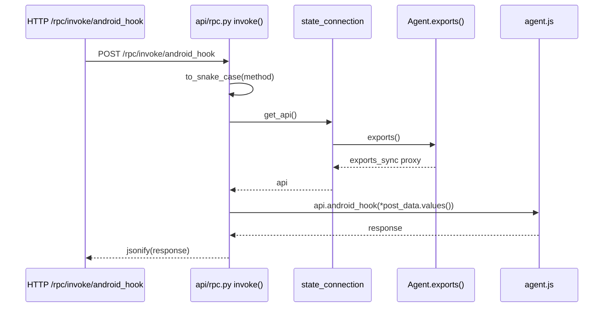

# API 状态 <code>objection/state/api.py</code>

objection 内置 HTTP API 服务的「应用工厂与蓝图注册表」单例。它不直接定义 RPC 方法（agent.js 的 RPC 导出由 `Agent.exports()` 提供，HTTP 侧的 `/rpc/invoke/<method>` 桥接在 `objection/api/rpc.py`），而是负责创建 Flask 应用、收集插件蓝图，并在 `start()` 时统一挂载启动。

## 📋 模块概览
| 项目 | 值 |
| --- | --- |
| 文件路径 | `objection/state/api.py` |
| 类型 | 状态（State，进程级单例） |
| 被谁调用 | `console/cli.py`（`api` 子命令启动服务）、`utils/plugin.py`（`_append_to_api` 注册插件蓝图） |
| 依赖 | `objection.api.app.create_app()`（Flask 工厂）、`objection.api.rpc` / `objection.api.script` / `objection.api.agent_endpoints` 蓝图 |

## 🎯 解决的问题
- 把 objection 的内置 Flask 端点（RPC 桥接、脚本注入、Agent 事件端点）与插件贡献的端点统一挂到一个 Flask app 上。
- 让插件通过 `Plugin.http_api()` 返回 `flask.Blueprint` 即可扩展 HTTP API，无需改核心。
- 暴露 `start(host, port, debug)` 作为 `objection api` 子命令的统一入口。

## 🏗️ 核心结构

### `ApiState` — Flask app 与蓝图列表
源码：`objection/state/api.py:4`

```python
def __init__(self):
    self.core_api = create_app()
    self.blueprints = []
```

`create_app()`（`objection/api/app.py:8`）创建一个 Flask 实例并注册三个核心蓝图：`rpc.bp`、`script.bp`、`agent_endpoints.bp`。`self.blueprints` 是「插件贡献、待挂载」的蓝图列表，在 `start()` 时才挂到 `core_api` 上。

```mermaid
flowchart LR
    CREATE["api/app.py<br/>create_app()"] -->|注册核心蓝图| CORE["Flask app<br/>rpc / script / agent_endpoints"]
    CORE --> AS["ApiState.core_api"]
    PLUGIN["utils/plugin.py<br/>Plugin.http_api()"] -->|返回 Blueprint| AS2["ApiState.blueprints[]"]
    AS2 -->|start() 挂载| CORE
    CLI["console/cli.py<br/>objection api"] -->|api_state.start(host,port)| AS
```

### `append_api_blueprint` — 插件蓝图入列
源码：`objection/state/api.py:11`

```python
def append_api_blueprint(self, blueprint):
    self.blueprints.append(blueprint)
```

由 `Plugin._append_to_api()`（`utils/plugin.py:101`）调用：若插件类定义了 `http_api()` 方法且返回 `flask.Blueprint`，则把它追加进列表。这是插件扩展 HTTP API 的唯一钩子。

### `start` — 挂载蓝图并启动 Flask
源码：`objection/state/api.py:25`

```python
def start(self, host: str, port: int, debug: bool = False):
    for bp in self.blueprints:
        self.core_api.register_blueprint(bp)
    self.core_api.run(host=host, port=port, debug=debug)
```

启动前把所有待挂载蓝图注册到 `core_api`，随后 `app.run()`。延迟注册是为了让插件加载完成后统一挂载，避免加载中途蓝图被部分访问。

### 模块级单例
源码：`objection/state/api.py:43`

```python
api_state = ApiState()
```

## ⚙️ 实现要点

### 与 RPC 方法包装层的关系
本模块只管理 Flask app 生命周期，**不定义任何 RPC 方法**。真正的「Frida RPC 方法包装」分布在两处：

1. **agent.js 侧的 RPC 导出**：由 `Agent.exports()`（`utils/agent.py:366`）返回 `script.exports_sync` 代理，命令层经 `state_connection.get_api()` 调用。agent.js 导出的方法按平台前缀分组，便于检索：
   - **`android_` 前缀**：Android 专属能力。代表如 `android_hook`（方法 hook）、`android_unhook`、`android_keystore_list`、`android_clipboard_set`、`android_intent_start`、`android_root_disable`、`android_ssl_pinning_disable` 等。
   - **`ios_` 前缀**：iOS 专属能力。代表如 `ios_hook`、`ios_keystore_list`、`ios_keychain_list`、`ios_pasteboard_set`、`ios_jailbreak_disable`、`ios_plist_read` 等。
   - **通用前缀**：`env_`（运行时信息，如 `env_frida`、`env_runtime`）、`jobs_`（任务管理，如 `jobs_kill`）、`hooking_`（通用 hook 工具，如 `hooking_list_classes`）。

   命名遵循 `to_snake_case` 转换：HTTP `/rpc/invoke/AndroidHook` 经 `helpers.to_snake_case` 转为 `android_hook` 后 `getattr(rpc, method)` 调用（见 `objection/api/rpc.py:22`）。

2. **HTTP 桥接层 `objection/api/rpc.py`**：`/rpc/invoke/<method>` 端点把 HTTP 请求转成 RPC 调用，GET 无参、POST 以 JSON body 的 values 为位置参数。响应默认 JSON 序列化，`?json=false` 时返回原始响应。



### 插件蓝图的安全挂载
`_append_to_api` 校验 `http_api` 必须是可调用对象且返回 Blueprint，否则抛异常——避免插件误把普通属性当蓝图注册导致 `register_blueprint` 崩溃。

### Agent 友好性
`start()` 监听地址来自 `app_state.api_host/api_port`（默认 `127.0.0.1:8888`），仅本地访问。Agent 客户端通过 `/rpc/invoke/<method>` 与 `/events/*`（`agent_endpoints.bp`）与之交互，全部走 JSON。

## 🔍 源码索引
| 符号 | 位置 |
| --- | --- |
| `ApiState` | `objection/state/api.py:4` |
| `ApiState.__init__` | `objection/state/api.py:7` |
| `append_api_blueprint` | `objection/state/api.py:11` |
| `start` | `objection/state/api.py:25` |
| `api_state`（单例） | `objection/state/api.py:43` |
| `create_app`（被调用） | `objection/api/app.py:8` |
| `invoke`（RPC HTTP 桥接） | `objection/api/rpc.py:10` |

## 🔗 相关文档
- [整体架构](/guide/architecture)
- [RPC 通信机制](/guide/rpc)
- [REPL 与命令](/guide/repl)
- [HTTP API 端点](/guide/agent-http)
- [面向 AI Agent 使用](/guide/agent-usage)
