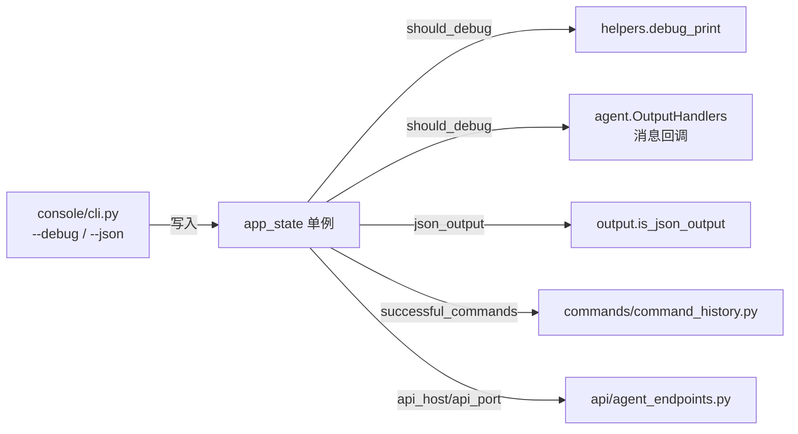
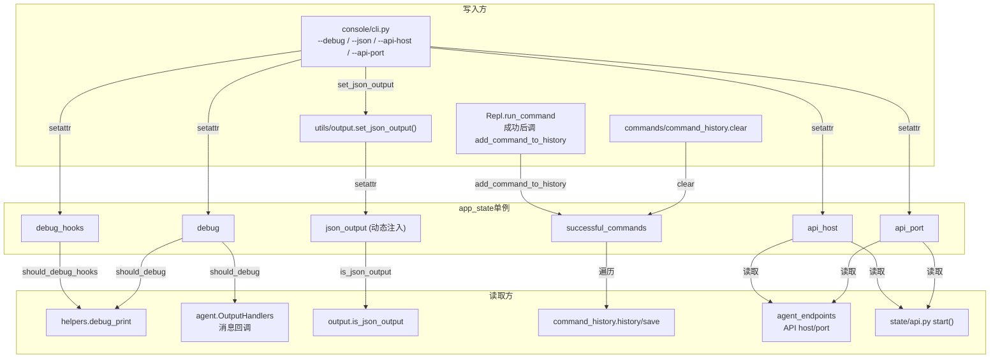
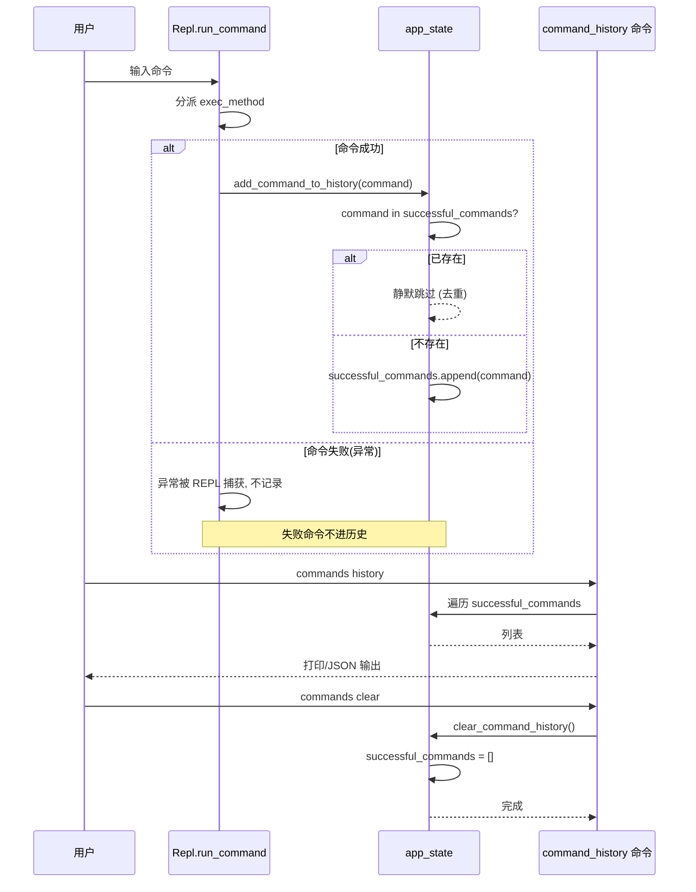

# 应用状态 <code>objection/state/app.py</code>

承载一次 objection 会话的「应用级偏好」：是否开启 hook 调试、是否开启 debug 日志、HTTP API 服务监听的 host/port、以及成功执行过的命令历史。它是一个纯字段袋单例，所有字段都被其它模块按需读取来切换行为分支。

## 📋 模块概览
| 项目 | 值 |
| --- | --- |
| 文件路径 | `objection/state/app.py` |
| 类型 | 状态（State，进程级单例） |
| 被谁调用 | `utils/agent.py`（`should_debug`）、`utils/output.py`（`json_output` 字段）、`commands/command_history.py`（历史记录）、`api/agent_endpoints.py`（API host/port） |
| 依赖 | 无外部依赖 |

## 🎯 解决的问题
- 提供一个进程级开关板，让 CLI 解析层（`console/cli.py`）一次性写入，运行时各模块读取，避免参数穿透。
- 记录成功命令列表，供 `command_history` 命令回放与 Agent 取回。
- 暴露 `json_output` 字段（由 `set_json_output` 写入）作为 Agent JSON 化输出的总开关。

## 🏗️ 核心结构

### `AppState` — 偏好字段袋
源码：[`objection/state/app.py:1`](https://github.com/android-security-engineer/objection-skills/blob/master/objection/state/app.py#L1)

```python
def __init__(self):
    self.debug_hooks = False
    self.debug = False
    self.api_host = '127.0.0.1'
    self.api_port = 8888
    self.successful_commands = []
```

字段说明：
- `debug_hooks` / `debug`：两个独立调试开关。`debug` 控制 `debug_print` 是否输出；`debug_hooks` 历史上用于更细粒度的 hook 调试。
- `api_host` / `api_port`：内置 Flask API 服务监听地址，默认 `127.0.0.1:8888`。
- `successful_commands`：去重的成功命令列表。

> 注：`json_output` 字段未在 `__init__` 中显式声明，由 `utils/output.set_json_output()` 运行时 `setattr` 写入，`is_json_output()` 用 `getattr(app_state, 'json_output', False)` 安全读取。这是为 Agent JSON 化输出后加的字段，刻意不破坏既有构造函数签名。

### `add_command_to_history` — 去重追加
源码：[`objection/state/app.py:11`](https://github.com/android-security-engineer/objection-skills/blob/master/objection/state/app.py#L11)

```python
def add_command_to_history(self, command: str) -> None:
    if command not in self.successful_commands:
        self.successful_commands.append(command)
```

仅成功执行的命令才会被记录（由调用方在成功路径上调用），且天然去重。

### `clear_command_history` — 清空
源码：[`objection/state/app.py:22`](https://github.com/android-security-engineer/objection-skills/blob/master/objection/state/app.py#L22)

重置 `successful_commands` 为空列表。

### `should_debug_hooks / should_debug` — 调试开关读取
源码：[`objection/state/app.py:32`](https://github.com/android-security-engineer/objection-skills/blob/master/objection/state/app.py#L32)、`:41`

```python
def should_debug(self) -> bool:
    return self.debug
```

`should_debug()` 被 `utils/helpers.debug_print` 与 `utils/agent.OutputHandlers` 的消息回调用来决定是否打印原始 Frida 消息 JSON。



### 模块级单例
源码：[`objection/state/app.py:52`](https://github.com/android-security-engineer/objection-skills/blob/master/objection/state/app.py#L52)

```python
app_state = AppState()
```

## ⚙️ 实现要点
- **纯字段袋，无副作用**：`AppState` 不持有 Frida、不打印、不落盘，所有行为都在读取方实现，便于测试与单例复用。
- **`json_output` 字段的动态注入**：Agent JSON 化改造时刻意不在构造函数里加该字段，而是由 `output.set_json_output()` 用属性赋值注入，`is_json_output()` 用 `getattr` 带默认值读取——这样老代码路径（未调用 `set_json_output`）天然得到 `False`，零破坏。
- **API host/port 默认仅监听本地**：`127.0.0.1:8888` 出于安全考虑不绑定公网，Agent / HTTP 客户端需同机访问。

## 🔍 源码索引
| 符号 | 位置 |
| --- | --- |
| `AppState` | [`objection/state/app.py:1`](https://github.com/android-security-engineer/objection-skills/blob/master/objection/state/app.py#L1) |
| `AppState.__init__` | [`objection/state/app.py:4`](https://github.com/android-security-engineer/objection-skills/blob/master/objection/state/app.py#L4) |
| `add_command_to_history` | [`objection/state/app.py:11`](https://github.com/android-security-engineer/objection-skills/blob/master/objection/state/app.py#L11) |
| `clear_command_history` | [`objection/state/app.py:22`](https://github.com/android-security-engineer/objection-skills/blob/master/objection/state/app.py#L22) |
| `should_debug_hooks` | [`objection/state/app.py:32`](https://github.com/android-security-engineer/objection-skills/blob/master/objection/state/app.py#L32) |
| `should_debug` | [`objection/state/app.py:41`](https://github.com/android-security-engineer/objection-skills/blob/master/objection/state/app.py#L41) |
| `app_state`（单例） | [`objection/state/app.py:52`](https://github.com/android-security-engineer/objection-skills/blob/master/objection/state/app.py#L52) |

## 🌐 app_state 全局状态依赖图

下图刻画 `app_state` 单例的各字段被哪些模块读取，以及写入方与读取方的关系，展示其作为"进程级开关板"的中心地位。



依赖关系要点：

- **单写多读**：`app_state` 的字段几乎都是 CLI 解析层一次性写入、运行时各模块只读。唯一在运行时持续写入的是 `successful_commands`（由 `Repl.run_command` 在每条命令成功后追加，[`repl.py:172`](https://github.com/android-security-engineer/objection-skills/blob/master/objection/console/repl.py#L172)）。
- **`json_output` 的注入式字段**：该字段不在 `__init__` 声明（[`app.py:4-9`](https://github.com/android-security-engineer/objection-skills/blob/master/objection/state/app.py#L4)），由 `output.set_json_output()` 在 CLI 检测到 `--json` 时 `setattr` 注入，`is_json_output()` 用 `getattr(app_state, 'json_output', False)` 安全读取。这是为兼容老代码路径（未调用 `set_json_output` 时天然得 `False`）刻意设计。
- **`debug` vs `debug_hooks` 双开关**：`debug` 是总开关，控制 `debug_print` 与 `OutputHandlers` 的原始消息打印；`debug_hooks` 历史上用于更细粒度的 hook 调试，当前代码中读取方较少。两者独立设置，不互相影响。

## 🔁 命令历史生命周期

下图刻画 `successful_commands` 列表从追加、去重、查询到清空的完整时序。



历史记录边界情况：

- **仅成功命令入历史**：`add_command_to_history` 只在 `run_command` 的成功路径末尾调用（[`repl.py:170-172`](https://github.com/android-security-engineer/objection-skills/blob/master/objection/console/repl.py#L170)）。命令抛异常被 REPL 捕获时不会追加，所以历史列表是"成功执行过的命令"而非"所有输入过的命令"——这与 prompt_toolkit 的 `FileHistory`（记录所有输入）是两套独立历史。
- **去重是 O(n) 的**：`command not in self.successful_commands` 对列表做线性扫描（[`app.py:19`](https://github.com/android-security-engineer/objection-skills/blob/master/objection/state/app.py#L19)）。单次会话命令数通常不大，性能可接受；但若长时间运行积累大量命令，每次追加的去重成本会线性增长。这是为保持列表有序且实现简单而做的取舍。
- **`clear` 是替换非原地清空**：`self.successful_commands = []`（[`app.py:30`](https://github.com/android-security-engineer/objection-skills/blob/master/objection/state/app.py#L30)）是重新赋值空列表，而非 `self.successful_commands.clear()`。两者效果相同，但前者会让任何持有旧列表引用的对象（理论上无此场景，因为读取方都是即时遍历）保留旧数据——objection 的读取方每次都通过 `app_state.successful_commands` 取值，不缓存引用，所以无副作用。
- **`save` 与 `history` 的区别**：`commands save` 把列表写入文件，`commands history` 直接打印/JSON 输出。两者都读 `successful_commands`，但 `save` 是持久化出口，`history` 是会话内查看。

## 📐 app_state 字段袋内存视图（ASCII 框图）

下图展示 `AppState` 单例在进程内的字段布局，以及动态注入字段与构造字段的并存关系。

```
app_state = AppState()  (模块级单例, 进程共享)
┌──────────────────────────────────────────────────────────┐
│ AppState 实例                                              │
│                                                           │
│  构造时字段 (__init__ 显式赋值):                           │
│  ┌────────────────────────────────────────────────────┐  │
│  │ debug_hooks: bool = False                          │  │
│  │ debug:       bool = False                          │  │
│  │ api_host:    str  = '127.0.0.1'                    │  │
│  │ api_port:    int  = 8888                           │  │
│  │ successful_commands: list[str] = []                │  │
│  └────────────────────────────────────────────────────┘  │
│                                                           │
│  运行时动态注入字段 (不在 __init__):                      │
│  ┌────────────────────────────────────────────────────┐  │
│  │ json_output: bool  ← set_json_output() setattr     │  │
│  │                     (仅 --json 模式下注入)         │  │
│  │                     读取: getattr(.., 'json_output', False) │  │
│  └────────────────────────────────────────────────────┘  │
│                                                           │
│  方法:                                                    │
│  ┌────────────────────────────────────────────────────┐  │
│  │ add_command_to_history(command)  # 去重追加         │  │
│  │ clear_command_history()          # 置空列表         │  │
│  │ should_debug_hooks() -> bool     # 读 debug_hooks   │  │
│  │ should_debug() -> bool           # 读 debug         │  │
│  └────────────────────────────────────────────────────┘  │
└──────────────────────────────────────────────────────────┘
        │
        │  被以下模块按需读取
        ▼
   helpers.debug_print    ← should_debug()
   agent.OutputHandlers   ← should_debug()
   output.is_json_output  ← getattr(json_output)
   command_history        ← successful_commands
   agent_endpoints        ← api_host, api_port
   state/api.start()      ← api_host, api_port
```

设计取舍说明：

- **无锁单例**：`app_state` 是普通对象，无锁。CLI 解析阶段写入、REPL 运行阶段读取是顺序进行的，无竞态。但若插件在 Frida 回调线程中读取 `should_debug()` 或 `successful_commands`，与主线程的写入可能交错——Python 的属性读取与 list append 是 GIL 保护的原子操作，但 `add_command_to_history` 的"检查 + 追加"是两步操作，理论上存在 TOCTOU 竞态（两个线程同时检查"不存在"然后都追加）。实际 objection 的 hook 回调不会调 `add_command_to_history`，故无实际触发路径。
- **字段袋优于参数穿透**：若不用 `app_state`，`debug`/`json_output` 等标志需要从 CLI 层逐层透传到 `debug_print`、`OutputHandlers` 等深处，签名污染严重。单例字段袋让写入方与读取方解耦，是 objection 全局偏好的事实标准模式。
- **`should_debug` 是方法非属性**：读取 `debug` 走方法 `should_debug()` 而非直接 `app_state.debug`，这层间接让未来可在方法内加额外逻辑（如结合 `debug_hooks` 与 `debug` 的联合判断）而不破坏调用方。当前实现只是简单 `return self.debug`（[`app.py:49`](https://github.com/android-security-engineer/objection-skills/blob/master/objection/state/app.py#L49)），但接口预留了扩展点。

## 🔗 相关文档
- [整体架构](/guide/architecture)
- [RPC 通信机制](/guide/rpc)
- [REPL 与命令](/guide/repl)
- [面向 AI Agent 使用](/guide/agent-usage)
