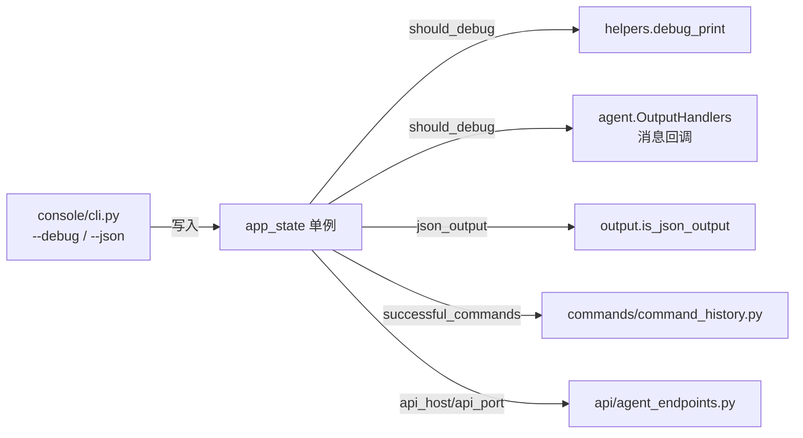

# 应用状态 <code>objection/state/app.py</code>

承载一次 objection 会话的「应用级偏好」：是否开启 hook 调试、是否开启 debug 日志、HTTP API 服务监听的 host/port、以及成功执行过的命令历史。它是一个纯字段袋单例，所有字段都被其它模块按需读取来切换行为分支。

## 📋 模块概览
| 项目 | 值 |
| --- | --- |
| 文件路径 | `objection/state/app.py` |
| 类型 | 状态（State，进程级单例） |
| 被谁调用 | `utils/agent.py`（`should_debug`）、`utils/output.py`（`json_output` 字段）、`commands/command_history.py`（历史记录）、`api/agent_endpoints.py`（API host/port） |
| 依赖 | 无外部依赖 |

## 🎯 解决的问题
- 提供一个进程级开关板，让 CLI 解析层（`console/cli.py`）一次性写入，运行时各模块读取，避免参数穿透。
- 记录成功命令列表，供 `command_history` 命令回放与 Agent 取回。
- 暴露 `json_output` 字段（由 `set_json_output` 写入）作为 Agent JSON 化输出的总开关。

## 🏗️ 核心结构

### `AppState` — 偏好字段袋
源码：`objection/state/app.py:1`

```python
def __init__(self):
    self.debug_hooks = False
    self.debug = False
    self.api_host = '127.0.0.1'
    self.api_port = 8888
    self.successful_commands = []
```

字段说明：
- `debug_hooks` / `debug`：两个独立调试开关。`debug` 控制 `debug_print` 是否输出；`debug_hooks` 历史上用于更细粒度的 hook 调试。
- `api_host` / `api_port`：内置 Flask API 服务监听地址，默认 `127.0.0.1:8888`。
- `successful_commands`：去重的成功命令列表。

> 注：`json_output` 字段未在 `__init__` 中显式声明，由 `utils/output.set_json_output()` 运行时 `setattr` 写入，`is_json_output()` 用 `getattr(app_state, 'json_output', False)` 安全读取。这是为 Agent JSON 化输出后加的字段，刻意不破坏既有构造函数签名。

### `add_command_to_history` — 去重追加
源码：`objection/state/app.py:11`

```python
def add_command_to_history(self, command: str) -> None:
    if command not in self.successful_commands:
        self.successful_commands.append(command)
```

仅成功执行的命令才会被记录（由调用方在成功路径上调用），且天然去重。

### `clear_command_history` — 清空
源码：`objection/state/app.py:22`

重置 `successful_commands` 为空列表。

### `should_debug_hooks / should_debug` — 调试开关读取
源码：`objection/state/app.py:32`、`:41`

```python
def should_debug(self) -> bool:
    return self.debug
```

`should_debug()` 被 `utils/helpers.debug_print` 与 `utils/agent.OutputHandlers` 的消息回调用来决定是否打印原始 Frida 消息 JSON。



### 模块级单例
源码：`objection/state/app.py:52`

```python
app_state = AppState()
```

## ⚙️ 实现要点
- **纯字段袋，无副作用**：`AppState` 不持有 Frida、不打印、不落盘，所有行为都在读取方实现，便于测试与单例复用。
- **`json_output` 字段的动态注入**：Agent JSON 化改造时刻意不在构造函数里加该字段，而是由 `output.set_json_output()` 用属性赋值注入，`is_json_output()` 用 `getattr` 带默认值读取——这样老代码路径（未调用 `set_json_output`）天然得到 `False`，零破坏。
- **API host/port 默认仅监听本地**：`127.0.0.1:8888` 出于安全考虑不绑定公网，Agent / HTTP 客户端需同机访问。

## 🔍 源码索引
| 符号 | 位置 |
| --- | --- |
| `AppState` | `objection/state/app.py:1` |
| `AppState.__init__` | `objection/state/app.py:4` |
| `add_command_to_history` | `objection/state/app.py:11` |
| `clear_command_history` | `objection/state/app.py:22` |
| `should_debug_hooks` | `objection/state/app.py:32` |
| `should_debug` | `objection/state/app.py:41` |
| `app_state`（单例） | `objection/state/app.py:52` |

## 🔗 相关文档
- [整体架构](/guide/architecture)
- [RPC 通信机制](/guide/rpc)
- [REPL 与命令](/guide/repl)
- [面向 AI Agent 使用](/guide/agent-usage)
