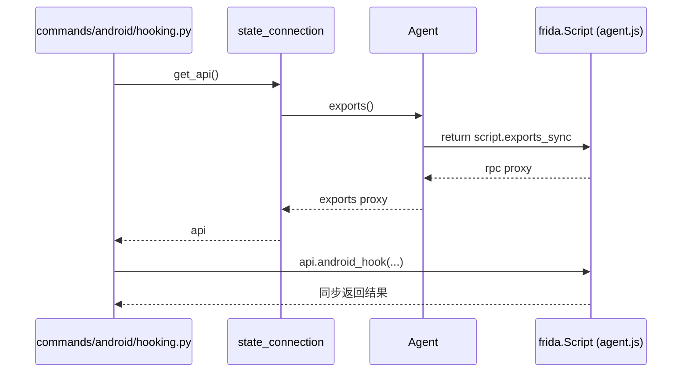

# 连接状态 <code>objection/state/connection.py</code>

objection 与 Frida 设备/进程之间的「会话句柄」单例。它不直接负责 spawn 或 attach（那是 `Agent` 的职责），而是把一次 objection 会话所需的设备类型、目标名、网络参数以及注入完成后得到的 `Agent` 实例与 RPC 句柄挂在进程级全局状态上，让任意层级的命令函数都能拿到同一个会话。

## 📋 模块概览
| 项目 | 值 |
| --- | --- |
| 文件路径 | `objection/state/connection.py` |
| 类型 | 状态（State，进程级单例） |
| 被谁调用 | `Agent.run()` 注入完成后写回；几乎所有 `commands/` 与 `utils/plugin.py` 通过 `state_connection.get_api()` 读取 |
| 依赖 | `objection.utils.agent.Agent`（通过 `set_agent` 间接持有） |

## 🎯 解决的问题
- 命令函数需要「拿到当前 Frida RPC」时，不必层层传参，直接 `state_connection.get_api()` 即可。
- 集中表达一次会话的连接拓扑：USB / 网络 / 本地、host:port、device_id、是否 spawn、是否 foremost、是否带 debugger。
- 在 `Agent.exports()` 之上提供一层薄封装 `get_api()`，作为统一的 RPC 入口。

## 🏗️ 核心结构

### `StateConnection` — 会话状态容器
源码：[`objection/state/connection.py:1`](https://github.com/android-security-engineer/objection-skills/blob/master/objection/state/connection.py#L1)

构造时默认为 USB 连接，所有字段置空：

```python
def __init__(self) -> None:
    self.network = False
    self.host = None
    self.port = None
    self.device_type = 'usb'
    self.device_id = None

    self.spawn = False
    self.no_pause = False
    self.foremost = False
    self.debugger = False

    self.name = None
    self.agent = None
    self.api = None
    self.uid = None
```

字段分三组：连接拓扑（`network/host/port/device_type/device_id`）、启动策略（`spawn/no_pause/foremost/debugger`）、运行时句柄（`name/agent/api/uid`）。

```mermaid
flowchart LR
    CLI["CLI 参数解析"] -->|"set_*"| SC["StateConnection 单例<br/>state_connection"]
    AGENT["Agent.run()<br/>注入完成"] -->|set_agent| SC
    SC -->|get_agent| PLUGIN["utils/plugin.py<br/>Plugin.inject()"]
    SC -->|get_api → agent.exports()| CMDS["commands/*<br/>RPC 调用"]
    SC -->|name / device_id| PROMPT["REPL 提示符渲染"]
```

### `use_usb / use_network / use_local` — 切换连接拓扑
源码：[`objection/state/connection.py:26`](https://github.com/android-security-engineer/objection-skills/blob/master/objection/state/connection.py#L26)、`:36`、`:46`

三个小方法把 `network` 布尔与 `device_type` 字符串切到对应取值，供 `Agent.set_device()` 据此调用 `frida.get_device` / `get_remote_device` / `get_local_device`。

```python
def use_network(self) -> None:
    self.network = True
    self.device_type = 'remote'
```

### `get_api` — RPC 单例入口（重点）
源码：[`objection/state/connection.py:63`](https://github.com/android-security-engineer/objection-skills/blob/master/objection/state/connection.py#L63)

整个 objection 调用 Frida agent RPC 的统一入口。它不缓存、不构造——直接返回当前 `Agent.exports()`，即 `script.exports_sync`。

```python
def get_api(self):
    if not self.agent:
        raise Exception('No session available to get API')
    return self.agent.exports()
```

「单例」语义来自两点：模块级 `state_connection = StateConnection()`（`:96`）保证进程内只有一个会话；`get_api()` 每次返回的是同一个 `Agent` 的 `exports_sync` 代理对象。命令层调用 `api.jobs_kill(...)`、`api.android_...` 等方法时，实际经 Frida 的同步 RPC 通道打到注入的 `agent.js`。



### `set_agent / get_agent` — 注入句柄写回与读取
源码：[`objection/state/connection.py:75`](https://github.com/android-security-engineer/objection-skills/blob/master/objection/state/connection.py#L75)、`:85`

`Agent.run()` 完成 attach + load 后调用 `set_agent(self)` 把自身写进 `state_connection.agent`；插件 `Plugin.inject()` 则通过 `get_agent()` 取回 `Agent`，进而访问 `agent.device` 与 `agent.pid` 为自己创建独立 session。

```python
def get_agent(self):
    if not self.agent:
        raise Exception('No Agent available')
    return self.agent
```

### `get_comms_type` — 占位
源码：[`objection/state/connection.py:56`](https://github.com/android-security-engineer/objection-skills/blob/master/objection/state/connection.py#L56)

方法体为空（仅有 docstring），历史上用于返回通信类型常量，当前未实现、也无调用方。文档保留以反映真实状态。

### 模块级单例
源码：[`objection/state/connection.py:96`](https://github.com/android-security-engineer/objection-skills/blob/master/objection/state/connection.py#L96)

```python
state_connection = StateConnection()
```

`from objection.state.connection import state_connection` 是整个代码库的标准导入姿势。

## ⚙️ 实现要点
- **薄设计**：`StateConnection` 不持有 `frida` 模块引用、不调用任何 Frida API，纯粹是字段袋 + getter/setter。所有 Frida 交互都发生在 `Agent` 内部，状态对象只负责「记住这次会话用的是哪个 agent」。
- **`get_api()` 的「单例」是逻辑单例而非对象缓存**：每次调用都重新执行 `agent.exports()`，但 `Agent.exports()` 内部返回的 `self.script.exports_sync` 是 Frida 绑定到同一脚本实例的稳定代理，因此多次 `get_api()` 拿到的是等价的句柄。
- **Agent 友好性**：`get_api()` 抛出的异常带人类可读消息（`'No session available to get API'`），`output.error_result` / HTTP `/rpc/invoke` 端点会把它原样转成 JSON 错误响应，便于 Agent 解析失败原因。
- **`__repr__`**（`:92`）把 `device_id / network / host / port` 拼成一行，供调试与 REPL 提示符使用。

## 🔍 源码索引
| 符号 | 位置 |
| --- | --- |
| `StateConnection` | [`objection/state/connection.py:1`](https://github.com/android-security-engineer/objection-skills/blob/master/objection/state/connection.py#L1) |
| `StateConnection.__init__` | [`objection/state/connection.py:4`](https://github.com/android-security-engineer/objection-skills/blob/master/objection/state/connection.py#L4) |
| `use_usb` | [`objection/state/connection.py:26`](https://github.com/android-security-engineer/objection-skills/blob/master/objection/state/connection.py#L26) |
| `use_network` | [`objection/state/connection.py:36`](https://github.com/android-security-engineer/objection-skills/blob/master/objection/state/connection.py#L36) |
| `use_local` | [`objection/state/connection.py:46`](https://github.com/android-security-engineer/objection-skills/blob/master/objection/state/connection.py#L46) |
| `get_comms_type` | [`objection/state/connection.py:56`](https://github.com/android-security-engineer/objection-skills/blob/master/objection/state/connection.py#L56) |
| `get_api` | [`objection/state/connection.py:63`](https://github.com/android-security-engineer/objection-skills/blob/master/objection/state/connection.py#L63) |
| `set_agent` | [`objection/state/connection.py:75`](https://github.com/android-security-engineer/objection-skills/blob/master/objection/state/connection.py#L75) |
| `get_agent` | [`objection/state/connection.py:85`](https://github.com/android-security-engineer/objection-skills/blob/master/objection/state/connection.py#L85) |
| `__repr__` | [`objection/state/connection.py:92`](https://github.com/android-security-engineer/objection-skills/blob/master/objection/state/connection.py#L92) |
| `state_connection`（单例） | [`objection/state/connection.py:96`](https://github.com/android-security-engineer/objection-skills/blob/master/objection/state/connection.py#L96) |

## 🔗 相关文档
- [整体架构](/guide/architecture)
- [RPC 通信机制](/guide/rpc)
- [REPL 与命令](/guide/repl)
- [面向 AI Agent 使用](/guide/agent-usage)
