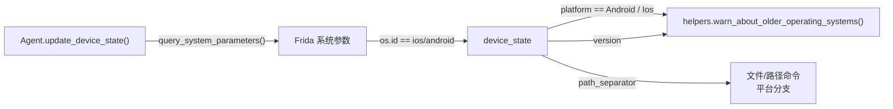

# 设备状态 <code>objection/state/device.py</code>

记录当前所连设备的平台（Android / iOS）与 OS 版本。`Agent` 在 attach 完成后通过 `query_system_parameters()` 探测平台，再调用 `device_state.set_platform(...)` 写回，供命令层据此做平台相关的分支决策（如路径分隔符、版本警告阈值）。

## 📋 模块概览
| 项目 | 值 |
| --- | --- |
| 文件路径 | `objection/state/device.py` |
| 类型 | 状态（State，进程级单例） |
| 被谁调用 | `utils/helpers.warn_about_older_operating_systems()`、命令层按平台分支 |
| 依赖 | 无外部依赖；`Agent.update_device_state()` 写入 |

## 🎯 解决的问题
- 提供统一的「当前是 Android 还是 iOS」判定，避免每个命令各自调 Frida 探测。
- 携带 OS 版本字符串，用于在老系统上发出 hook 兼容性警告。
- 用 `Device` 基类 + `Android` / `Ios` 子类表达平台常量（name、path_separator）。

## 🏗️ 核心结构

### `Device` / `Android` / `Ios` — 平台常量类
源码：[`objection/state/device.py:1`](https://github.com/android-security-engineer/objection-skills/blob/master/objection/state/device.py#L1)、`:6`、`:13`

```python
class Device(object):
    """ Represents a mobile device """
    pass

class Android(Device):
    name = 'android'
    path_separator = '/'

class Ios(Device):
    name = 'ios'
    path_separator = '/'
```

`Android` / `Ios` 是带类属性的「枚举式」类型，用类本身（而非实例）作为 `device_state.platform` 的取值，命令层可用 `platform == Android` 做身份比较。

### `DeviceState` — 平台与版本容器
源码：[`objection/state/device.py:20`](https://github.com/android-security-engineer/objection-skills/blob/master/objection/state/device.py#L20)

```python
class DeviceState(object):
    platform: Device
    version: str

    def set_version(self, v: str):
        self.version = v

    def set_platform(self, t: Device):
        self.platform = t
```

类注解 `platform: Device` / `version: str` 仅为类型提示，不强制运行时校验。两个 setter 被 `Agent.update_device_state()` 调用。



### `__repr__`
源码：[`objection/state/device.py:46`](https://github.com/android-security-engineer/objection-skills/blob/master/objection/state/device.py#L46)

```python
def __repr__(self) -> str:
    return f'<Type: {self.platform} >'
```

供 REPL 提示符与调试输出使用。

### 模块级单例
源码：[`objection/state/device.py:50`](https://github.com/android-security-engineer/objection-skills/blob/master/objection/state/device.py#L50)

```python
device_state = DeviceState()
```

## ⚙️ 实现要点
- **类即常量**：`Android` / `Ios` 不被实例化，直接以类对象作为 `platform` 取值，调用方写 `device_state.platform == Android` 做平台判断，简洁且无实例化开销。
- **平台探测的回退路径**：`Agent.update_device_state()`（`utils/agent.py:325`）优先用 `query_system_parameters()['os']['id']`，匹配失败时回退到调用 agent RPC 的 `env_runtime()`——这覆盖了某些非标准 Frida 运行时不暴露 `os.id` 的情况。
- **版本警告**：`helpers.warn_about_older_operating_systems()` 用 `packaging.version.Version` 比较，Android < 5、iOS < 9 时发出黄色警告，提示 hook 可能失败。

## 🔍 源码索引
| 符号 | 位置 |
| --- | --- |
| `Device` | [`objection/state/device.py:1`](https://github.com/android-security-engineer/objection-skills/blob/master/objection/state/device.py#L1) |
| `Android` | [`objection/state/device.py:6`](https://github.com/android-security-engineer/objection-skills/blob/master/objection/state/device.py#L6) |
| `Ios` | [`objection/state/device.py:13`](https://github.com/android-security-engineer/objection-skills/blob/master/objection/state/device.py#L13) |
| `DeviceState` | [`objection/state/device.py:20`](https://github.com/android-security-engineer/objection-skills/blob/master/objection/state/device.py#L20) |
| `set_version` | [`objection/state/device.py:26`](https://github.com/android-security-engineer/objection-skills/blob/master/objection/state/device.py#L26) |
| `set_platform` | [`objection/state/device.py:36`](https://github.com/android-security-engineer/objection-skills/blob/master/objection/state/device.py#L36) |
| `__repr__` | [`objection/state/device.py:46`](https://github.com/android-security-engineer/objection-skills/blob/master/objection/state/device.py#L46) |
| `device_state`（单例） | [`objection/state/device.py:50`](https://github.com/android-security-engineer/objection-skills/blob/master/objection/state/device.py#L50) |

## 🔗 相关文档
- [整体架构](/guide/architecture)
- [RPC 通信机制](/guide/rpc)
- [REPL 与命令](/guide/repl)
