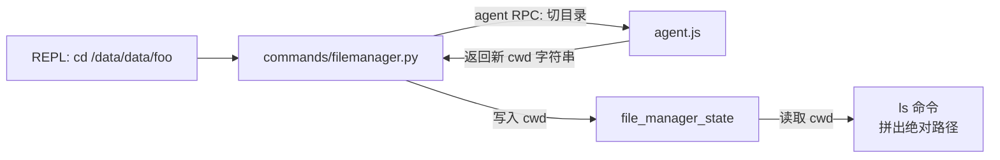

# 文件管理器状态 <code>objection/state/filemanager.py</code>

objection 文件系统命令的「当前工作目录」单例。REPL 中 `cd` / `ls` / `pwd` 等命令在设备文件系统上模拟 shell 语义时，需要记住当前所在目录，本模块就是这唯一字段的持有者。

## 📋 模块概览
| 项目 | 值 |
| --- | --- |
| 文件路径 | `objection/state/filemanager.py` |
| 类型 | 状态（State，进程级单例） |
| 被谁调用 | `commands/filemanager.py`（cd/ls/pwd/download/upload 等命令） |
| 依赖 | 无外部依赖 |

## 🎯 解决的问题
- 在无状态的 RPC 调用之上叠加一个「当前目录」概念，让 `ls` 不必每次要求绝对路径。
- 隔离设备路径语义：`cwd` 由 agent 返回的设备路径字符串直接保存，Python 侧不做路径拼接假设（分隔符由 `device_state.path_separator` 决定）。

## 🏗️ 核心结构

### `FileManagerState` — 工作目录容器
源码：`objection/state/filemanager.py:1`

```python
class FileManagerState(object):
    """  A class representing the state of the filemanager. """

    def __init__(self) -> None:
        self.cwd = None
```

仅一个 `cwd` 字段，初始为 `None`（表示尚未 `cd` 进任何目录，命令层据此回退到设备根或报错）。



### 模块级单例
源码：`objection/state/filemanager.py:8`

```python
file_manager_state = FileManagerState()
```

## ⚙️ 实现要点
- **极简设计**：本模块是整个 state 包中最小的一个，仅一个字段、无方法。所有路径解析、目录切换的实际逻辑都在 `commands/filemanager.py` 与 agent.js 侧，状态对象只负责跨命令持久化 `cwd`。
- **设备路径原样保存**：`cwd` 存的是 agent 返回的原始字符串（如 Android 的 `/data/data/com.foo/files`），Python 侧不调用 `os.path`——因为 `os.path` 在 Windows host 上会用反斜杠，破坏设备路径语义。
- **Agent 友好性**：JSON 模式下 `commands/filemanager.py` 会把 `cwd` 包进 `CommandResult.result` 一并返回，Agent 可从任何命令的响应里读到当前目录，无需单独查询。

## 🔍 源码索引
| 符号 | 位置 |
| --- | --- |
| `FileManagerState` | `objection/state/filemanager.py:1` |
| `FileManagerState.__init__` | `objection/state/filemanager.py:4` |
| `file_manager_state`（单例） | `objection/state/filemanager.py:8` |

## 🔗 相关文档
- [整体架构](/guide/architecture)
- [RPC 通信机制](/guide/rpc)
- [REPL 与命令](/guide/repl)
