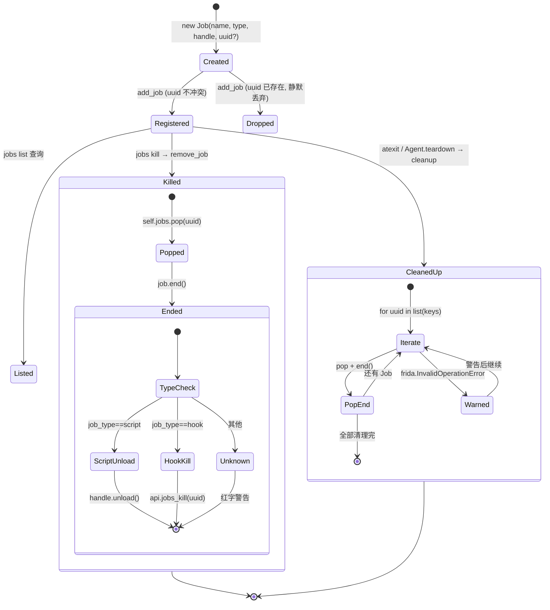
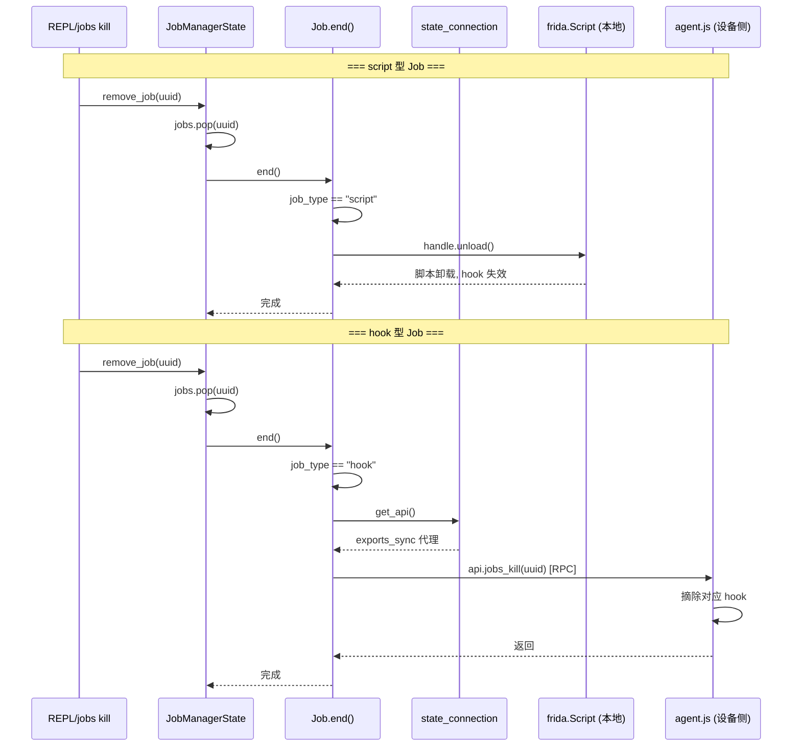

# 任务注册表 <code>objection/state/jobs.py</code>

objection 的「后台任务注册表」单例。一个 Job 代表一组持续生效的 hook 或一段独立注入的 Frida 脚本（如 `android hooking watch`、`android sslpinning disable`）。`JobManagerState` 维护 `uuid → Job` 字典，负责注册、移除与进程退出时的统一清理，并通过 `atexit` 保证 hook 被还原。

## 📋 模块概览
| 项目 | 值 |
| --- | --- |
| 文件路径 | `objection/state/jobs.py` |
| 类型 | 状态（State，进程级单例） |
| 被谁调用 | `commands/jobs.py`（list/kill）、`commands/android/hooking.py`、`commands/android/pinning.py` 等创建持久 hook 的命令、`utils/agent.py`（脚本型 Job 与 teardown） |
| 依赖 | `click`、`frida`、`objection.state.connection.state_connection` |

## 🎯 解决的问题
- 给每个长生命周期 hook 一个稳定标识（uuid），让 `jobs list` / `jobs kill <id>` 可定位。
- 区分两种 Job 生命周期：`script` 型（本地 `frida.Script`，靠 `unload()` 终止）与 `hook` 型（agent 侧注册的 hook，靠 RPC `jobs_kill` 终止）。
- 进程退出时统一卸载所有脚本并通知 agent 清理 hook，避免设备侧残留。

## 🏗️ 核心结构

### `Job` — 单个任务
源码：[`objection/state/jobs.py:10`](https://github.com/android-security-engineer/objection-skills/blob/master/objection/state/jobs.py#L10)

```python
def __init__(self, name, job_type, handle, uuid: int = None) -> None:
    if uuid is not None:
        try:
            self.uuid = int(uuid)
        except (ValueError, TypeError):
            # identifier 可能是 base36 字符串（如 rdcjq16g8xi），原样保留
            self.uuid = uuid
    else:
        self.uuid = randint(100000, 999999)
    self.name = name
    self.job_type = job_type
    self.handle = handle
```

字段：
- `uuid`：任务标识。调用方可传入（agent 侧 hook 返回的 base36 字符串如 `rdcjq16g8xi`），无法 `int()` 时原样保留；未传入则随机生成 6 位整数。
- `name`：人类可读名（如 `Watch com.foo.Bar.login`）。
- `job_type`：`'script'` 或 `'hook'`，决定 `end()` 的清理路径。
- `handle`：`script` 型为 `frida.Script`，`hook` 型无实际句柄（清理走 RPC）。

### `Job.end` — 按类型清理
源码：[`objection/state/jobs.py:35`](https://github.com/android-security-engineer/objection-skills/blob/master/objection/state/jobs.py#L35)

```python
def end(self):
    if self.job_type == "script":
        click.secho("[job manager] Killing job {0}...".format(self.uuid), dim=True)
        self.handle.unload()
    elif self.job_type == "hook":
        api = state_connection.get_api()
        api.jobs_kill(self.uuid)
    else:
        click.secho(('[job {0}] - Unknown job type {1}'.format(self.uuid, self.job_type)), fg='red', dim=True)
```

两条清理路径：
- `script`：直接调 `frida.Script.unload()`，本地卸载。
- `hook`：经 `state_connection.get_api()` 拿到 RPC，调 agent 侧的 `jobs_kill(uuid)` 让 agent 自己摘除 hook。

```mermaid
flowchart LR
    HCMD["hooking/pinning 命令"] -->|创建 Job(job_type=hook)| JM["JobManagerState"]
    SCMD["agent.attach_script / 插件"] -->|创建 Job(job_type=script)| JM
    JM -->|jobs list| USER["REPL 用户"]
    USER -->|jobs kill id| JM
    JM -->|job.end| HOOKEND["hook: api.jobs_kill(uuid)"]
    JM -->|job.end| SCRIPTEND["script: handle.unload()"]
    ATEXIT["atexit"] -->|cleanup| JM
```

### `JobManagerState` — 注册表
源码：[`objection/state/jobs.py:53`](https://github.com/android-security-engineer/objection-skills/blob/master/objection/state/jobs.py#L53)

```python
def __init__(self) -> None:
    self.jobs: dict[int, Job] = {}
    atexit.register(self.cleanup)
```

构造时注册 `atexit` 钩子，确保解释器退出时统一清理。

#### `add_job` — 去重注册
源码：[`objection/state/jobs.py:67`](https://github.com/android-security-engineer/objection-skills/blob/master/objection/state/jobs.py#L67)

```python
def add_job(self, new_job: Job) -> None:
    if new_job.uuid not in self.jobs:
        self.jobs[new_job.uuid] = new_job
```

#### `remove_job` — 弹出并终止
源码：[`objection/state/jobs.py:79`](https://github.com/android-security-engineer/objection-skills/blob/master/objection/state/jobs.py#L79)

```python
def remove_job(self, job_uuid: int):
    if job_uuid not in self.jobs:
        click.secho(f"Error: Job with ID {job_uuid} does not exist.", fg='red')
        return
    job_to_remove = self.jobs.pop(job_uuid)
    job_to_remove.end()
```

不存在时打印红色错误并返回，不抛异常。

#### `cleanup` — 批量卸载
源码：[`objection/state/jobs.py:93`](https://github.com/android-security-engineer/objection-skills/blob/master/objection/state/jobs.py#L93)

```python
def cleanup(self) -> None:
    for uuid in list(self.jobs.keys()):
        try:
            job = self.jobs.pop(uuid)
            job.end()
        except frida.InvalidOperationError:
            click.secho(('[job manager] Job: {0} - An error occurred stopping job. '
                         'Device may no longer be available.'.format(uuid)), fg='red', dim=True)
```

逐个 `pop` + `end()`；若设备已掉线（`frida.InvalidOperationError`），打印警告但继续清理其余 Job。`list(self.jobs.keys())` 复制键视图，避免迭代中修改字典。

### 模块级单例
源码：[`objection/state/jobs.py:113`](https://github.com/android-security-engineer/objection-skills/blob/master/objection/state/jobs.py#L113)

```python
job_manager_state = JobManagerState()
```

## ⚙️ 实现要点
- **uuid 的两种来源**：本地随机 6 位整数（默认）或 agent 侧返回的 base36 字符串（如 `rdcjq16g8xi`）。`int(uuid)` 失败时原样保留——这是为兼容 agent 侧 hook 标识格式而做的容错（见 `:26-28` 注释）。
- **`atexit` 兜底**：`JobManagerState` 在构造时注册 `atexit.register(self.cleanup)`，保证 `Agent.teardown()` 与解释器退出两条路径都会触发清理。`Agent.teardown()`（`utils/agent.py:397`）也显式调 `job_manager_state.cleanup()`。
- **`script` vs `hook` 双轨**：`script` 型 Job 由 `Agent.attach_script()`（`utils/agent.py:308`）创建，用于独立脚本注入；`hook` 型由 hooking/pinning 等命令创建，依赖 agent 侧 RPC 管理。`end()` 据类型分派，避免本地脚本与远程 hook 混用清理路径。
- **Agent 友好性**：`commands/jobs.py` 在 JSON 模式下把 `jobs` 字典序列化进 `CommandResult.result`，Agent 可直接拿到 `[{uuid, name, type}, ...]` 列表，无需解析终端文本。

## 🔍 源码索引
| 符号 | 位置 |
| --- | --- |
| `Job` | [`objection/state/jobs.py:10`](https://github.com/android-security-engineer/objection-skills/blob/master/objection/state/jobs.py#L10) |
| `Job.__init__` | [`objection/state/jobs.py:13`](https://github.com/android-security-engineer/objection-skills/blob/master/objection/state/jobs.py#L13) |
| `Job.end` | [`objection/state/jobs.py:35`](https://github.com/android-security-engineer/objection-skills/blob/master/objection/state/jobs.py#L35) |
| `JobManagerState` | [`objection/state/jobs.py:53`](https://github.com/android-security-engineer/objection-skills/blob/master/objection/state/jobs.py#L53) |
| `JobManagerState.__init__` | [`objection/state/jobs.py:56`](https://github.com/android-security-engineer/objection-skills/blob/master/objection/state/jobs.py#L56) |
| `add_job` | [`objection/state/jobs.py:67`](https://github.com/android-security-engineer/objection-skills/blob/master/objection/state/jobs.py#L67) |
| `remove_job` | [`objection/state/jobs.py:79`](https://github.com/android-security-engineer/objection-skills/blob/master/objection/state/jobs.py#L79) |
| `cleanup` | [`objection/state/jobs.py:93`](https://github.com/android-security-engineer/objection-skills/blob/master/objection/state/jobs.py#L93) |
| `job_manager_state`（单例） | [`objection/state/jobs.py:113`](https://github.com/android-security-engineer/objection-skills/blob/master/objection/state/jobs.py#L113) |

## 🔄 Job 生命周期状态机

下图刻画一个 Job 从创建到清理的完整状态迁移，重点区分 `script` 型与 `hook` 型在 `end()` 阶段的不同清理路径，以及设备掉线时的异常分支。



状态迁移要点（基于 [`jobs.py:35-50`](https://github.com/android-security-engineer/objection-skills/blob/master/objection/state/jobs.py#L35) 与 [`jobs.py:93-110`](https://github.com/android-security-engineer/objection-skills/blob/master/objection/state/jobs.py#L93)）：

- **`add_job` 去重是静默的**：若 `new_job.uuid` 已存在，直接不插入也不报错（[`jobs.py:76-77`](https://github.com/android-security-engineer/objection-skills/blob/master/objection/state/jobs.py#L76)）。这意味着重复注册同一 hook（如两次 `android hooking watch` 同一方法且 agent 返回相同 base36 id）会被静默吞掉，本地注册表只保留第一个。
- **`remove_job` 不存在的 Job 不抛异常**：打印红色 `Error: Job with ID ... does not exist.` 后直接 `return`（[`jobs.py:86-88`](https://github.com/android-security-engineer/objection-skills/blob/master/objection/state/jobs.py#L86)），保证 `jobs kill <错误id>` 不会把 REPL 打挂。
- **`cleanup` 容错继续**：设备掉线时 `handle.unload()` 或 `api.jobs_kill()` 抛 `frida.InvalidOperationError`，被捕获后只打印警告，循环继续清理其余 Job（[`jobs.py:108-110`](https://github.com/android-security-engineer/objection-skills/blob/master/objection/state/jobs.py#L108)）。这保证一个 Job 清理失败不会阻塞其他 Job 的卸载。
- **`Unknown` 分支是防御性的**：`job_type` 既非 `script` 也非 `hook` 时，`end()` 走 else 分支打印红字警告但不抛异常（[`jobs.py:49-50`](https://github.com/android-security-engineer/objection-skills/blob/master/objection/state/jobs.py#L49)）。实际注册表不会出现其他类型，但 schema 层面 `job_type` 是自由字符串。

## 🔁 双轨清理路径时序

下图并排对比 `script` 型与 `hook` 型 Job 在 `end()` 时的调用链，以及它们与 Frida/agent 的交互差异。



双轨差异说明：

- **`script` 型纯本地**：`handle` 是 `frida.Script` 对象，`unload()` 直接在本地 Frida binding 层卸载脚本，不经过 RPC（[`jobs.py:45`](https://github.com/android-security-engineer/objection-skills/blob/master/objection/state/jobs.py#L45)）。这类 Job 由 `Agent.attach_script()`（`utils/agent.py`）创建，常用于插件注入的独立脚本。
- **`hook` 型走 RPC**：清理依赖 agent 侧的 `jobs_kill` RPC 方法（[`jobs.py:47-48`](https://github.com/android-security-engineer/objection-skills/blob/master/objection/state/jobs.py#L47)），agent.js 收到 uuid 后在自己的 hook 注册表中查找并摘除。这意味着 `hook` 型 Job 的 `handle` 字段实际上未被 `end()` 使用——清理完全靠 uuid 路由到 agent 侧。
- **设备掉线时的分歧**：`script` 型掉线时 `handle.unload()` 抛 `frida.InvalidOperationError`（脚本所在 session 已失效）；`hook` 型掉线时 `api.jobs_kill()` 抛 `frida.core.RPCException` 或底层连接异常。但 `cleanup` 只捕获 `frida.InvalidOperationError`（[`jobs.py:108`](https://github.com/android-security-engineer/objection-skills/blob/master/objection/state/jobs.py#L108)）——`hook` 型在掉线时抛出的其他异常会冒泡出 `cleanup`，可能中断剩余 Job 的清理。这是 `cleanup` 容错的一个边界缺口。

## 📐 uuid 解析与注册表结构（ASCII 框图）

下图展示 `Job.__init__` 对 uuid 的三种解析路径，以及 `JobManagerState.jobs` 字典的最终结构。

```
Job.__init__(name, job_type, handle, uuid)
│
├── uuid is not None?
│   │
│   ├── 是 → try: int(uuid)
│   │       │
│   │       ├── 成功 (uuid="123456")
│   │       │   → self.uuid = 123456 (整数)
│   │       │
│   │       └── 失败 (ValueError/TypeError, uuid="rdcjq16g8xi")
│   │           → self.uuid = "rdcjq16g8xi" (原样 base36 字符串)
│   │
│   └── 否 → self.uuid = randint(100000, 999999)
│              → 6 位随机整数 (本地生成)
│
▼

JobManagerState.jobs (dict, 键可为 int 或 str)
┌─────────────────────────────────────────────────────────┐
│  {                                                       │
│    123456: Job(name="Watch Bar.login", type="hook",      │
│               handle=None),        # agent 侧 hook       │
│    "rdcjq16g8xi": Job(name="SSL pinning disable",        │
│                      type="hook", handle=None),           │
│    987654: Job(name="plugin script", type="script",      │
│               handle=<frida.Script>),  # 本地脚本         │
│  }                                                       │
└─────────────────────────────────────────────────────────┘
        │
        │  jobs list (JSON 模式)
        ▼
   [{uuid, name, type}, ...]
```

并发与边界考量：

- **uuid 类型不统一**：字典键可能是 `int` 或 `str`，因为 agent 侧返回的 base36 字符串无法 `int()` 成功时原样保留（[`jobs.py:26-28`](https://github.com/android-security-engineer/objection-skills/blob/master/objection/state/jobs.py#L26)）。`jobs kill <id>` 命令传入的 id 是字符串，`remove_job` 用 `job_uuid not in self.jobs` 查询时——若注册表里存的是 `int(123456)` 而用户传 `"123456"`，`in` 查询会失败（`123456 != "123456"` 作为 dict 键）。实际 `commands/jobs.py` 的 `kill` 会先尝试 `int()` 转换传入的 id 再传给 `remove_job`，所以本地生成的整数 id 能正确命中；agent 返回的 base36 字符串 id 则原样匹配。
- **`randint` 碰撞风险**：本地随机生成 6 位整数（10 万到 99 万，共 90 万个可能值），理论上有碰撞可能。`add_job` 的去重逻辑（[`jobs.py:76`](https://github.com/android-security-engineer/objection-skills/blob/master/objection/state/jobs.py#L76)）会静默丢弃碰撞的 Job——这意味着两个 hook 可能只注册成功一个，但用户无感知。实际单次会话 Job 数量远小于 90 万，碰撞概率极低。
- **非线程安全**：`self.jobs` 是普通 dict，`add_job`/`remove_job`/`cleanup` 都无锁。objection REPL 是单线程事件循环，正常使用无竞态；但若插件在 Frida 回调线程中调用 `add_job`，与主线程的 `jobs list` 可能并发访问 dict——Python GIL 保证 dict 操作原子性，但 `list` 遍历期间 `add` 可能抛 `RuntimeError: dictionary changed size during iteration`。`cleanup` 用 `list(self.jobs.keys())` 复制键规避了自身迭代中的修改，但 `jobs list` 命令的实现需自行注意。

## 🔗 相关文档
- [整体架构](/guide/architecture)
- [RPC 通信机制](/guide/rpc)
- [REPL 与命令](/guide/repl)
- [面向 AI Agent 使用](/guide/agent-usage)
