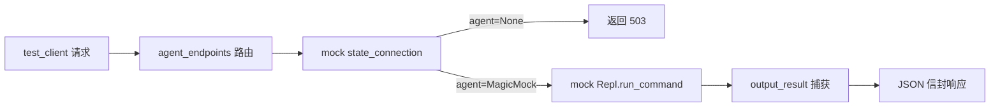

# Agent HTTP 端点测试 <code>tests/api/test_agent_endpoints.py</code>

这个测试文件验证 objection 新增的本地 HTTP API（`objection.api.app` + `objection.api.agent_endpoints`）对外暴露的端点：capabilities 查询、事件轮询、状态查询、命令执行与 Agent RPC 调用，确保无 agent 时返回 503、JSON 体校验、参数透传等契约。

## 📋 模块概览
| 项目 | 值 |
| --- | --- |
| 文件路径 | `tests/api/test_agent_endpoints.py` |
| 被测对象 | `objection.api.app.create_app`、`objection.api.agent_endpoints` |
| 用例数 | 8 |
| 框架 | unittest（Flask test client + mock.patch） |

## 🎯 测试意图
- 验证 `/capabilities`、`/events/poll`、`/state`、`/command/exec`、`/agent/rpc/<m>` 等端点的 HTTP 语义。
- 验证无 agent 连接时返回 503 + `error` 信封。
- 验证事件 `peek` 不清空缓冲、`poll` 清空缓冲。
- 验证 RPC 方法以 JSON 数组为位置参数调用，未知方法返回 500。
- 验证命令执行结果被统一输出层捕获并回写到响应体。

## 🧪 用例清单
| 用例 | 行号 | 验证点 |
| --- | --- | --- |
| `test_capabilities_no_device_needed` | `tests/api/test_agent_endpoints.py:16` | `/capabilities` 无需 agent 即返回命令清单 |
| `test_events_poll_empty` | `tests/api/test_agent_endpoints.py:25` | 空事件缓冲 poll 返回空列表与 dropped=0 |
| `test_events_peek_does_not_clear` | `tests/api/test_agent_endpoints.py:33` | peek 后事件仍可被 drain |
| `test_state_returns_503_without_agent` | `tests/api/test_agent_endpoints.py:50` | 无 agent 时 `/state` 返回 503 + error |
| `test_command_exec_requires_json_body` | `tests/api/test_agent_endpoints.py:59` | 非 JSON body 不被接受 |
| `test_command_exec_no_agent_returns_503` | `tests/api/test_agent_endpoints.py:63` | 无 agent 时命令执行返回 503 |
| `test_command_exec_runs_command` | `tests/api/test_agent_endpoints.py:69` | 已连 agent 时执行命令返回结构化 echo 结果 |
| `test_agent_rpc_unknown_method` | `tests/api/test_agent_endpoints.py:89` | 未知 RPC 方法返回 500 + error |
| `test_agent_rpc_calls_method_with_args` | `tests/api/test_agent_endpoints.py:102` | POST JSON 数组作为位置参数调用 RPC |

## ⚙️ 测试手法
使用 Flask `test_client()` 发请求，用 `mock.patch('objection.api.agent_endpoints.state_connection')` 注入伪造连接状态（`sc.agent` 为 `None` 或 `MagicMock`）。`test_command_exec_runs_command` 中（`tests/api/test_agent_endpoints.py:71-79`）进一步 patch `Repl`，并用 `fake_run` 在命令执行回调里调用 `output_result(CommandResult(...))`，验证结果被捕获器截获后写入 HTTP 响应。

## 🔍 源码索引
| 用例 | 位置 |
| --- | --- |
| `test_capabilities_no_device_needed` | `tests/api/test_agent_endpoints.py:16` |
| `test_events_poll_empty` | `tests/api/test_agent_endpoints.py:25` |
| `test_events_peek_does_not_clear` | `tests/api/test_agent_endpoints.py:33` |
| `test_state_returns_503_without_agent` | `tests/api/test_agent_endpoints.py:50` |
| `test_command_exec_requires_json_body` | `tests/api/test_agent_endpoints.py:59` |
| `test_command_exec_no_agent_returns_503` | `tests/api/test_agent_endpoints.py:63` |
| `test_command_exec_runs_command` | `tests/api/test_agent_endpoints.py:69` |
| `test_agent_rpc_unknown_method` | `tests/api/test_agent_endpoints.py:89` |
| `test_agent_rpc_calls_method_with_args` | `tests/api/test_agent_endpoints.py:102` |

## 🔗 相关文档
- [面向 AI Agent 使用](/guide/agent-usage)
