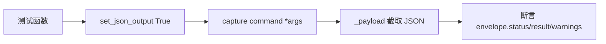

# Agent JSON 模式命令测试 <code>tests/commands/test_agent_converted_json.py</code>

验证 objection 命令在全局 JSON 输出模式下（`set_json_output(True)`）能正确产出统一 schema 的 JSON envelope。覆盖 UI、Android shell 执行、Intent、iOS binary 信息、Hook 生成、命令历史等多个模块的"已转换"JSON 路径，确保 `status`/`result`/`warnings`/`command` 字段稳定可被 AI Agent 解析。

## 📋 模块概览

| 项目 | 值 |
| --- | --- |
| 文件路径 | `tests/commands/test_agent_converted_json.py` |
| 被测对象 | `objection.commands.*`（多模块）在 JSON 模式下的输出 |
| 用例数 | 15 |
| 框架 | pytest + unittest + mock |

## 🎯 测试意图

- 确认 `set_json_output(True)` 后，各命令输出可被解析为 JSON envelope（`_payload` 截取首个 `{` 起的内容）。
- 校验 `result` 子字段语义（如 `message`/`ui`/`action`/`stdout`/`hooks`/`binaries`/`count`/`commands` 等）。
- 验证校验失败路径返回 `status == 'error'`，含告警的命令（bypass_touchid、analyze_implicit_intents）会在 `warnings` 中体现。
- 确认 `agent capabilities` 类的命令历史 history/clear 也走统一 JSON 渲染。

## 🧪 用例清单

| 用例 | 行号 | 验证点 |
| --- | --- | --- |
| test_alert_json | 22 | alert 输出 JSON，result.message == 'hello' |
| test_dump_ios_ui_json | 35 | dump_ios_ui 的 result.ui == '<window/>' |
| test_bypass_touchid_json | 43 | result.action == 'bypass_touchid' 且有 warnings |
| test_android_flag_secure_json_validates | 51 | 非法参数 status == 'error' |
| test_android_flag_secure_json | 58 | result.value == 'true' |
| test_execute_json | 73 | android_shell_exec 的 result.command/stdout |
| test_launch_activity_json | 90 | result.activity == 类名 |
| test_launch_activity_json_validates | 97 | 无参 status == 'error' |
| test_analyze_implicit_intents_json | 104 | result.action 且有 warnings |
| test_info_json | 120 | ios_binary_info 的 result.count/binaries |
| test_android_simple_json | 139 | generate simple 的 hooks 数 == 2 |
| test_android_simple_json_validates | 148 | 无类名 status == 'error' |
| test_history_json | 167 | result.count == 2 且 commands 列表 |
| test_clear_json | 174 | result.cleared == True |

## ⚙️ 测试手法

每个 `setUp`/`tearDown` 包裹 `set_json_output(True/False)` 隔离全局可变状态。命令执行用 `..helpers.capture` 捕获 stdout，再用 `_payload` 从输出里截取 JSON 段解析。对 `state_connection.get_api` 的 mock 注入返回值（如 `ios_ui_window_dump`、`android_shell_exec`、`ios_binary_info`、`android_hooking_get_class_methods`），断言 envelope 字段而非 API 调用细节。命令历史用例直接改写 `app_state.successful_commands` 后断言渲染结果。

关键代码 `tests/commands/test_agent_converted_json.py:9` 定义提取器：

```python
def _payload(output):
    return _json.loads(output[output.index('{'):])
```



## 🔍 源码索引

| 用例 | 位置 |
| --- | --- |
| test_alert_json | tests/commands/test_agent_converted_json.py:22 |
| test_dump_ios_ui_json | tests/commands/test_agent_converted_json.py:35 |
| test_bypass_touchid_json | tests/commands/test_agent_converted_json.py:43 |
| test_android_flag_secure_json_validates | tests/commands/test_agent_converted_json.py:51 |
| test_android_flag_secure_json | tests/commands/test_agent_converted_json.py:58 |
| test_execute_json | tests/commands/test_agent_converted_json.py:73 |
| test_launch_activity_json | tests/commands/test_agent_converted_json.py:90 |
| test_launch_activity_json_validates | tests/commands/test_agent_converted_json.py:97 |
| test_analyze_implicit_intents_json | tests/commands/test_agent_converted_json.py:104 |
| test_info_json | tests/commands/test_agent_converted_json.py:120 |
| test_android_simple_json | tests/commands/test_agent_converted_json.py:139 |
| test_android_simple_json_validates | tests/commands/test_agent_converted_json.py:148 |
| test_history_json | tests/commands/test_agent_converted_json.py:167 |
| test_clear_json | tests/commands/test_agent_converted_json.py:174 |

## 🔗 相关文档

- [面向 AI Agent 使用](/guide/agent-usage)
- 对应被测模块：[/reference/commands/ui](/reference/commands/ui)、[/reference/commands/memory](/reference/commands/memory)、[/reference/commands/command-history](/reference/commands/command-history)
