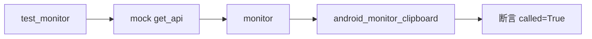

# Android 剪贴板监控测试 <code>tests/commands/android/test_clipboard.py</code>

这个测试文件验证 objection 的 Android 剪贴板监控命令 `monitor` 是否正确通过 RPC 调用设备端 `android_monitor_clipboard` 方法，启动剪贴板监听任务。

## 📋 模块概览
| 项目 | 值 |
| --- | --- |
| 文件路径 | `tests/commands/android/test_clipboard.py` |
| 被测对象 | `objection.commands.android.clipboard.monitor` |
| 用例数 | 1 |
| 框架 | unittest（mock.patch 隔离 RPC） |

## 🎯 测试意图
- 验证 `monitor([])` 调用后，设备端 `android_monitor_clipboard` RPC 方法被触发。
- 不关心返回值或输出，只断言 RPC 调用发生。

## 🧪 用例清单
| 用例 | 行号 | 验证点 |
| --- | --- | --- |
| `test_monitor` | `tests/commands/android/test_clipboard.py:9` | `monitor` 触发 `android_monitor_clipboard` RPC |

## ⚙️ 测试手法
通过 `@mock.patch('objection.state.connection.state_connection.get_api')` 替换全局 RPC 句柄（`tests/commands/android/test_clipboard.py:8`），调用 `monitor([])` 后断言 `mock_api.return_value.android_monitor_clipboard.called` 为真。命令无参数、无输出校验，是最简单的 RPC 透传型用例。

## 🔍 源码索引
| 用例 | 位置 |
| --- | --- |
| `test_monitor` | `tests/commands/android/test_clipboard.py:9` |

## 🔗 相关文档
- 对应被测模块文档：`/reference/commands/android/clipboard`（如存在）
