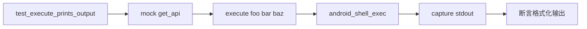

# Android Shell 命令执行测试 <code>tests/commands/android/test_command.py</code>

这个测试文件验证 objection 的 Android shell 命令执行命令 `execute`，确认它能把参数拼成命令并通过 RPC 调用 `android_shell_exec`，再按预期格式打印 stdout/stderr。

## 📋 模块概览
| 项目 | 值 |
| --- | --- |
| 文件路径 | `tests/commands/android/test_command.py` |
| 被测对象 | `objection.commands.android.command.execute` |
| 用例数 | 1 |
| 框架 | unittest（mock.patch + capture） |

## 🎯 测试意图
- 验证参数 `['foo','bar','baz']` 被拼成命令字符串 `foo bar baz`。
- 验证 RPC 返回的 `stdOut`/`stdErr` 被格式化打印（含 "Running shell command" 前缀、空行分隔）。
- 验证输出顺序：命令提示 → stdout → stderr。

## 🧪 用例清单
| 用例 | 行号 | 验证点 |
| --- | --- | --- |
| `test_execute_prints_output` | `tests/commands/android/test_command.py:10` | 拼接参数、调用 RPC、格式化打印 stdOut/stdErr |

## ⚙️ 测试手法
通过 `@mock.patch(...get_api)` 注入 mock（`tests/commands/android/test_command.py:9`），预设 `android_shell_exec` 返回包含 `command`/`stdErr`/`stdOut` 三字段的字典。用 `capture(execute, ['foo','bar','baz'])` 捕获 stdout，再与多行字符串字面量逐字符比对，覆盖前缀、换行与字段顺序。

## 🔍 源码索引
| 用例 | 位置 |
| --- | --- |
| `test_execute_prints_output` | `tests/commands/android/test_command.py:10` |

## 🔗 相关文档
- 对应被测模块文档：`/reference/commands/android/command`（如存在）
