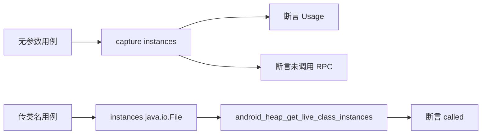

# Android 堆实例枚举测试 <code>tests/commands/android/test_heap.py</code>

这个测试文件验证 objection 的 Android 堆实例枚举命令 `instances`：无参数时打印用法提示且不发起 RPC；传入类名时调用设备端 `android_heap_get_live_class_instances`。

## 📋 模块概览
| 项目 | 值 |
| --- | --- |
| 文件路径 | `tests/commands/android/test_heap.py` |
| 被测对象 | `objection.commands.android.heap.instances` |
| 用例数 | 2 |
| 框架 | unittest（mock.patch + capture） |

## 🎯 测试意图
- 验证缺少类名参数时打印 Usage 提示并阻止 RPC 调用。
- 验证传入类名（如 `java.io.File`）时触发 `android_heap_get_live_class_instances` RPC。

## 🧪 用例清单
| 用例 | 行号 | 验证点 |
| --- | --- | --- |
| `test_print_live_instances_validates_command` | `tests/commands/android/test_heap.py:10` | 无参数打印 Usage 且不调用 RPC |
| `test_print_live_instances_validates_command` | `tests/commands/android/test_heap.py:18` | 传类名触发 RPC 调用 |

::: tip 注意
两个用例同名（源码中即如此重复命名），实际是不同断言：前者验证用法提示，后者验证 RPC 触发。
:::

## ⚙️ 测试手法
两个用例都 `@mock.patch(...get_api)`（`tests/commands/android/test_heap.py:9`、`:17`）。第一个用 `capture(instances, [])` 捕获输出并断言 Usage 文本，同时断言 `android_heap_get_live_class_instances` 未被调用；第二个直接 `instances(['java.io.File'])` 并断言 RPC 被调用。

## 🔍 源码索引
| 用例 | 位置 |
| --- | --- |
| `test_print_live_instances_validates_command`（用法） | `tests/commands/android/test_heap.py:10` |
| `test_print_live_instances_validates_command`（RPC） | `tests/commands/android/test_heap.py:18` |

## 🔗 相关文档
- 对应被测模块文档：`/reference/commands/android/heap`（如存在）
