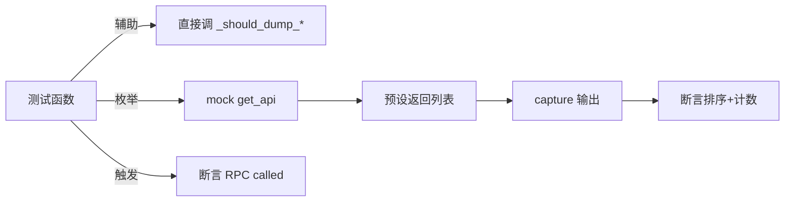

# Android Hooking 测试 <code>tests/commands/android/test_hooking.py</code>

这个测试文件验证 objection 的 Android hooking 命令模块，覆盖参数解析辅助函数（`--dump-backtrace`/`--dump-args`/`--dump-return`/字符串布尔）、类与方法枚举、已注册组件（广播接收器/服务/Activity）列表、方法返回值设置以及当前 Activity/Fragment 获取。

## 📋 模块概览
| 项目 | 值 |
| --- | --- |
| 文件路径 | `tests/commands/android/test_hooking.py` |
| 被测对象 | `objection.commands.android.hooking` |
| 用例数 | 18 |
| 框架 | unittest（mock.patch + capture） |

## 🎯 测试意图
- 验证布尔/开关类参数解析辅助函数对各种参数列表的判定。
- 验证枚举命令对空数据与多元素数据的格式化输出（排序、计数行）。
- 验证缺少必要参数时打印 Usage 提示。
- 验证 `set_method_return_value` 与 `get_current_activity` 正确调用对应 RPC。

## 🧪 用例清单
| 用例 | 行号 | 验证点 |
| --- | --- | --- |
| `test_checks_if_string_value_is_python_boolean_true` | `tests/commands/android/test_hooking.py:12` | `_string_is_true('true')` 返回 True |
| `test_checks_if_string_value_is_python_boolean_false` | `tests/commands/android/test_hooking.py:17` | `_string_is_true('false')` 返回 False |
| `test_argument_includes_backtrace_flag` | `tests/commands/android/test_hooking.py:22` | `--dump-backtrace` 被识别 |
| `test_argument_dump_args_returns_true` | `tests/commands/android/test_hooking.py:30` | `--dump-args` 返回 True |
| `test_argument_dump_args_returns_false` | `tests/commands/android/test_hooking.py:38` | 无 `--dump-args` 返回 False |
| `test_argument_dump_return_returns_true` | `tests/commands/android/test_hooking.py:45` | `--dump-return` 返回 True |
| `test_argument_dump_return_returns_false` | `tests/commands/android/test_hooking.py:53` | 无 `--dump-return` 返回 False |
| `test_show_android_classes` | `tests/commands/android/test_hooking.py:61` | 类列表排序打印并计数 |
| `test_show_android_class_methods_validates_arguments` | `tests/commands/android/test_hooking.py:80` | 无类名打印 Usage |
| `test_show_android_class_methods` | `tests/commands/android/test_hooking.py:87` | 方法列表排序打印并计数 |
| `test_show_registered_broadcast_receivers_handles_empty_data` | `tests/commands/android/test_hooking.py:106` | 空数据打印 Found 0 |
| `test_show_registered_broadcast_receivers` | `tests/commands/android/test_hooking.py:115` | 多元素排序打印并计数 |
| `test_show_registered_services_handles_empty_data` | `tests/commands/android/test_hooking.py:133` | 空数据 Found 0 |
| `test_show_services` | `tests/commands/android/test_hooking.py:142` | 服务列表排序打印 |
| `test_show_registered_activities_handles_empty_data` | `tests/commands/android/test_hooking.py:160` | 空数据 Found 0 |
| `test_show_registered_activities` | `tests/commands/android/test_hooking.py:169` | Activity 列表排序打印 |
| `test_set_method_return_value_validates_arguments` | `tests/commands/android/test_hooking.py:186` | 缺参数打印 Usage |
| `test_set_method_return_value` | `tests/commands/android/test_hooking.py:195` | 触发 `android_hooking_set_method_return` |
| `test_get_current_activity_and_fragment` | `tests/commands/android/test_hooking.py:201` | 打印 Activity/Fragment |

## ⚙️ 测试手法
辅助函数用例直接调用 `_string_is_true`/`_should_dump_*` 并断言布尔返回。枚举类用例 `@mock.patch(...get_api)` 注入 RPC，预设返回列表，用 `capture` 捕获输出后与含排序结果和计数行的多行字符串逐字比对（如 `tests/commands/android/test_hooking.py:71-76`）。RPC 触发类用例仅断言 `.called` 为真。

## 🔍 源码索引
| 用例 | 位置 |
| --- | --- |
| `test_checks_if_string_value_is_python_boolean_true` | `tests/commands/android/test_hooking.py:12` |
| `test_checks_if_string_value_is_python_boolean_false` | `tests/commands/android/test_hooking.py:17` |
| `test_argument_includes_backtrace_flag` | `tests/commands/android/test_hooking.py:22` |
| `test_argument_dump_args_returns_true` | `tests/commands/android/test_hooking.py:30` |
| `test_argument_dump_args_returns_false` | `tests/commands/android/test_hooking.py:38` |
| `test_argument_dump_return_returns_true` | `tests/commands/android/test_hooking.py:45` |
| `test_argument_dump_return_returns_false` | `tests/commands/android/test_hooking.py:53` |
| `test_show_android_classes` | `tests/commands/android/test_hooking.py:61` |
| `test_show_android_class_methods_validates_arguments` | `tests/commands/android/test_hooking.py:80` |
| `test_show_android_class_methods` | `tests/commands/android/test_hooking.py:87` |
| `test_show_registered_broadcast_receivers_handles_empty_data` | `tests/commands/android/test_hooking.py:106` |
| `test_show_registered_broadcast_receivers` | `tests/commands/android/test_hooking.py:115` |
| `test_show_registered_services_handles_empty_data` | `tests/commands/android/test_hooking.py:133` |
| `test_show_services` | `tests/commands/android/test_hooking.py:142` |
| `test_show_registered_activities_handles_empty_data` | `tests/commands/android/test_hooking.py:160` |
| `test_show_registered_activities` | `tests/commands/android/test_hooking.py:169` |
| `test_set_method_return_value_validates_arguments` | `tests/commands/android/test_hooking.py:186` |
| `test_set_method_return_value` | `tests/commands/android/test_hooking.py:195` |
| `test_get_current_activity_and_fragment` | `tests/commands/android/test_hooking.py:201` |

## 🔗 相关文档
- 对应被测模块文档：`/reference/commands/android/hooking`（如存在）
