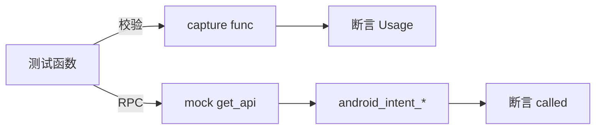

# Android Intent 测试 <code>tests/commands/android/test_intents.py</code>

这个测试文件验证 objection 的 Android intent 命令：`launch_activity`、`launch_service` 与 `analyze_implicit_intents`，覆盖参数校验与 RPC 透传。

## 📋 模块概览
| 项目 | 值 |
| --- | --- |
| 文件路径 | `tests/commands/android/test_intents.py` |
| 被测对象 | `objection.commands.android.intents` |
| 用例数 | 5 |
| 框架 | unittest（mock.patch + capture） |

## 🎯 测试意图
- 验证 `launch_activity`/`launch_service` 缺少类名时打印 Usage 提示。
- 验证传入类名时分别触发 `android_intent_start_activity`/`android_intent_start_service` RPC。
- 验证 `analyze_implicit_intents` 触发 `android_intent_analyze` RPC。

## 🧪 用例清单
| 用例 | 行号 | 验证点 |
| --- | --- | --- |
| `test_launch_activity_validates_arguments` | `tests/commands/android/test_intents.py:9` | 无参数打印 Usage |
| `test_launch_activity` | `tests/commands/android/test_intents.py:16` | 触发 `android_intent_start_activity` |
| `test_launch_service_validates_arguments` | `tests/commands/android/test_intents.py:21` | 无参数打印 Usage |
| `test_launch_service` | `tests/commands/android/test_intents.py:28` | 触发 `android_intent_start_service` |
| `test_analyze_implicit_intents` | `tests/commands/android/test_intents.py:34` | 触发 `android_intent_analyze` |

## ⚙️ 测试手法
校验类用例用 `capture(func, [])` 捕获 Usage 文本并断言；RPC 类用例 `@mock.patch(...get_api)` 注入后直接调用命令并断言 `.called` 为真。无返回值或输出校验，是典型的参数校验 + RPC 透传双层用例。

## 🔍 源码索引
| 用例 | 位置 |
| --- | --- |
| `test_launch_activity_validates_arguments` | `tests/commands/android/test_intents.py:9` |
| `test_launch_activity` | `tests/commands/android/test_intents.py:16` |
| `test_launch_service_validates_arguments` | `tests/commands/android/test_intents.py:21` |
| `test_launch_service` | `tests/commands/android/test_intents.py:28` |
| `test_analyze_implicit_intents` | `tests/commands/android/test_intents.py:34` |

## 🔗 相关文档
- 对应被测模块文档：`/reference/commands/android/intents`（如存在）
