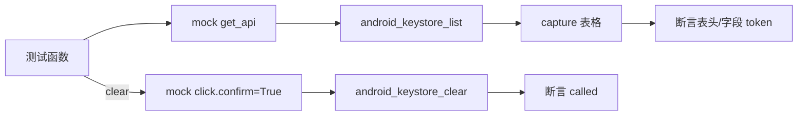

# Android Keystore 测试 <code>tests/commands/android/test_keystore.py</code>

这个测试文件验证 objection 的 Android keystore 命令 `entries` 与 `clear`，覆盖空数据/有数据两种表格输出以及清空前的二次确认。

## 📋 模块概览
| 项目 | 值 |
| --- | --- |
| 文件路径 | `tests/commands/android/test_keystore.py` |
| 被测对象 | `objection.commands.android.keystore`（`entries`、`clear`） |
| 用例数 | 3 |
| 框架 | unittest（mock.patch + capture） |

## 🎯 测试意图
- 验证 `entries` 在空列表时仍打印表头（Alias/Key/Certificate）。
- 验证有数据时表格包含别名与布尔值字段。
- 验证 `clear` 在 `click.confirm` 返回 True 后调用 `android_keystore_clear` RPC。

## 🧪 用例清单
| 用例 | 行号 | 验证点 |
| --- | --- | --- |
| `test_entries_handles_empty_data` | `tests/commands/android/test_keystore.py:10` | 空数据打印表头 |
| `test_entries_handles` | `tests/commands/android/test_keystore.py:21` | 有数据打印别名与布尔字段 |
| `test_clear` | `tests/commands/android/test_keystore.py:36` | confirm=True 后触发清空 RPC |

## ⚙️ 测试手法
`entries` 用例 `@mock.patch(...get_api)` 预设 `android_keystore_list` 返回值，用 `capture` 捕获 tabulate 表格输出。注释（`tests/commands/android/test_keystore.py:16`）说明不锁定 tabulate 精确列宽，只断言关键字段 token 存在。`clear` 用例额外 patch `click.confirm`（`:35`）返回 True，再断言 RPC 被调用。

## 🔍 源码索引
| 用例 | 位置 |
| --- | --- |
| `test_entries_handles_empty_data` | `tests/commands/android/test_keystore.py:10` |
| `test_entries_handles` | `tests/commands/android/test_keystore.py:21` |
| `test_clear` | `tests/commands/android/test_keystore.py:36` |

## 🔗 相关文档
- 对应被测模块文档：`/reference/commands/android/keystore`（如存在）
