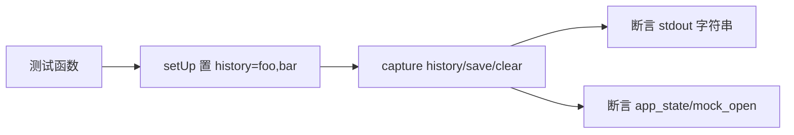

# 命令历史测试 <code>tests/commands/test_command_history.py</code>

验证 `objection.commands.command_history` 模块的 history/save/clear 三个命令：打印当前会话历史、保存到本地 `.rc` 文件、清空历史。测试通过 `capture` 上下文断言人类可读输出，并检查 `app_state` 状态变更。

## 📋 模块概览

| 项目 | 值 |
| --- | --- |
| 文件路径 | `tests/commands/test_command_history.py` |
| 被测对象 | `objection.commands.command_history`（history/save/clear） |
| 用例数 | 4 |
| 框架 | pytest + unittest + mock |

## 🎯 测试意图

- 确认 `history` 列出 `app_state.successful_commands` 中的去重命令并带表头。
- 确认 `save` 在参数缺失时打印 Usage，参数齐全时写入本地文件。
- 确认 `clear` 重置 `app_state.successful_commands` 并提示已清空。
- 通过 `setUp`/`tearDown` 固定历史为 `['foo','bar']` 并最终清空，隔离用例间状态。

## 🧪 用例清单

| 用例 | 行号 | 验证点 |
| --- | --- | --- |
| test_prints_command_history | 16 | 输出含表头 + foo + bar |
| test_save_validates_arguments | 27 | 无参输出 Usage 字符串 |
| test_save_saves_to_file | 34 | 输出保存提示且 open 被调用 |
| test_clear_clears_command_history | 41 | 输出清空提示且 history 长度为 0 |

## ⚙️ 测试手法

用 `capture(history, [])` 捕获 stdout 后做字符串相等断言。`save` 用例以 `@mock.patch('objection.commands.command_history.open', create=True)` mock 内建 `open`，断言 `mock_open.called` 而不真正写盘。`clear` 用例额外断言 `app_state.successful_commands` 长度归零。

关键代码 `tests/commands/test_command_history.py:34`：

```python
@mock.patch('objection.commands.command_history.open', create=True)
def test_save_saves_to_file(self, mock_open):
    with capture(save, ['foo.rc']) as o:
        output = o
    self.assertEqual(output, 'Saved commands to: foo.rc\n')
    self.assertTrue(mock_open.called)
```



## 🔍 源码索引

| 用例 | 位置 |
| --- | --- |
| test_prints_command_history | tests/commands/test_command_history.py:16 |
| test_save_validates_arguments | tests/commands/test_command_history.py:27 |
| test_save_saves_to_file | tests/commands/test_command_history.py:34 |
| test_clear_clears_command_history | tests/commands/test_command_history.py:41 |

## 🔗 相关文档

- 对应被测模块文档：[/reference/commands/command-history](/reference/commands/command-history)
