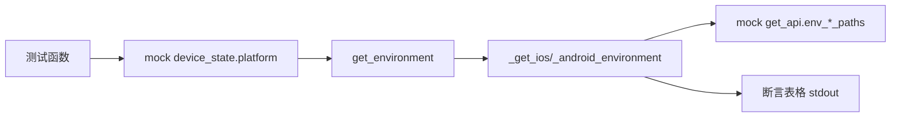

# 设备环境信息测试 <code>tests/commands/test_device.py</code>

验证 `objection.commands.device` 的 `get_environment` 平台分发逻辑，以及 iOS/Android 各自的 `_get_ios_environment`/`_get_android_environment` 私有方法能正确调用 API 并以表格打印路径信息。

## 📋 模块概览

| 项目 | 值 |
| --- | --- |
| 文件路径 | `tests/commands/test_device.py` |
| 被测对象 | `objection.commands.device`（get_environment/_get_ios_environment/_get_android_environment） |
| 用例数 | 4 |
| 框架 | pytest + unittest + mock |

## 🎯 测试意图

- 确认 `get_environment` 根据 `device_state.platform`（Ios/Android）分发到对应平台方法。
- 确认 iOS 环境方法调用 `env_ios_paths` 并以两列表格打印路径名与路径值。
- 确认 Android 环境方法调用 `env_android_paths` 并同样打印。
- 用 `PropertyMock` 模拟 `device_state.platform` 属性，断言分发调用链。

## 🧪 用例清单

| 用例 | 行号 | 验证点 |
| --- | --- | --- |
| test_gets_environment_and_calls_ios_platform_specific_method | 13 | platform=Ios 时调用 _get_ios_environment |
| test_gets_environment_and_calls_android_platform_specific_method | 22 | platform=Android 时调用 _get_android_environment |
| test_prints_ios_environment_via_platform_helpers | 31 | env_ios_paths 返回值渲染为表格 |
| test_prints_android_environment_via_platform_helpers | 47 | env_android_paths 返回值渲染为表格 |

## ⚙️ 测试手法

分发用例以 `@mock.patch('objection.commands.device.device_state')` + `mock.PropertyMock(return_value=Ios/Android)` 注入平台类型，再 `@mock.patch` 对应私有方法，断言其 `.called`。渲染用例以 `@mock.patch('objection.state.connection.state_connection.get_api')` 注入 `env_ios_paths`/`env_android_paths` 返回值，用 `capture` 捕获 stdout 做精确字符串相等。

关键代码 `tests/commands/test_device.py:13`：

```python
@mock.patch('objection.commands.device._get_ios_environment')
@mock.patch('objection.commands.device.device_state')
def test_gets_environment_and_calls_ios_platform_specific_method(self, mock_device_state, mock_ios_environment):
    type(mock_device_state).platform = mock.PropertyMock(return_value=Ios)
    get_environment()
    self.assertTrue(mock_ios_environment.called)
```



## 🔍 源码索引

| 用例 | 位置 |
| --- | --- |
| test_gets_environment_and_calls_ios_platform_specific_method | tests/commands/test_device.py:13 |
| test_gets_environment_and_calls_android_platform_specific_method | tests/commands/test_device.py:22 |
| test_prints_ios_environment_via_platform_helpers | tests/commands/test_device.py:31 |
| test_prints_android_environment_via_platform_helpers | tests/commands/test_device.py:47 |

## 🔗 相关文档

- 对应被测模块文档：[/reference/commands/device](/reference/commands/device)
