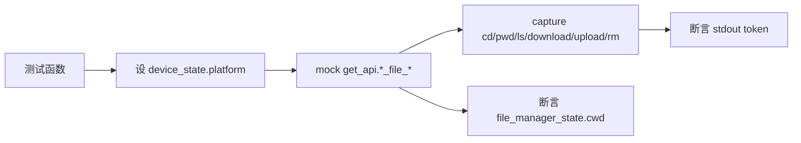

# 文件管理命令测试 <code>tests/commands/test_filemanager.py</code>

验证 `objection.commands.filemanager` 的全套文件操作：cd/pwd/ls/download/upload/rm，及其 iOS/Android 平台私有 helper 方法。覆盖路径校验、相对/绝对路径拼接、`.`/`..` 处理、可读性判断、目录列表渲染与下载/上传字节流。

## 📋 模块概览

| 项目 | 值 |
| --- | --- |
| 文件路径 | `tests/commands/test_filemanager.py` |
| 被测对象 | `objection.commands.filemanager`（cd/pwd/ls/download/upload/rm 及 _ios/_android helper） |
| 用例数 | 40 |
| 框架 | pytest + unittest + mock |

## 🎯 测试意图

- 验证 `cd` 对参数缺失、`.`、`..`、绝对路径、相对路径的处理，以及跨平台（Ios/Android）路径存在性检查代理。
- 验证 `pwd`/`pwd_print` 在已设 cwd 与未设时的回退逻辑（调用 `_pwd_ios`/`_pwd_android` 并更新 `file_manager_state.cwd`）。
- 验证 `ls` 在无参时取 pwd，分发到平台 helper，并以表格渲染目录属性（iOS NSFile* 字段、Android isDirectory/lastModified 等）。
- 验证 `download`/`upload` 的参数校验、平台分发，及下载时对可读性、文件类型（folder 需 `--folder`）的检查与字节写入。
- 验证 `rm` 的确认交互（`click.confirm`）与 Android helper 删除调用。

## 🧪 用例清单

| 用例 | 行号 | 验证点 |
| --- | --- | --- |
| test_cd_argument_validation | 15 | 无参输出 Usage |
| test_cd_to_dot_directory_does_nothing | 21 | cd . 不变 cwd |
| test_cd_to_double_dot_moves_up_one_directory | 28 | cd .. 上一级并打印新路径 |
| test_cd_to_double_dot_moves_stays_in_current_directory_if_already_root | 37 | 根目录 cd .. 保持 / |
| test_cd_to_absoluate_ios_path | 47 | iOS 绝对路径设置成功 |
| test_cd_to_absoluate_android_path | 60 | Android 绝对路径设置成功 |
| test_cd_to_absoluate_ios_path_that_does_not_exist | 73 | 不存在路径报 Invalid |
| test_cd_to_relative_path_ios | 86 | iOS 相对路径拼接 |
| test_cd_to_relative_path_android | 99 | Android 相对路径拼接 |
| test_cd_to_relative_path_ios_that_does_not_exist | 112 | 相对路径不存在报错 |
| test_ios_path_exists_helper | 125 | _path_exists_ios 调 ios_file_exists |
| test_rm_dispatcher_validates_arguments | 130 | rm 无参 Usage |
| test_rm_dispatcher_confirms_before_delete | 140 | confirm=False 不删除 |
| test_rm_dispatcher_calls_android_rm_helper | 155 | confirm=True 调 _rm_android |
| test_rm_android_helper_file_exists | 166 | _rm_android 文件存在时删除 |
| test_android_path_exists_helper | 178 | _path_exists_android 调 android_file_exists |
| test_returns_current_directory_via_helper_when_already_set | 183 | cwd 已设时 pwd 直接返回 |
| test_returns_current_directory_via_helper_for_ios | 189 | iOS 平台调 _pwd_ios |
| test_returns_current_directory_via_helper_for_android | 197 | Android 平台调 _pwd_android |
| test_prints_the_current_working_directory | 204 | pwd_print 输出当前目录 |
| test_get_ios_pwd_via_helper | 213 | _pwd_ios 调 ios_file_cwd 并更新 state |
| test_get_android_pwd_via_helper | 220 | _pwd_android 调 android_file_cwd 并更新 state |
| test_ls_gets_pwd_from_helper_with_no_argument | 228 | ls 无参先取 pwd |
| test_ls_calls_ios_helper_method | 236 | iOS 平台调 _ls_ios |
| test_ls_calls_android_helper_method | 244 | Android 平台调 _ls_android |
| test_lists_readable_ios_directory_using_helper_method | 252 | iOS 目录渲染含 NSFile 字段与大小 |
| test_lists_readable_ios_directory_using_helper_method_no_attributes | 288 | 属性为空时显示 n/a |
| test_lists_unreadable_ios_directory_using_helper_method | 313 | 不可读时只输出 Readable/Writable |
| test_lists_readable_android_directory_using_helper_method | 327 | Android 目录渲染含 Type/Size/时间 |
| test_lists_unreadable_android_directory_using_helper_method | 358 | Android 不可读只输出状态 |
| test_download_platform_proxy_validates_arguments | 371 | download 无参 Usage |
| test_download_platform_proxy_calls_ios_method | 378 | iOS 平台调 _download_ios |
| test_download_platform_proxy_calls_android_method | 386 | Android 平台调 _download_android |
| test_downloads_file_with_ios_helper | 395 | iOS 下载写盘并打印流程 |
| test_downloads_file_but_fails_on_unreadable_with_ios_helper | 415 | iOS 不可读报错 |
| test_downloads_file_but_fails_on_file_type_with_ios_helper | 424 | iOS 非文件提示 --folder |
| test_downloads_file_with_android_helper | 435 | Android 下载写盘 |
| test_downloads_file_but_fails_on_unreadable_with_android_helper | 456 | Android 不可读报错 |
| test_downloads_file_but_fails_on_file_type_with_android_helper | 469 | Android 非文件提示 --folder |
| test_file_upload_method_proxy_validates_arguments | 481 | upload 无参 Usage |
| test_file_upload_method_proxy_calls_ios_helper_method | 488 | iOS 平台调 _upload_ios |
| test_file_upload_method_proxy_calls_android_helper_method | 496 | Android 平台调 _upload_android |

## ⚙️ 测试手法

平台分发用 `device_state.platform = Ios/Android` 设置当前平台。API 注入统一走 `@mock.patch('objection.state.connection.state_connection.get_api')`，对 `ios_file_*`/`android_file_*` 系列方法设返回值。目录列表用例采用 `assertIn` 逐 token 断言关键字段而非锁定 tabulate 列宽（见 `:281` 注释）。下载用例以 `@mock.patch('objection.commands.filemanager.open', create=True)` mock 内建 `open` 验证写盘。`rm` 用 `click.confirm` mock 控制确认分支。每个用例 `tearDown` 重置 `file_manager_state.cwd = None`。

关键代码 `tests/commands/test_filemanager.py:252` 渲染断言片段：

```python
for token in ('NSFileType', 'Perms', 'NSFileProtection', 'Read', 'Write',
              'Owner', 'Group', 'Size', 'Creation', 'Name', ...):
    self.assertIn(token, output)
```



## 🔍 源码索引

| 用例 | 位置 |
| --- | --- |
| test_cd_argument_validation | tests/commands/test_filemanager.py:15 |
| test_cd_to_dot_directory_does_nothing | tests/commands/test_filemanager.py:21 |
| test_cd_to_double_dot_moves_up_one_directory | tests/commands/test_filemanager.py:28 |
| test_cd_to_double_dot_moves_stays_in_current_directory_if_already_root | tests/commands/test_filemanager.py:37 |
| test_cd_to_absoluate_ios_path | tests/commands/test_filemanager.py:47 |
| test_cd_to_absoluate_android_path | tests/commands/test_filemanager.py:60 |
| test_cd_to_absoluate_ios_path_that_does_not_exist | tests/commands/test_filemanager.py:73 |
| test_cd_to_relative_path_ios | tests/commands/test_filemanager.py:86 |
| test_cd_to_relative_path_android | tests/commands/test_filemanager.py:99 |
| test_cd_to_relative_path_ios_that_does_not_exist | tests/commands/test_filemanager.py:112 |
| test_ios_path_exists_helper | tests/commands/test_filemanager.py:125 |
| test_rm_dispatcher_validates_arguments | tests/commands/test_filemanager.py:130 |
| test_rm_dispatcher_confirms_before_delete | tests/commands/test_filemanager.py:140 |
| test_rm_dispatcher_calls_android_rm_helper | tests/commands/test_filemanager.py:155 |
| test_rm_android_helper_file_exists | tests/commands/test_filemanager.py:166 |
| test_android_path_exists_helper | tests/commands/test_filemanager.py:178 |
| test_returns_current_directory_via_helper_when_already_set | tests/commands/test_filemanager.py:183 |
| test_returns_current_directory_via_helper_for_ios | tests/commands/test_filemanager.py:189 |
| test_returns_current_directory_via_helper_for_android | tests/commands/test_filemanager.py:197 |
| test_prints_the_current_working_directory | tests/commands/test_filemanager.py:204 |
| test_get_ios_pwd_via_helper | tests/commands/test_filemanager.py:213 |
| test_get_android_pwd_via_helper | tests/commands/test_filemanager.py:220 |
| test_ls_gets_pwd_from_helper_with_no_argument | tests/commands/test_filemanager.py:228 |
| test_ls_calls_ios_helper_method | tests/commands/test_filemanager.py:236 |
| test_ls_calls_android_helper_method | tests/commands/test_filemanager.py:244 |
| test_lists_readable_ios_directory_using_helper_method | tests/commands/test_filemanager.py:252 |
| test_lists_readable_ios_directory_using_helper_method_no_attributes | tests/commands/test_filemanager.py:288 |
| test_lists_unreadable_ios_directory_using_helper_method | tests/commands/test_filemanager.py:313 |
| test_lists_readable_android_directory_using_helper_method | tests/commands/test_filemanager.py:327 |
| test_lists_unreadable_android_directory_using_helper_method | tests/commands/test_filemanager.py:358 |
| test_download_platform_proxy_validates_arguments | tests/commands/test_filemanager.py:371 |
| test_download_platform_proxy_calls_ios_method | tests/commands/test_filemanager.py:378 |
| test_download_platform_proxy_calls_android_method | tests/commands/test_filemanager.py:386 |
| test_downloads_file_with_ios_helper | tests/commands/test_filemanager.py:395 |
| test_downloads_file_but_fails_on_unreadable_with_ios_helper | tests/commands/test_filemanager.py:415 |
| test_downloads_file_but_fails_on_file_type_with_ios_helper | tests/commands/test_filemanager.py:424 |
| test_downloads_file_with_android_helper | tests/commands/test_filemanager.py:435 |
| test_downloads_file_but_fails_on_unreadable_with_android_helper | tests/commands/test_filemanager.py:456 |
| test_downloads_file_but_fails_on_file_type_with_android_helper | tests/commands/test_filemanager.py:469 |
| test_file_upload_method_proxy_validates_arguments | tests/commands/test_filemanager.py:481 |
| test_file_upload_method_proxy_calls_ios_helper_method | tests/commands/test_filemanager.py:488 |
| test_file_upload_method_proxy_calls_android_helper_method | tests/commands/test_filemanager.py:496 |

## 🔗 相关文档

- 对应被测模块文档：[/reference/commands/filemanager](/reference/commands/filemanager)
