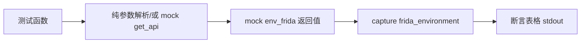

# Frida 环境命令测试 <code>tests/commands/test_frida_commands.py</code>

验证 `objection.commands.frida_commands` 的两个能力：`_should_disable_exception_handler` 参数解析，以及 `frida_environment` 调用 API 获取 Frida 运行时信息并以表格渲染版本/架构/平台/堆大小等。

## 📋 模块概览

| 项目 | 值 |
| --- | --- |
| 文件路径 | `tests/commands/test_frida_commands.py` |
| 被测对象 | `objection.commands.frida_commands`（_should_disable_exception_handler/frida_environment） |
| 用例数 | 2 |
| 框架 | pytest + unittest + mock |

## 🎯 测试意图

- 确认 `--no-exception-handler` 参数被正确识别为禁用异常处理器（返回 True）。
- 确认 `frida_environment` 调用 `env_frida` 并把返回的 arch/version/heap 等渲染为对齐表格，堆大小按 MiB 格式化。

## 🧪 用例清单

| 用例 | 行号 | 验证点 |
| --- | --- | --- |
| test_detects_no_exception_handler_argument | 9 | 含 --no-exception-handler 返回 True |
| test_gets_frida_environment | 18 | env_frida 渲染为表格，含版本/架构/堆大小 |

## ⚙️ 测试手法

`_should_disable_exception_handler` 是纯参数解析，直接传入字符串列表断言布尔结果。`frida_environment` 用例以 `@mock.patch('objection.state.connection.state_connection.get_api')` 注入 `env_frida` 返回值（含 `heap: 6988464` 字节），用 `capture` 捕获 stdout 做精确字符串相等，验证 `6.7 MiB` 格式化。

关键代码 `tests/commands/test_frida_commands.py:18`：

```python
@mock.patch('objection.state.connection.state_connection.get_api')
def test_gets_frida_environment(self, mock_api):
    mock_api.return_value.env_frida.return_value = {
        'arch': 'x64', 'debugger': True, 'heap': 6988464,
        'platform': 'darwin', 'version': '12.0.3', 'runtime': 'DUK'}
    with capture(frida_environment, []) as o:
        output = o
    self.assertEqual(output, expected_output)
```



## 🔍 源码索引

| 用例 | 位置 |
| --- | --- |
| test_detects_no_exception_handler_argument | tests/commands/test_frida_commands.py:9 |
| test_gets_frida_environment | tests/commands/test_frida_commands.py:18 |

## 🔗 相关文档

- 对应被测模块文档：[/reference/commands/frida-commands](/reference/commands/frida-commands)
