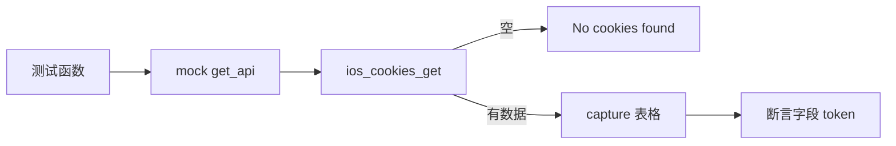

# iOS Cookies 测试 <code>tests/commands/ios/test_cookies.py</code>

这个测试文件验证 objection 的 iOS cookie 读取命令 `get`，覆盖空数据与有数据两种表格输出。

## 📋 模块概览
| 项目 | 值 |
| --- | --- |
| 文件路径 | `tests/commands/ios/test_cookies.py` |
| 被测对象 | `objection.commands.ios.cookies.get` |
| 用例数 | 2 |
| 框架 | unittest（mock.patch + capture） |

## 🎯 测试意图
- 验证空 cookie 列表时打印 "No cookies found"。
- 验证有数据时表格包含 name/value/expires/domain/path/secure/httpOnly 等字段。

## 🧪 用例清单
| 用例 | 行号 | 验证点 |
| --- | --- | --- |
| `test_get_handles_empty_data` | `tests/commands/ios/test_cookies.py:10` | 空数据打印提示 |
| `test_get` | `tests/commands/ios/test_cookies.py:19` | 有数据打印字段 token |

## ⚙️ 测试手法
两个用例都 `@mock.patch(...get_api)`（`:9`、`:18`）预设 `ios_cookies_get` 返回值。空数据用例断言整行输出为 `'No cookies found\n'`；有数据用例用 `capture` 捕获 tabulate 表格，按注释（`:33`）不锁定列宽，只断言关键字段 token 存在。

## 🔍 源码索引
| 用例 | 位置 |
| --- | --- |
| `test_get_handles_empty_data` | `tests/commands/ios/test_cookies.py:10` |
| `test_get` | `tests/commands/ios/test_cookies.py:19` |

## 🔗 相关文档
- 对应被测模块文档：`/reference/commands/ios/cookies`（如存在）
