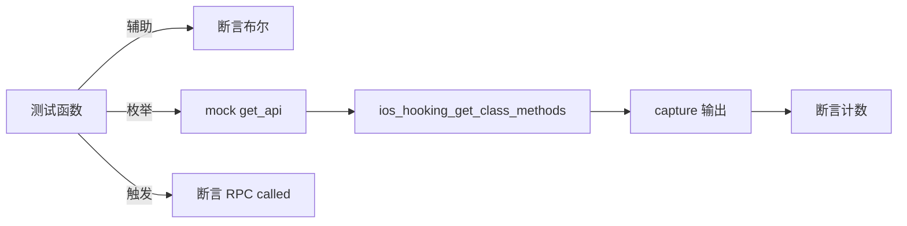

# iOS Hooking 测试 <code>tests/commands/ios/test_hooking.py</code>

这个测试文件验证 objection 的 iOS hooking 命令模块，覆盖辅助函数（忽略 native 类、包含父类方法、native 前缀判定、字符串布尔）、`show_ios_class_methods` 列表与 `set_method_return_value` 的参数校验及 RPC 透传。

## 📋 模块概览
| 项目 | 值 |
| --- | --- |
| 文件路径 | `tests/commands/ios/test_hooking.py` |
| 被测对象 | `objection.commands.ios.hooking` |
| 用例数 | 11 |
| 框架 | unittest（mock.patch + capture） |

## 🎯 测试意图
- 验证 `--ignore-native`/`--include-parents` flag 解析。
- 验证 `_class_is_prefixed_with_native` 对 `AC` 前缀类的判定。
- 验证 `_string_is_true` 对 'true' 与其他字符串的判定。
- 验证 `show_ios_class_methods` 缺类名时打印 Usage，有类名时排序打印并计数。
- 验证 `set_method_return_value` 缺参数打印 Usage，有参数时触发 RPC。

## 🧪 用例清单
| 用例 | 行号 | 验证点 |
| --- | --- | --- |
| `test_should_ignore_native_classes_returns_true` | `tests/commands/ios/test_hooking.py:10` | `--ignore-native` 返回 True |
| `test_should_ignore_native_classes_returns_false` | `tests/commands/ios/test_hooking.py:18` | 无 flag 返回 False |
| `test_should_include_parents_includes_returns_true` | `tests/commands/ios/test_hooking.py:25` | `--include-parents` 返回 True |
| `test_should_include_parents_includes_returns_false` | `tests/commands/ios/test_hooking.py:33` | 无 flag 返回 False |
| `test_class_is_prefixed_with_native_returns_true` | `tests/commands/ios/test_hooking.py:40` | `ACFoo` 返回 True |
| `test_class_is_prefixed_with_native_returns_false` | `tests/commands/ios/test_hooking.py:45` | `FooBar` 返回 False |
| `test_string_is_true_returns_true` | `tests/commands/ios/test_hooking.py:50` | 'true' 返回 True |
| `test_string_is_true_returns_false` | `tests/commands/ios/test_hooking.py:55` | 'foo' 返回 False |
| `test_show_ios_class_methods_validates_arguments` | `tests/commands/ios/test_hooking.py:60` | 无类名打印 Usage |
| `test_show_ios_class_methods` | `tests/commands/ios/test_hooking.py:67` | 方法列表打印并计数 |
| `test_set_method_return_value_validates_arguments` | `tests/commands/ios/test_hooking.py:81` | 缺参数打印 Usage |
| `test_set_method_return_value` | `tests/commands/ios/test_hooking.py:89` | 触发 `ios_hooking_set_return_value` |

## ⚙️ 测试手法
辅助函数用例直接断言布尔返回。枚举/触发用例 `@mock.patch(...get_api)` 注入 RPC。`show_ios_class_methods` 预设返回 `['foo','bar']`，用 `capture` 捕获后与含 "Found 2 methods" 的多行字符串逐字比对（`:73-77`）。`set_method_return_value` 用例传入 selector 字符串 `-[TEKeychainManager forData:]` 后断言 RPC `.called`。

## 🔍 源码索引
| 用例 | 位置 |
| --- | --- |
| `test_should_ignore_native_classes_returns_true` | `tests/commands/ios/test_hooking.py:10` |
| `test_should_ignore_native_classes_returns_false` | `tests/commands/ios/test_hooking.py:18` |
| `test_should_include_parents_includes_returns_true` | `tests/commands/ios/test_hooking.py:25` |
| `test_should_include_parents_includes_returns_false` | `tests/commands/ios/test_hooking.py:33` |
| `test_class_is_prefixed_with_native_returns_true` | `tests/commands/ios/test_hooking.py:40` |
| `test_class_is_prefixed_with_native_returns_false` | `tests/commands/ios/test_hooking.py:45` |
| `test_string_is_true_returns_true` | `tests/commands/ios/test_hooking.py:50` |
| `test_string_is_true_returns_false` | `tests/commands/ios/test_hooking.py:55` |
| `test_show_ios_class_methods_validates_arguments` | `tests/commands/ios/test_hooking.py:60` |
| `test_show_ios_class_methods` | `tests/commands/ios/test_hooking.py:67` |
| `test_set_method_return_value_validates_arguments` | `tests/commands/ios/test_hooking.py:81` |
| `test_set_method_return_value` | `tests/commands/ios/test_hooking.py:89` |

## 🔗 相关文档
- 对应被测模块文档：`/reference/commands/ios/hooking`（如存在）
