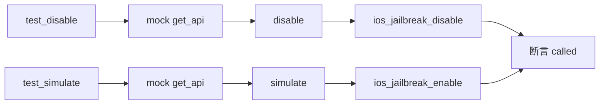

# iOS 越狱检测绕过测试 <code>tests/commands/ios/test_jailbreak.py</code>

这个测试文件验证 objection 的 iOS 越狱检测命令 `disable` 与 `simulate`，确认它们分别触发设备端禁用/模拟越狱检测的 RPC 方法。

## 📋 模块概览
| 项目 | 值 |
| --- | --- |
| 文件路径 | `tests/commands/ios/test_jailbreak.py` |
| 被测对象 | `objection.commands.ios.jailbreak`（`disable`、`simulate`） |
| 用例数 | 2 |
| 框架 | unittest（mock.patch） |

## 🎯 测试意图
- 验证 `disable([])` 触发 `ios_jailbreak_disable` RPC。
- 验证 `simulate([])` 触发 `ios_jailbreak_enable` RPC（模拟越狱状态）。

## 🧪 用例清单
| 用例 | 行号 | 验证点 |
| --- | --- | --- |
| `test_disable` | `tests/commands/ios/test_jailbreak.py:9` | 触发越狱检测禁用 RPC |
| `test_simulate` | `tests/commands/ios/test_jailbreak.py:15` | 触发越狱检测启用 RPC |

## ⚙️ 测试手法
两个用例都 `@mock.patch(...get_api)`（`:8`、`:14`），调用命令后断言对应 RPC `.called` 为真。无参数、无输出校验，与 Android `test_root.py` 结构对称。

## 🔍 源码索引
| 用例 | 位置 |
| --- | --- |
| `test_disable` | `tests/commands/ios/test_jailbreak.py:9` |
| `test_simulate` | `tests/commands/ios/test_jailbreak.py:15` |

## 🔗 相关文档
- 对应被测模块文档：`/reference/commands/ios/jailbreak`（如存在）
