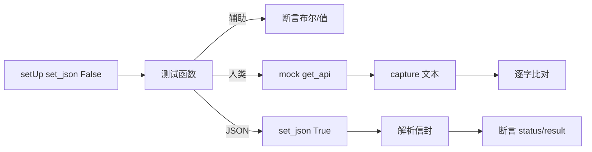

# iOS Keychain 测试 <code>commands/ios/test_keychain.py</code>

这个测试文件验证 objection 的 iOS keychain 命令模块，覆盖 `dump`/`dump_raw`/`clear`/`add` 四个命令及其辅助函数（`--json`/`--data`/`--key`/`--smart` flag 解析、smart decode 判定、flag 取值），同时验证人类模式与全局 JSON 模式（agent exec）两种输出路径。

## 📋 模块概览
| 项目 | 值 |
| --- | --- |
| 文件路径 | `tests/commands/ios/test_keychain.py` |
| 被测对象 | `objection.commands.ios.keychain` |
| 用例数 | 17 |
| 框架 | unittest（mock.patch + capture） |

## 🎯 测试意图
- 验证 `should_output_json` 全局标志与 `--json` arg flag 的判定。
- 验证 `_data_flag_has_identifier` 在有/无 `--data`/`--key` 时的行为。
- 验证 `_should_do_smart_decode` 与 `_get_flag_value` 辅助函数。
- 验证 `dump` 人类模式表格输出、命令级 `--json <file>` 写文件、全局 JSON 模式返回结构化信封。
- 验证 `clear` 在人类模式经 `click.confirm` 确认，JSON 模式跳过确认直接清空。
- 验证 `add` 的参数校验、成功/失败人类文本与全局 JSON 状态返回。

## 🧪 用例清单
| 用例 | 行号 | 验证点 |
| --- | --- | --- |
| `test_should_output_json_in_arguments_returns_true` | `tests/commands/ios/test_keychain.py:18` | `--json` 返回 True |
| `test_should_output_json_in_arguments_returns_false` | `tests/commands/ios/test_keychain.py:22` | 无 flag 返回 False |
| `test_dump_to_screen_handles_empty_data` | `tests/commands/ios/test_keychain.py:26` | 空数据仍打印表头与提示 |
| `test_data_flag_check_ignored_without_data_flag` | `tests/commands/ios/test_keychain.py:39` | 仅 `--key` 返回 True |
| `test_data_flag_is_checked_when_flag_is_specified` | `tests/commands/ios/test_keychain.py:43` | `--data`+`--key` 返回 False |
| `test_data_flag_is_checked_when_only_data_flag_is_specified_without_key` | `tests/commands/ios/test_keychain.py:47` | 仅 `--data` 返回 False |
| `test_should_do_smart_decode_returns_true` | `tests/commands/ios/test_keychain.py:51` | `--json`+`--smart` 返回 True |
| `test_should_do_smart_decode_returns_false` | `tests/commands/ios/test_keychain.py:55` | 仅 `--json` 返回 False |
| `test_get_flag_value_gets_value_of_flag` | `tests/commands/ios/test_keychain.py:59` | 取 `--key` 的值 |
| `test_dump_raw` | `tests/commands/ios/test_keychain.py:64` | 触发 `ios_keychain_list_raw` |
| `test_dump_to_json_file` | `tests/commands/ios/test_keychain.py:72` | 命令级 `--json` 写文件 |
| `test_dump_global_json_returns_structured` | `tests/commands/ios/test_keychain.py:86` | 全局 JSON 返回 entries+count 信封 |
| `test_clear` | `tests/commands/ios/test_keychain.py:106` | confirm=True 后清空 |
| `test_clear_global_json_skips_confirm` | `tests/commands/ios/test_keychain.py:114` | JSON 模式跳过 confirm |
| `test_adds_item_validates_data_key_to_need_identifier` | `tests/commands/ios/test_keychain.py:127` | `--data` 缺 account/service 打印提示 |
| `test_adds_item_successfully` | `tests/commands/ios/test_keychain.py:134` | add 成功人类文本 |
| `test_adds_item_with_failure` | `tests/commands/ios/test_keychain.py:145` | add 失败人类文本 |
| `test_adds_item_global_json_returns_status` | `tests/commands/ios/test_keychain.py:156` | 全局 JSON 返回 added 状态 |

## ⚙️ 测试手法
`setUp`/`tearDown`（`:11`、`:15`）用 `set_json_output(False)` 隔离全局 JSON 标志。辅助函数用例直接断言返回。命令用例 `@mock.patch(...get_api)` 注入 RPC，人类模式用 `capture` 捕获多行文本逐字比对。全局 JSON 模式用例（如 `:86`）调用 `set_json_output(True)`，捕获后用 `_json.loads(output[output.index('{'):])` 提取信封并断言 `status`/`command`/`result`。`clear` 的 JSON 模式用例（`:114`）验证 `assertNotIn('Are you sure')` 确认跳过交互。

## 🔍 源码索引
| 用例 | 位置 |
| --- | --- |
| `test_should_output_json_in_arguments_returns_true` | `tests/commands/ios/test_keychain.py:18` |
| `test_should_output_json_in_arguments_returns_false` | `tests/commands/ios/test_keychain.py:22` |
| `test_dump_to_screen_handles_empty_data` | `tests/commands/ios/test_keychain.py:26` |
| `test_data_flag_check_ignored_without_data_flag` | `tests/commands/ios/test_keychain.py:39` |
| `test_data_flag_is_checked_when_flag_is_specified` | `tests/commands/ios/test_keychain.py:43` |
| `test_data_flag_is_checked_when_only_data_flag_is_specified_without_key` | `tests/commands/ios/test_keychain.py:47` |
| `test_should_do_smart_decode_returns_true` | `tests/commands/ios/test_keychain.py:51` |
| `test_should_do_smart_decode_returns_false` | `tests/commands/ios/test_keychain.py:55` |
| `test_get_flag_value_gets_value_of_flag` | `tests/commands/ios/test_keychain.py:59` |
| `test_dump_raw` | `tests/commands/ios/test_keychain.py:64` |
| `test_dump_to_json_file` | `tests/commands/ios/test_keychain.py:72` |
| `test_dump_global_json_returns_structured` | `tests/commands/ios/test_keychain.py:86` |
| `test_clear` | `tests/commands/ios/test_keychain.py:106` |
| `test_clear_global_json_skips_confirm` | `tests/commands/ios/test_keychain.py:114` |
| `test_adds_item_validates_data_key_to_need_identifier` | `tests/commands/ios/test_keychain.py:127` |
| `test_adds_item_successfully` | `tests/commands/ios/test_keychain.py:134` |
| `test_adds_item_with_failure` | `tests/commands/ios/test_keychain.py:145` |
| `test_adds_item_global_json_returns_status` | `tests/commands/ios/test_keychain.py:156` |

## 🔗 相关文档
- 对应被测模块文档：`/reference/commands/ios/keychain`（如存在）
