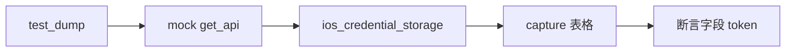

# iOS NSURLCredentialStorage 测试 <code>tests/commands/ios/test_nsurlcredentialstorage.py</code>

这个测试文件验证 objection 的 iOS NSURLCredentialStorage 凭证转储命令 `dump`，确认它通过 RPC 获取凭证列表并按表格打印各字段。

## 📋 模块概览
| 项目 | 值 |
| --- | --- |
| 文件路径 | `tests/commands/ios/test_nsurlcredentialstorage.py` |
| 被测对象 | `objection.commands.ios.nsurlcredentialstorage.dump` |
| 用例数 | 1 |
| 框架 | unittest（mock.patch + capture） |

## 🎯 测试意图
- 验证 `dump([])` 调用 `ios_credential_storage` RPC 并将返回的凭证字典格式化为含 protocol/host/port/authMethod/user/password 的表格。

## 🧪 用例清单
| 用例 | 行号 | 验证点 |
| --- | --- | --- |
| `test_dump` | `tests/commands/ios/test_nsurlcredentialstorage.py:10` | RPC 调用并打印字段 token |

## ⚙️ 测试手法
`@mock.patch(...get_api)`（`:9`）预设 `ios_credential_storage` 返回单条凭证字典，用 `capture(dump, [])` 捕获 tabulate 表格。按注释（`:23`）不锁定列宽，只断言表头与各字段 token（含 `https`/`foo.bar`/`80`/`Default`/`foo`/`bar`）存在。

## 🔍 源码索引
| 用例 | 位置 |
| --- | --- |
| `test_dump` | `tests/commands/ios/test_nsurlcredentialstorage.py:10` |

## 🔗 相关文档
- 对应被测模块文档：`/reference/commands/ios/nsurlcredentialstorage`（如存在）
