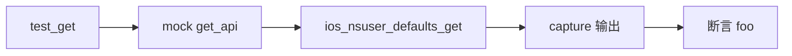

# iOS NSUserDefaults 测试 <code>tests/commands/ios/test_nsuserdefaults.py</code>

这个测试文件验证 objection 的 iOS NSUserDefaults 读取命令 `get`，确认它通过 RPC 调用 `ios_nsuser_defaults_get` 并把返回值打印到终端。

## 📋 模块概览
| 项目 | 值 |
| --- | --- |
| 文件路径 | `tests/commands/ios/test_nsuserdefaults.py` |
| 被测对象 | `objection.commands.ios.nsuserdefaults.get` |
| 用例数 | 1 |
| 框架 | unittest（mock.patch + capture） |

## 🎯 测试意图
- 验证 `get([])` 调用 `ios_nsuser_defaults_get` RPC 并将其返回值（如字符串 `'foo'`）原样打印加换行。

## 🧪 用例清单
| 用例 | 行号 | 验证点 |
| --- | --- | --- |
| `test_get` | `tests/commands/ios/test_nsuserdefaults.py:10` | RPC 返回值被打印 |

## ⚙️ 测试手法
`@mock.patch(...get_api)`（`:9`）预设 `ios_nsuser_defaults_get` 返回 `'foo'`，用 `capture(get, [])` 捕获输出后断言整行为 `'foo\n'`。无表格、无参数校验，是最简单的"打印 RPC 返回值"型用例。

## 🔍 源码索引
| 用例 | 位置 |
| --- | --- |
| `test_get` | `tests/commands/ios/test_nsuserdefaults.py:10` |

## 🔗 相关文档
- 对应被测模块文档：`/reference/commands/ios/nsuserdefaults`（如存在）
