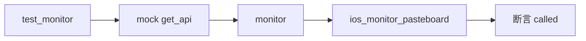

# iOS 粘贴板监控测试 <code>tests/commands/ios/test_pasteboard.py</code>

这个测试文件验证 objection 的 iOS 粘贴板监控命令 `monitor`，确认它通过 RPC 调用设备端 `ios_monitor_pasteboard` 启动粘贴板监听任务。

## 📋 模块概览
| 项目 | 值 |
| --- | --- |
| 文件路径 | `tests/commands/ios/test_pasteboard.py` |
| 被测对象 | `objection.commands.ios.pasteboard.monitor` |
| 用例数 | 1 |
| 框架 | unittest（mock.patch） |

## 🎯 测试意图
- 验证 `monitor([])` 触发 `ios_monitor_pasteboard` RPC 调用。

## 🧪 用例清单
| 用例 | 行号 | 验证点 |
| --- | --- | --- |
| `test_monitor` | `tests/commands/ios/test_pasteboard.py:9` | 触发粘贴板监控 RPC |

## ⚙️ 测试手法
`@mock.patch(...get_api)`（`:8`）注入 mock，调用 `monitor([])` 后断言 `mock_api.return_value.ios_monitor_pasteboard.called` 为真。与 Android `test_clipboard.py` 结构对称，无参数、无输出校验。

## 🔍 源码索引
| 用例 | 位置 |
| --- | --- |
| `test_monitor` | `tests/commands/ios/test_pasteboard.py:9` |

## 🔗 相关文档
- 对应被测模块文档：`/reference/commands/ios/pasteboard`（如存在）
