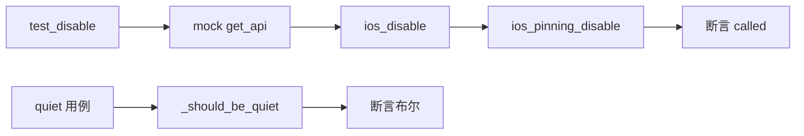

# iOS SSL Pinning 测试 <code>tests/commands/ios/test_pinning.py</code>

这个测试文件验证 objection 的 iOS SSL pinning 绕过命令 `ios_disable` 与辅助函数 `_should_be_quiet`，覆盖 RPC 透传与 `--quiet` flag 解析。

## 📋 模块概览
| 项目 | 值 |
| --- | --- |
| 文件路径 | `tests/commands/ios/test_pinning.py` |
| 被测对象 | `objection.commands.ios.pinning`（`ios_disable`、`_should_be_quiet`） |
| 用例数 | 3 |
| 框架 | unittest（mock.patch） |

## 🎯 测试意图
- 验证 `ios_disable([])` 触发 `ios_pinning_disable` RPC。
- 验证 `_should_be_quiet` 在含 `--quiet` 时返回 True，不含时返回 False。

## 🧪 用例清单
| 用例 | 行号 | 验证点 |
| --- | --- | --- |
| `test_disable` | `tests/commands/ios/test_pinning.py:9` | 触发 pinning 禁用 RPC |
| `test_should_be_quiet_returns_true` | `tests/commands/ios/test_pinning.py:14` | `--quiet` 返回 True |
| `test_should_be_quiet_returns_false` | `tests/commands/ios/test_pinning.py:18` | 无 flag 返回 False |

## ⚙️ 测试手法
`test_disable` 用 `@mock.patch(...get_api)`（`:8`）注入 mock，调用后断言 RPC `.called`。两个 `_should_be_quiet` 用例直接传入参数列表并断言布尔返回，无 mock、无 capture。

## 🔍 源码索引
| 用例 | 位置 |
| --- | --- |
| `test_disable` | `tests/commands/ios/test_pinning.py:9` |
| `test_should_be_quiet_returns_true` | `tests/commands/ios/test_pinning.py:14` |
| `test_should_be_quiet_returns_false` | `tests/commands/ios/test_pinning.py:18` |

## 🔗 相关文档
- 对应被测模块文档：`/reference/commands/ios/pinning`（如存在）
