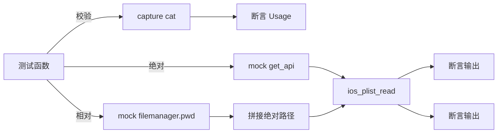

# iOS Plist 测试 <code>tests/commands/ios/test_plist.py</code>

这个测试文件验证 objection 的 iOS plist 读取命令 `cat`，覆盖参数校验、绝对路径读取与相对路径（经 `filemanager.pwd` 拼接）读取三种场景。

## 📋 模块概览
| 项目 | 值 |
| --- | --- |
| 文件路径 | `tests/commands/ios/test_plist.py` |
| 被测对象 | `objection.commands.ios.plist.cat` |
| 用例数 | 3 |
| 框架 | unittest（mock.patch + capture） |

## 🎯 测试意图
- 验证无参数时打印 Usage 提示。
- 验证绝对路径 `/foo` 直接调用 `ios_plist_read` 并打印返回值。
- 验证相对路径 `foo` 在 iOS 平台下经 `filemanager.pwd` 拼成绝对路径后再调用 RPC。

## 🧪 用例清单
| 用例 | 行号 | 验证点 |
| --- | --- | --- |
| `test_cat_validates_arguments` | `tests/commands/ios/test_plist.py:10` | 无参数打印 Usage |
| `test_cat_with_full_path` | `tests/commands/ios/test_plist.py:17` | 绝对路径直接 RPC |
| `test_cat_with_relative` | `tests/commands/ios/test_plist.py:27` | 相对路径拼接 pwd 后 RPC |

## ⚙️ 测试手法
校验用例用 `capture(cat, [])` 断言 Usage 文本。`test_cat_with_full_path`（`:17`）`@mock.patch(...get_api)` 预设 `ios_plist_read` 返回 `'foo'`，调用 `cat(['/foo'])` 后断言输出为 `'foo\n'`。`test_cat_with_relative`（`:27`）额外 patch `objection.commands.ios.plist.filemanager`，预设 `pwd` 返回 `'/baz'`，并设置 `device_state.platform = Ios`，验证相对路径被拼成绝对路径后 RPC 仍返回 `'foobar'`。

## 🔍 源码索引
| 用例 | 位置 |
| --- | --- |
| `test_cat_validates_arguments` | `tests/commands/ios/test_plist.py:10` |
| `test_cat_with_full_path` | `tests/commands/ios/test_plist.py:17` |
| `test_cat_with_relative` | `tests/commands/ios/test_plist.py:27` |

## 🔗 相关文档
- 对应被测模块文档：`/reference/commands/ios/plist`（如存在）
