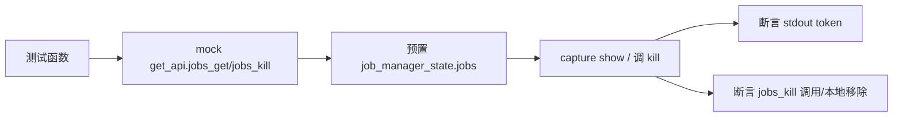

# 任务管理命令测试 <code>tests/commands/test_jobs.py</code>

验证 `objection.commands.jobs` 的 `show`/`kill` 命令：列出运行中的 Frida 任务、参数校验、按 UUID 终止任务，以及与 `job_manager_state` 本地状态的联动。

## 📋 模块概览

| 项目 | 值 |
| --- | --- |
| 文件路径 | `tests/commands/test_jobs.py` |
| 被测对象 | `objection.commands.jobs`（show/kill） |
| 用例数 | 5 |
| 框架 | pytest + unittest + mock |

## 🎯 测试意图

- 确认 `show` 在无任务时打印空表头（Job ID/Type/Name），有任务时列出任务行。
- 确认 `kill` 在参数缺失时打印 Usage。
- 确认 `kill` 对本地不存在的 UUID 不调用 `jobs_kill`，对存在的 UUID 调用 `jobs_kill` 并从 `job_manager_state.jobs` 移除。
- 用 `MockJob` 与真实 `Job` 构造本地状态，验证本地与远端 API 的协同。

## 🧪 用例清单

| 用例 | 行号 | 验证点 |
| --- | --- | --- |
| test_displays_empty_jobs_message | 32 | jobs_get 返回空列表时含表头 token |
| test_displays_list_of_jobs | 42 | 含任务时表头与任务类型均出现 |
| test_kill_validates_arguments | 52 | 无参输出 Usage |
| test_cant_find_job_by_uuid | 59 | 不存在 UUID 不调用 jobs_kill |
| test_kills_job_by_uuid | 66 | 存在的 UUID 调 jobs_kill 并移除本地 |

## ⚙️ 测试手法

`show` 用例以 `@mock.patch('objection.state.connection.state_connection.get_api')` 注入 `jobs_get` 返回值，用 `capture` 捕获 stdout，断言表头/任务类型 token 而非锁定 tabulate 列宽（见 `:37` 注释）。`kill` 用例预置 `job_manager_state.jobs` 字典（构造真实 `Job`），调用后断言 `mock_api.return_value.jobs_kill.called` 与本地 jobs 字典移除。`tearDown` 重置 `job_manager_state.jobs = {}`。

关键代码 `tests/commands/test_jobs.py:66`：

```python
@mock.patch('objection.state.connection.state_connection.get_api')
def test_kills_job_by_uuid(self, mock_api):
    job_manager_state.jobs = {}
    job = Job('test', 'hook', mock.MagicMock(), 12345)
    job_manager_state.jobs[12345] = job
    kill(['12345'])
    self.assertTrue(mock_api.return_value.jobs_kill.called)
    self.assertNotIn(12345, job_manager_state.jobs)
```



## 🔍 源码索引

| 用例 | 位置 |
| --- | --- |
| test_displays_empty_jobs_message | tests/commands/test_jobs.py:32 |
| test_displays_list_of_jobs | tests/commands/test_jobs.py:42 |
| test_kill_validates_arguments | tests/commands/test_jobs.py:52 |
| test_cant_find_job_by_uuid | tests/commands/test_jobs.py:59 |
| test_kills_job_by_uuid | tests/commands/test_jobs.py:66 |

## 🔗 相关文档

- 对应被测模块文档：[/reference/commands/jobs](/reference/commands/jobs)
- 任务状态测试：[/reference/tests/state/jobs](/reference/tests/state/jobs)
