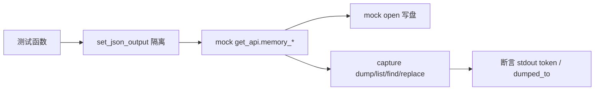

# 内存命令测试 <code>tests/commands/test_memory.py</code>

验证 `objection.commands.memory` 的全部子命令：dump_all/dump_from_base/list_modules/list_exports/find_pattern/replace_pattern，覆盖参数校验、`--string`/`--offsets-only`/`--json` 标志、字节大小格式化与 JSON 文件导出。

## 📋 模块概览

| 项目 | 值 |
| --- | --- |
| 文件路径 | `tests/commands/test_memory.py` |
| 被测对象 | `objection.commands.memory`（_is_string_input/dump_all/dump_from_base/list_modules/list_exports/find_pattern/replace_pattern） |
| 用例数 | 17 |
| 框架 | pytest + unittest + mock |

## 🎯 测试意图

- 验证 `_is_string_input` 解析 `--string` 标志。
- 验证 `dump_all`/`dump_from_base` 调用 `memory_list_ranges`/`memory_dump` 并写盘，字节量按 B 格式化。
- 验证 `list_modules`/`list_exports` 的人类模式表格渲染与 `--json <file>` 模式写文件并产出 `dumped_to` 确认。
- 验证 `find_pattern`/`replace_pattern` 在 hex 模式与 `--string` 模式下的搜索/替换字符串渲染，以及 `--offsets-only` 仅输出地址列表。
- `setUp`/`tearDown` 重置全局 `set_json_output(False)` 隔离人类模式断言。

## 🧪 用例清单

| 用例 | 行号 | 验证点 |
| --- | --- | --- |
| test_parses_is_string_input_flag_from_arguments | 28 | --string 返回 True |
| test_dump_all_validates_arguments | 36 | 无参 Usage |
| test_dump_all | 44 | memory_dump 写盘并打印大小 |
| test_dump_from_base_validates_arguments | 60 | 无参 Usage |
| test_dump_from_base | 69 | 指定基址+大小写盘 |
| test_list_modules_without_errors_without_json_flag | 83 | 人类模式表格含字段与大小 |
| test_list_modules_without_errors_with_json_flag | 101 | --json 写文件并含 dumped_to |
| test_dump_exports_validates_arguments_without_json_flag | 117 | 无参提示 --json 与 Usage |
| test_dump_exports_validates_arguments_with_json_flag | 127 | --json 无模块名仍 Usage |
| test_dump_exports_without_error | 135 | 人类模式表格含字段 |
| test_dump_exports_without_error_as_json | 152 | --json 写文件并含 dumped_to |
| test_find_pattern_validates_arguments | 166 | 无参 Usage |
| test_find_pattern_without_string_argument | 173 | hex 搜索渲染 |
| test_find_pattern_with_string_argument | 186 | --string 转十六进制搜索 |
| test_find_pattern_without_string_argument_with_offets_only | 199 | --offsets-only 仅地址 |
| test_replace_pattern_validates_arguments | 213 | 无参 Usage |
| test_replace_pattern_without_string_argument | 220 | hex 替换渲染 |
| test_replace_pattern_with_string_argument | 234 | --string-pattern 转换 |
| test_replace_pattern_without_string_argument_with_offets_only | 248 | --string-replace 渲染 |

## ⚙️ 测试手法

API 注入统一走 `@mock.patch('objection.state.connection.state_connection.get_api')`，对 `memory_list_ranges`/`memory_dump`/`memory_list_modules`/`memory_list_exports`/`memory_search`/`memory_replace` 设返回值。写盘用 `@mock.patch('objection.commands.memory.open', create=True)` mock 内建 `open`。人类模式表格用 `assertIn` 逐 token 断言而非锁定列宽（见 `:94` 注释）。`--json` 模式断言 `"dumped_to"` 出现且 `mock_open.called`。

关键代码 `tests/commands/test_memory.py:101`：

```python
@mock.patch('objection.commands.memory.open', create=True)
def test_list_modules_without_errors_with_json_flag(self, mock_open, mock_api):
    ...
    with capture(list_modules, ['--json', 'foo']) as o:
        output = o
    self.assertIn('Writing modules as json to foo...', output)
    self.assertIn('"dumped_to": "foo"', output)
    self.assertTrue(mock_open.called)
```



## 🔍 源码索引

| 用例 | 位置 |
| --- | --- |
| test_parses_is_string_input_flag_from_arguments | tests/commands/test_memory.py:28 |
| test_dump_all_validates_arguments | tests/commands/test_memory.py:36 |
| test_dump_all | tests/commands/test_memory.py:44 |
| test_dump_from_base_validates_arguments | tests/commands/test_memory.py:60 |
| test_dump_from_base | tests/commands/test_memory.py:69 |
| test_list_modules_without_errors_without_json_flag | tests/commands/test_memory.py:83 |
| test_list_modules_without_errors_with_json_flag | tests/commands/test_memory.py:101 |
| test_dump_exports_validates_arguments_without_json_flag | tests/commands/test_memory.py:117 |
| test_dump_exports_validates_arguments_with_json_flag | tests/commands/test_memory.py:127 |
| test_dump_exports_without_error | tests/commands/test_memory.py:135 |
| test_dump_exports_without_error_as_json | tests/commands/test_memory.py:152 |
| test_find_pattern_validates_arguments | tests/commands/test_memory.py:166 |
| test_find_pattern_without_string_argument | tests/commands/test_memory.py:173 |
| test_find_pattern_with_string_argument | tests/commands/test_memory.py:186 |
| test_find_pattern_without_string_argument_with_offets_only | tests/commands/test_memory.py:199 |
| test_replace_pattern_validates_arguments | tests/commands/test_memory.py:213 |
| test_replace_pattern_without_string_argument | tests/commands/test_memory.py:220 |
| test_replace_pattern_with_string_argument | tests/commands/test_memory.py:234 |
| test_replace_pattern_without_string_argument_with_offets_only | tests/commands/test_memory.py:248 |

## 🔗 相关文档

- 对应被测模块文档：[/reference/commands/memory](/reference/commands/memory)
