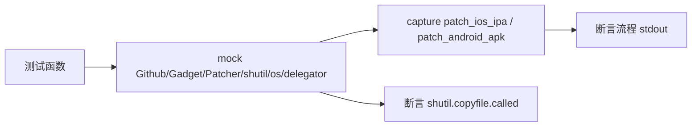

# 移动包补丁命令测试 <code>tests/commands/test_mobile_packages.py</code>

验证 `objection.commands.mobile_packages` 的 `patch_ios_ipa`/`patch_android_apk`：从 GitHub 拉取最新 gadget 版本、对比本地版本触发下载、调用平台 Patcher 完成 IPA/APK 重打包并拷贝到当前目录。

## 📋 模块概览

| 项目 | 值 |
| --- | --- |
| 文件路径 | `tests/commands/test_mobile_packages.py` |
| 被测对象 | `objection.commands.mobile_packages`（patch_ios_ipa/patch_android_apk） |
| 用例数 | 2 |
| 框架 | pytest + unittest + mock |

## 🎯 测试意图

- 确认 iOS IPA 补丁流程：Github 取最新版本、IosGadget 取本地版本、IosPatcher 检查 requirements 与补丁路径、shutil/os 拷贝最终 IPA。
- 确认 Android APK 补丁流程：未指定架构时用 `adb`（delegator）探测、Github/AndroidGadget/AndroidPatcher 协同、暂停提示与最终拷贝。
- 通过对 `Github`/`IosGadget`/`IosPatcher`/`AndroidGadget`/`AndroidPatcher`/`shutil`/`os`/`delegator`/`input` 的大量 mock，断言人类可读流程输出与 `shutil.copyfile` 调用。

## 🧪 用例清单

| 用例 | 行号 | 验证点 |
| --- | --- | --- |
| test_patching_ios_ipa | 14 | 流程输出含版本/下载/拷贝提示且 copyfile 被调用 |
| test_patching_android_apk | 43 | 含架构探测/版本/暂停/拷贝提示且 copyfile 被调用 |

## ⚙️ 测试手法

两个用例都用多重 `@mock.patch` 替换 `objection.commands.mobile_packages` 命名空间下的依赖：`Github`、`IosGadget`/`AndroidGadget`、`IosPatcher`/`AndroidPatcher`、`shutil`、`os`，Android 额外 mock `delegator`（返回 `out='x86'`）与 `input`。通过设定 `get_latest_version='1.0'` 与 `get_local_version='0.9'` 触发"远程较新，下载"分支。用 `capture` 捕获 stdout 做精确字符串相等，并断言 `mock_shutil.copyfile.called` 等。

关键代码 `tests/commands/test_mobile_packages.py:43`：

```python
@mock.patch('objection.commands.mobile_packages.Github')
@mock.patch('objection.commands.mobile_packages.AndroidGadget')
@mock.patch('objection.commands.mobile_packages.AndroidPatcher')
@mock.patch('objection.commands.mobile_packages.shutil')
@mock.patch('objection.commands.mobile_packages.os')
@mock.patch('objection.commands.mobile_packages.delegator')
@mock.patch('objection.commands.mobile_packages.input', create=True)
def test_patching_android_apk(self, mock_input, mock_delegator, ...):
    ...
```



## 🔍 源码索引

| 用例 | 位置 |
| --- | --- |
| test_patching_ios_ipa | tests/commands/test_mobile_packages.py:14 |
| test_patching_android_apk | tests/commands/test_mobile_packages.py:43 |

## 🔗 相关文档

- 对应被测模块文档：[/reference/commands/mobile-packages](/reference/commands/mobile-packages)
- Patchers 测试：[/reference/tests/utils/patchers/ios](/reference/tests/utils/patchers/ios)、[/reference/tests/utils/patchers/android](/reference/tests/utils/patchers/android)
