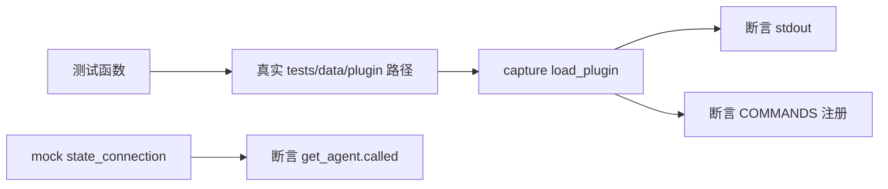

# 插件管理命令测试 <code>tests/commands/test_plugin_manager.py</code>

验证 `objection.commands.plugin_manager.load_plugin`：参数校验、`__init__.py` 存在性检查、加载真实测试插件并注册到 `console.commands.COMMANDS` 命名空间。

## 📋 模块概览

| 项目 | 值 |
| --- | --- |
| 文件路径 | `tests/commands/test_plugin_manager.py` |
| 被测对象 | `objection.commands.plugin_manager.load_plugin` |
| 用例数 | 3 |
| 框架 | pytest + unittest + mock |

## 🎯 测试意图

- 确认无参时打印 Usage。
- 确认插件目录缺少 `__init__.py` 时报"not a valid plugin"。
- 确认有效插件加载后注册到 COMMANDS（如 `version info` 子命令）并提示加载成功，且 `state_connection.get_agent` 被调用。

## 🧪 用例清单

| 用例 | 行号 | 验证点 |
| --- | --- | --- |
| test_load_plugin_validates_arguments | 13 | 无参输出 Usage |
| test_load_plugin_validates_plugin_init_exists | 21 | 缺 __init__.py 报错 |
| test_load_plugin_loads_plugin | 29 | 注册 version/info 并提示成功 |

## ⚙️ 测试手法

`setUp` 用 `os.path.abspath` 解析 `tests/data/plugin` 真实插件目录。校验用例以 `capture` 捕获 stdout 做断言。`__init__.py` 检查用 `@mock.patch('objection.commands.plugin_manager.os.path.exists')` 返回 False。加载用例以 `@mock.patch('objection.utils.plugin.state_connection')` mock 连接，调用真实 `load_plugin` 后断言 `console.commands.COMMANDS['plugin']['commands']['version']['commands']['info']['meta']` 与输出、`mock_state_connection.get_agent.called`。

关键代码 `tests/commands/test_plugin_manager.py:29`：

```python
@mock.patch('objection.utils.plugin.state_connection')
def test_load_plugin_loads_plugin(self, mock_state_connection):
    with capture(load_plugin, [self.plugin_path]) as o:
        output = o
    from objection.console import commands
    self.assertTrue(commands.COMMANDS['plugin']['commands']['version']['commands']['info']
                    ['meta'] == 'Get the current Frida version')
    self.assertEqual('Loaded plugin: version\n', output)
    self.assertTrue(mock_state_connection.get_agent.called)
```



## 🔍 源码索引

| 用例 | 位置 |
| --- | --- |
| test_load_plugin_validates_arguments | tests/commands/test_plugin_manager.py:13 |
| test_load_plugin_validates_plugin_init_exists | tests/commands/test_plugin_manager.py:21 |
| test_load_plugin_loads_plugin | tests/commands/test_plugin_manager.py:29 |

## 🔗 相关文档

- 对应被测模块文档：[/reference/commands/plugin-manager](/reference/commands/plugin-manager)
