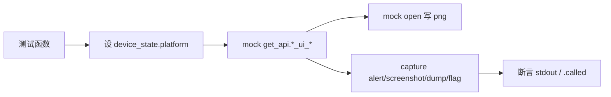

# UI 命令测试 <code>tests/commands/test_ui.py</code>

验证 `objection.commands.ui` 的 alert/screenshot/dump_ios_ui/bypass_touchid/android_flag_secure 等命令：平台代理分发、参数校验、API 调用与文件写入。

## 📋 模块概览

| 项目 | 值 |
| --- | --- |
| 文件路径 | `tests/commands/test_ui.py` |
| 被测对象 | `objection.commands.ui`（alert/_alert_ios/ios_screenshot/dump_ios_ui/bypass_touchid/android_screenshot/android_flag_secure） |
| 用例数 | 12 |
| 框架 | pytest + unittest + mock |

## 🎯 测试意图

- 确认 `alert` 根据 `device_state.platform` 分发到 `_alert_ios`，默认消息为 `objection!`，可自定义。
- 确认 iOS/Android screenshot 的参数校验、API 调用、`.png` 写入与成功提示。
- 确认 `dump_ios_ui` 调 `ios_ui_window_dump`，`bypass_touchid` 调 `ios_ui_biometrics_bypass`。
- 确认 `android_flag_secure` 校验布尔字符串与参数存在性，合法时调 `android_ui_set_flag_secure`。
- `tearDown` 重置 `device_state.platform = None`。

## 🧪 用例清单

| 用例 | 行号 | 验证点 |
| --- | --- | --- |
| test_alert_helper_method_proxy_calls_ios | 15 | iOS 平台 alert 调 _alert_ios('objection!') |
| test_alert_helper_method_proxy_calls_ios_custom_message | 23 | 自定义消息透传 |
| test_alert_ios_helper_method | 31 | _alert_ios 调 ios_ui_alert |
| test_ios_screenshot_validates_arguments | 36 | 无参 Usage |
| test_ios_screenshot | 44 | 写 png 并提示成功 |
| test_dump_ios_ui | 54 | 调 ios_ui_window_dump 并输出 |
| test_bypass_touchid | 63 | 调 ios_ui_biometrics_bypass |
| test_android_screenshot_validates_arguments | 68 | 无参 Usage |
| test_android_screenshot | 76 | 写 png 并提示成功 |
| test_android_flag_secure_validates_argument_as_boolean_string | 85 | 非布尔 Usage |
| test_android_flag_secure_validates_argument_is_present | 91 | 无参 Usage |
| test_android_flag_secure | 98 | 合法值调 android_ui_set_flag_secure |

## ⚙️ 测试手法

平台分发用例设 `device_state.platform = Ios()`。API 注入走 `@mock.patch('objection.state.connection.state_connection.get_api')`，对 `ios_ui_*`/`android_ui_*` 系列断言 `.called`。screenshot 用例以 `@mock.patch('objection.commands.ui.open', create=True)` mock 内建 `open` 验证写盘，返回 `b'\x00'`。校验用例用 `capture` 捕获 stdout 断言 Usage 字符串。

关键代码 `tests/commands/test_ui.py:44`：

```python
@mock.patch('objection.state.connection.state_connection.get_api')
@mock.patch('objection.commands.ui.open', create=True)
def test_ios_screenshot(self, mock_open, mock_api):
    mock_api.return_value.ios_ui_screenshot.return_value = b'\x00'
    with capture(ios_screenshot, ['foo']) as o:
        output = o
    self.assertTrue(output, 'Screenshot saved to: foo.png\n')
    self.assertTrue(mock_open.called)
```



## 🔍 源码索引

| 用例 | 位置 |
| --- | --- |
| test_alert_helper_method_proxy_calls_ios | tests/commands/test_ui.py:15 |
| test_alert_helper_method_proxy_calls_ios_custom_message | tests/commands/test_ui.py:23 |
| test_alert_ios_helper_method | tests/commands/test_ui.py:31 |
| test_ios_screenshot_validates_arguments | tests/commands/test_ui.py:36 |
| test_ios_screenshot | tests/commands/test_ui.py:44 |
| test_dump_ios_ui | tests/commands/test_ui.py:54 |
| test_bypass_touchid | tests/commands/test_ui.py:63 |
| test_android_screenshot_validates_arguments | tests/commands/test_ui.py:68 |
| test_android_screenshot | tests/commands/test_ui.py:76 |
| test_android_flag_secure_validates_argument_as_boolean_string | tests/commands/test_ui.py:85 |
| test_android_flag_secure_validates_argument_is_present | tests/commands/test_ui.py:91 |
| test_android_flag_secure | tests/commands/test_ui.py:98 |

## 🔗 相关文档

- 对应被测模块文档：[/reference/commands/ui](/reference/commands/ui)
