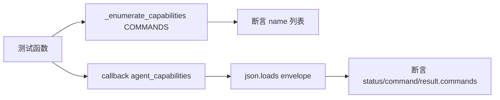

# Agent CLI 能力枚举测试 <code>tests/console/test_agent_cli.py</code>

验证 `objection.console.agent_cli` 的 `_enumerate_capabilities` 与 `agent_capabilities` 命令：递归遍历 COMMANDS 命名空间生成能力树，强制 JSON 输出完整统一 schema，供 AI Agent 发现可用命令。

## 📋 模块概览

| 项目 | 值 |
| --- | --- |
| 文件路径 | `tests/console/test_agent_cli.py` |
| 被测对象 | `objection.console.agent_cli`（_enumerate_capabilities/agent_capabilities） |
| 用例数 | 5 |
| 框架 | pytest + unittest |

## 🎯 测试意图

- 确认 `_enumerate_capabilities(COMMANDS)` 顶层含 android/ios/memory 等命令。
- 确认子命令递归展开（如 android 含 `android hooking`）。
- 确认可执行叶子（如 `pwd`）带 `has_exec=True` 标志。
- 确认每个条目有 `name`/`meta`/`has_exec` 三个键。
- 确认 `agent_capabilities` 命令强制 JSON 并输出含 `status=ok`、`command='agent capabilities'`、`result.commands` 列表的完整 envelope。

## 🧪 用例清单

| 用例 | 行号 | 验证点 |
| --- | --- | --- |
| test_enumerates_top_level_commands | 10 | 顶层含 android/ios/memory |
| test_recursive_subcommands | 17 | android 含 'android hooking' 子命令 |
| test_has_exec_flag | 24 | pwd 叶子 has_exec=True |
| test_entry_shape | 30 | 每条目含 name/meta/has_exec |
| test_capabilities_outputs_full_envelope | 39 | 输出完整 JSON envelope |

## ⚙️ 测试手法

枚举用例直接调用 `_enumerate_capabilities(COMMANDS)`，用生成器表达式提取 `name` 做断言，无 mock。`agent_capabilities` 用例先 `set_json_output(False)` 确保"即使全局非 JSON 也能强制输出"，再以 `.callback` 形式绕过 click 解析直接调用，用 `capture` 捕获 stdout 后 `json.loads` 解析 envelope 断言字段，`finally` 重置 JSON 标志。

关键代码 `tests/console/test_agent_cli.py:39`：

```python
def test_capabilities_outputs_full_envelope(self):
    from objection.console.agent_cli import agent_capabilities
    from objection.utils.output import set_json_output
    set_json_output(False)
    callback = agent_capabilities.callback if hasattr(agent_capabilities, 'callback') else agent_capabilities
    try:
        with capture(callback) as o:
            import json as _json
            payload = _json.loads(o)
        self.assertEqual(payload['status'], 'ok')
        self.assertEqual(payload['command'], 'agent capabilities')
        self.assertIn('commands', payload['result'])
    finally:
        set_json_output(False)
```



## 🔍 源码索引

| 用例 | 位置 |
| --- | --- |
| test_enumerates_top_level_commands | tests/console/test_agent_cli.py:10 |
| test_recursive_subcommands | tests/console/test_agent_cli.py:17 |
| test_has_exec_flag | tests/console/test_agent_cli.py:24 |
| test_entry_shape | tests/console/test_agent_cli.py:30 |
| test_capabilities_outputs_full_envelope | tests/console/test_agent_cli.py:39 |

## 🔗 相关文档

- [面向 AI Agent 使用](/guide/agent-usage)
- CLI 测试：[/reference/tests/console/cli](/reference/tests/console/cli)
