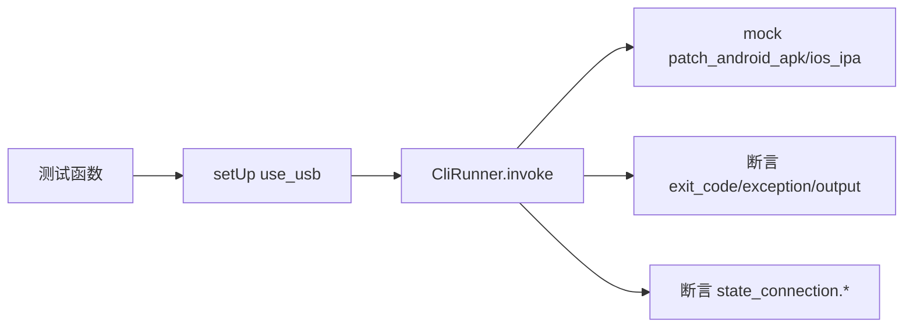

# CLI 命令行测试 <code>tests/console/test_cli.py</code>

验证 `objection.console.cli` 的 `cli`/`version`/`patchapk`/`patchipa` 入口：版本打印、补丁命令的参数解析与必填校验、`--local`/`--network` 连接模式切换与互斥。

## 📋 模块概览

| 项目 | 值 |
| --- | --- |
| 文件路径 | `tests/console/test_cli.py` |
| 被测对象 | `objection.console.cli`（cli/version/patchapk/patchipa） |
| 用例数 | 10 |
| 框架 | pytest + unittest + mock + click.testing.CliRunner |

## 🎯 测试意图

- 确认 `version` 子命令打印 `objection: <version>` 且退出码 0。
- 确认 `patchapk`/`patchipa` 在最小与全量参数下成功（patch 函数被 mock），缺失必填参数时退出码 2。
- 确认 `--local` 设置 `device_type='local'` 且 `network=False`。
- 确认 `--network --host --port` 设置 `device_type='remote'`、`network=True` 及 host/port。
- 确认 `--local` 与 `--network` 互斥，退出码 2 且输出含错误提示。
- `setUp` 重置 `state_connection` 为 USB 模式。

## 🧪 用例清单

| 用例 | 行号 | 验证点 |
| --- | --- | --- |
| test_version | 17 | 输出 objection: 版本 |
| test_patchapk_runs_with_minimal_cli_arguments | 26 | 仅 --source 成功 |
| test_patchapk_runs_with_all_cli_arguments | 34 | 全量参数成功 |
| test_patchapk_fails_and_wants_source | 49 | 缺 --source 退出码 2 |
| test_patchipa_runs_with_source_and_codesignature | 57 | source+codesignature 成功 |
| test_patchipa_runs_with_all_cli_arguments | 65 | 全量参数成功 |
| test_patchipa_fails_and_wants_source | 78 | 缺 --source 退出码 2 |
| test_patchipa_fails_and_wants_codesign_signature | 85 | 缺 --codesign-signature 退出码 2 |
| test_cli_uses_local_connection_mode | 92 | --local 设 local 模式 |
| test_cli_uses_network_connection_mode | 101 | --network 设 remote 模式 |
| test_cli_rejects_local_and_network_together | 112 | 二者同用退出码 2 |

## ⚙️ 测试手法

使用 `click.testing.CliRunner().invoke` 调用 click 命令对象，断言 `result.exit_code`/`result.exception`/`result.output`。补丁命令以 `@mock.patch('objection.console.cli.patch_android_apk')`/`patch_ios_ipa` 替换真实实现，仅验证 CLI 参数解析层。连接模式用例额外断言 `state_connection.device_type`/`network`/`host`/`port` 副作用。`setUp` 调 `state_connection.use_usb()` 并清空 host/port 隔离用例。

关键代码 `tests/console/test_cli.py:92`：

```python
def test_cli_uses_local_connection_mode(self):
    runner = CliRunner()
    result = runner.invoke(cli, ['--local', 'version'])
    self.assertIsNone(result.exception)
    self.assertEqual(result.exit_code, 0)
    self.assertEqual(state_connection.device_type, 'local')
    self.assertFalse(state_connection.network)
```



## 🔍 源码索引

| 用例 | 位置 |
| --- | --- |
| test_version | tests/console/test_cli.py:17 |
| test_patchapk_runs_with_minimal_cli_arguments | tests/console/test_cli.py:26 |
| test_patchapk_runs_with_all_cli_arguments | tests/console/test_cli.py:34 |
| test_patchapk_fails_and_wants_source | tests/console/test_cli.py:49 |
| test_patchipa_runs_with_source_and_codesignature | tests/console/test_cli.py:57 |
| test_patchipa_runs_with_all_cli_arguments | tests/console/test_cli.py:65 |
| test_patchipa_fails_and_wants_source | tests/console/test_cli.py:78 |
| test_patchipa_fails_and_wants_codesign_signature | tests/console/test_cli.py:85 |
| test_cli_uses_local_connection_mode | tests/console/test_cli.py:92 |
| test_cli_uses_network_connection_mode | tests/console/test_cli.py:101 |
| test_cli_rejects_local_and_network_together | tests/console/test_cli.py:112 |

## 🔗 相关文档

- 对应被测模块文档：[/reference/console/cli](/reference/console/cli)
- 移动包补丁测试：[/reference/tests/commands/mobile-packages](/reference/tests/commands/mobile-packages)
