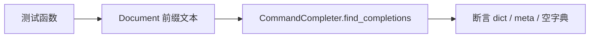

# 命令补全测试 <code>tests/console/test_completer.py</code>

验证 `objection.console.completer.CommandCompleter` 在 REPL 中根据已输入命令前缀返回后续可补全的子命令字典。

## 📋 模块概览

| 项目 | 值 |
| --- | --- |
| 文件路径 | `tests/console/test_completer.py` |
| 被测对象 | `objection.console.completer.CommandCompleter` |
| 用例数 | 2 |
| 框架 | pytest + unittest + prompt_toolkit |

## 🎯 测试意图

- 确认对合法前缀（`android hooking list `）返回字典，且 `activities` 条目带正确 `meta` 描述。
- 确认对非法前缀（`android hooking list fruitcakes `）返回空字典，不抛异常。

## 🧪 用例清单

| 用例 | 行号 | 验证点 |
| --- | --- | --- |
| test_can_find_command_completion | 12 | 返回 dict 且 activities.meta 正确 |
| test_will_have_empty_dict_for_invalid_command | 20 | 非法前缀返回空 dict |

## ⚙️ 测试手法

用 `prompt_toolkit.document.Document` 构造光标位置的输入文本，调用 `CommandCompleter().find_completions(document)`，断言返回类型为 `dict` 并检查条目 `meta` 或长度为 0。无 mock，直接走真实 COMMANDS 树。

关键代码 `tests/console/test_completer.py:12`：

```python
def test_can_find_command_completion(self):
    document = Document('android hooking list ', 21)
    completions = self.command_completer.find_completions(document)
    self.assertEqual(type(completions), dict)
    self.assertEqual(completions['activities']['meta'], 'List the registered Activities')
```



## 🔍 源码索引

| 用例 | 位置 |
| --- | --- |
| test_can_find_command_completion | tests/console/test_completer.py:12 |
| test_will_have_empty_dict_for_invalid_command | tests/console/test_completer.py:20 |

## 🔗 相关文档

- 对应被测模块文档：[/reference/console/completer](/reference/console/completer)
- REPL 测试：[/reference/tests/console/repl](/reference/tests/console/repl)
