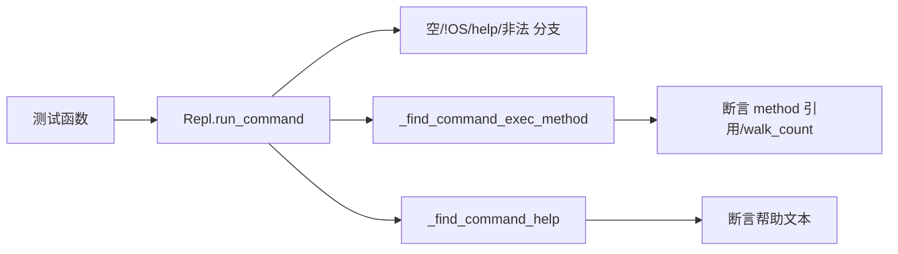

# REPL 交互测试 <code>tests/console/test_repl.py</code>

验证 `objection.console.repl.Repl` 的命令解析与分发：空命令/纯空白忽略、`!` 前缀执行 OS 命令、`help` 查找帮助、非法命令提示、`_find_command_exec_method` 令牌遍历、嵌套帮助文件定位，以及异常捕获。

## 📋 模块概览

| 项目 | 值 |
| --- | --- |
| 文件路径 | `tests/console/test_repl.py` |
| 被测对象 | `objection.console.repl.Repl`（run_command/_find_command_exec_method/_find_command_help） |
| 用例数 | 9 |
| 框架 | pytest + unittest + mock |

## 🎯 测试意图

- 确认空字符串与纯空白 `run_command` 不产出。
- 确认 `!id` 走 `delegator.run` 并回显 stdout/stderr。
- 确认 `help <cmd>` 返回对应帮助文本，无效命令返回"无帮助"提示。
- 确认非法命令返回"Unknown or ambiguous"提示并建议 `help`。
- 确认 `_find_command_exec_method` 对合法令牌链返回方法引用与遍历数，对非法返回 None。
- 确认 `_find_command_help` 能定位嵌套帮助（如 `ios keychain clear`）。
- 确认主循环捕获 `run_command` 抛出的异常不崩溃。

## 🧪 用例清单

| 用例 | 行号 | 验证点 |
| --- | --- | --- |
| test_does_nothing_when_empty_command_is_passed | 13 | 空命令输出空 |
| test_does_nothing_when_only_spaces_as_command_is_passed | 17 | 纯空白输出空 |
| test_runs_os_command_when_prefixed_with_excalmation_mark | 24 | !id 走 delegator 并回显 |
| test_finds_help_when_prefixed_with_help_command | 36 | help android 返回帮助文本 |
| test_fails_to_find_help_for_invalid_command | 46 | 无效命令返回无帮助提示 |
| test_fails_when_invalid_command_is_passed | 55 | 非法命令返回 Unknown 提示 |
| test_is_able_to_find_an_executable_method_to_run_with_tokens_passed | 62 | 令牌链定位到 show_registered_activities |
| test_will_fail_to_find_exec_method_with_invalid_tokens | 68 | 非法令牌返回 None |
| test_is_able_to_locate_nested_helpfile_contents | 74 | 定位 ios keychain clear 帮助 |
| test_runs_commands_and_catches_exceptions | 95 | 主循环捕获异常 |

## ⚙️ 测试手法

输出类用例用 `capture(self.repl.run_command, ...)` 捕获 stdout 做字符串相等。`!` 前缀用例以 `@mock.patch('objection.console.repl.delegator.run')` 注入返回 `MagicMock(out=b'out_test', err=b'err_test')`。方法定位用例直接调用 `_find_command_exec_method`/`_find_command_help` 断言返回值（含对 `show_registered_activities` 函数引用的相等比较）。异常捕获用例 mock `PromptSession` 与 `Repl.run_command`，后者 `side_effect=TypeError()`，断言不向上传播。

关键代码 `tests/console/test_repl.py:62`：

```python
def test_is_able_to_find_an_executable_method_to_run_with_tokens_passed(self):
    walk_count, method = self.repl._find_command_exec_method(
        ['android', 'hooking', 'list', 'activities'])
    self.assertEqual(walk_count, 4)
    self.assertEqual(method, show_registered_activities)
```



## 🔍 源码索引

| 用例 | 位置 |
| --- | --- |
| test_does_nothing_when_empty_command_is_passed | tests/console/test_repl.py:13 |
| test_does_nothing_when_only_spaces_as_command_is_passed | tests/console/test_repl.py:17 |
| test_runs_os_command_when_prefixed_with_excalmation_mark | tests/console/test_repl.py:24 |
| test_finds_help_when_prefixed_with_help_command | tests/console/test_repl.py:36 |
| test_fails_to_find_help_for_invalid_command | tests/console/test_repl.py:46 |
| test_fails_when_invalid_command_is_passed | tests/console/test_repl.py:55 |
| test_is_able_to_find_an_executable_method_to_run_with_tokens_passed | tests/console/test_repl.py:62 |
| test_will_fail_to_find_exec_method_with_invalid_tokens | tests/console/test_repl.py:68 |
| test_is_able_to_locate_nested_helpfile_contents | tests/console/test_repl.py:74 |
| test_runs_commands_and_catches_exceptions | tests/console/test_repl.py:95 |

## 🔗 相关文档

- 对应被测模块文档：[/reference/console/repl](/reference/console/repl)
- 补全测试：[/reference/tests/console/completer](/reference/tests/console/completer)
