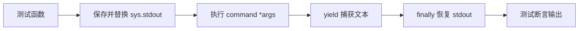

# 测试公共工具 <code>tests/helpers.py</code>

这个模块提供测试用例捕获 stdout 输出的公共上下文管理器，被几乎所有 `tests/commands` 下的测试文件通过相对导入复用，用于断言命令函数打印到终端的人类可读文本。

## 📋 模块概览
| 项目 | 值 |
| --- | --- |
| 文件路径 | `tests/helpers.py` |
| 被测对象 | 测试基础设施（非被测模块） |
| 公开函数 | `capture`（1 个） |
| 框架 | Python 标准库 `contextlib` + `io.StringIO` |

## 🎯 测试意图
- 临时重定向 `sys.stdout`，把命令函数的 `print` 输出收集成字符串供断言。
- 保证测试结束后恢复原始 stdout，即便命令抛异常也能恢复。
- 不依赖 pytest fixture，以便在 `unittest.TestCase` 子类中直接以 `with capture(func, *args) as o:` 形式使用。

## 🧪 用例清单
本文件本身不含测试用例，而是被以下测试文件导入使用（部分列举）：

| 使用方 | 位置 |
| --- | --- |
| `test_clipboard` 间接（无 capture） | — |
| `test_command` | `tests/commands/android/test_command.py:5` |
| `test_heap` | `tests/commands/android/test_heap.py:5` |
| `test_hooking` | `tests/commands/android/test_hooking.py:8` |
| `test_keychain` | `tests/commands/ios/test_keychain.py:7` |

## ⚙️ 测试手法
`capture` 是一个 `@contextmanager` 装饰的生成器函数（`tests/helpers.py:8`）。其策略为：

1. 保存原始 `sys.stdout`，替换为新的 `StringIO`。
2. 执行传入的 `command(*args, **kwargs)`。
3. `seek(0)` 回到流首，`yield` 出已捕获的字符串。
4. `finally` 块中无条件恢复原始 `sys.stdout`，确保异常路径也安全。

关键代码位于 `tests/helpers.py:8-19`，注释中标注了实现来源链接 `http://schinckel.net/...`。

## 🔍 源码索引
| 符号 | 位置 |
| --- | --- |
| `capture` | `tests/helpers.py:8` |
| stdout 替换 | `tests/helpers.py:9` |
| `yield` 捕获文本 | `tests/helpers.py:15` |
| 恢复 stdout | `tests/helpers.py:19` |

## 🔗 相关文档
- 各被测命令模块文档（如 `/reference/commands/android/hooking`）
